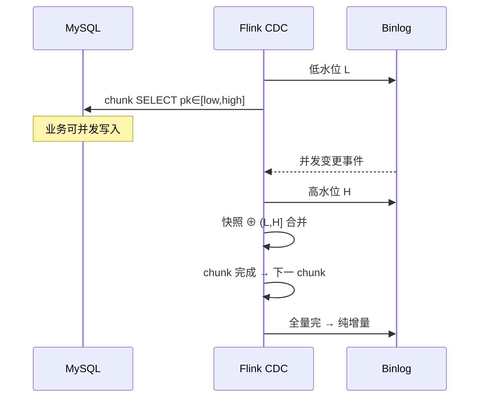

# Flink CDC 增量快照原理（FLIP-27）— 学习指南

> 配套代码：`FlinkCdcSnapshotDemoJob` + `FlinkCdcSnapshotDemoJobTest`  
> 数据源：MySQL `flink_cdc_demo.student_enrollment`（在线教育选课表）  
> 实现：Flink CDC 2.2 + `MySqlSource` + `StartupOptions.initial()`

---

## 读前扫盲：为什么需要「增量快照」？

传统 MySQL → 数仓同步两难：

| 方案 | 问题 |
|------|------|
| **mysqldump 全量 + 锁表** | 锁表影响业务；大表慢；切增量易丢数据 |
| **Canal 等纯 binlog** | 冷启动无一致全量锚点；历史要另做 |
| **Flink CDC 增量快照** | **无锁 + 并行 chunk + 水位合并 + CK 断点** |

核心问题：**如何在不锁表的情况下，拿到与 binlog 位点一致的全量基线？**

---

## Step 1 原理：chunk + 高低水位合并

### ① FLIP-27 Source 架构

```
MySqlSource（FLIP-27 统一 Source）
  ├─ Enumerator：切分 Snapshot Split（按主键 chunk）
  ├─ Reader：并行读 chunk + 读 binlog split
  └─ State：未完成 split + binlog 位点 → Checkpoint
```

### ② 无锁快照算法（DBLog / Netflix）

```
表按主键切 chunk: [1,1000], [1001,2000], ...

每个 chunk 执行：
  1. 记录低水位 L = 当前 binlog 位点
  2. SELECT * FROM t WHERE pk BETWEEN low AND high   ← 无锁读
  3. 记录高水位 H = 当前 binlog 位点
  4. 读取 (L, H] 内影响该 chunk 键的 binlog 事件
  5. 合并：快照行被窗口内 UPDATE/DELETE 覆盖

全部分 chunk 完成 → 切换到纯 binlog 增量
```



### ③ 与 Demo 代码映射

| 概念 | 代码 |
|------|------|
| 无锁 | `debezium.snapshot.locking.mode=none` |
| chunk 大小 | `scan.incremental.snapshot.chunk.size` |
| 增量快照 | `StartupOptions.initial()` |
| 阶段日志 | `CdcPhaseLogFunction` → `[CDC-SNAPSHOT]` / `[CDC-BINLOG]` |
| 算法单测 | `IncrementalSnapshotSimulator` |

### ④ Exactly-Once 与位点

```
binlog 位点 + 未完成 split 状态 → 写入 Flink Checkpoint
failover → 从 CK 恢复 Source，而非仅依赖外部 offset 表
```

---

## Step 2 实操

### 0. MySQL 前置

```sql
-- my.cnf
log_bin=ON
binlog_format=ROW
binlog_row_image=FULL
server-id=5400   -- 集群内唯一

-- 用户权限
GRANT SELECT, REPLICATION SLAVE, REPLICATION CLIENT ON *.* TO 'cdc_user'@'%';
```

### 1. 初始化表与数据

```bash
mysql -h 192.168.1.124 -u root -p < src/main/resources/cdc/init_mysql.sql
```

### 2. 启动 Job（增量快照）

```bash
# VM 可选：-Dcdc.mysql.host=192.168.1.124 -Dcdc.mysql.password=yourpwd

# A：initial = 增量快照 + binlog
org.example.job.cdc.FlinkCdcSnapshotDemoJob initial 2 1024 hashmap

# B：latest = 仅增量（Job 先启，再灌数）
org.example.job.cdc.FlinkCdcSnapshotDemoJob latest 2 1024 hashmap
```

### 3. 写入/变更数据

```bash
mvn test -Dtest=FlinkCdcSnapshotDemoJobTest#sendCdcDemoDataToMysql
```

### 4. 观察日志

**全量快照阶段**

```
[CDC-SNAPSHOT] subtask=0 op=r id=1 student=S90001 course=C_JAVA status=enrolled | snapshot=true
[CDC-SNAPSHOT] subtask=0 op=r id=2 ...
```

**切换增量**

```
========== [CDC-PHASE] Snapshot → Binlog 切换 ==========
  快照阶段累计: 3 条 | 开始消费增量 binlog
```

**增量捕获**

```
[CDC-BINLOG] subtask=0 op=u id=1 student=S90001 status=dropped | file=mysql-bin.000001 pos=...
[CDC-BINLOG] subtask=0 op=d id=3 ...
```

---

## Step 3 对比表

| 维度 | mysqldump+锁表 | Canal 纯增量 | Flink CDC 增量快照 |
|------|----------------|--------------|-------------------|
| **锁表** | ❌ 常需 | ✅ 无 | ✅ 无 |
| **全量并行** | ❌ | — | ✅ chunk 并行 |
| **全+增一致** | ⚠️ 切换风险 | ❌ 冷启动难 | ✅ 水位合并 |
| **断点续传** | ❌ | 自建 offset | ✅ Flink CK |
| **Exactly-Once** | — | at-least-once 为主 | ✅ 与 Flink CK 集成 |

### 为什么 chunk 能并行加速全量？

```
单线程 dump：1000 万行串行
增量快照：chunk1 ∥ chunk2 ∥ chunk3 …（多 Subtask）
瓶颈变为：MySQL 读 IO + binlog 解析 + Sink 写出
```

---

## Step 4 调优 / 陷阱

### ① 全量阶段背压

chunk 大 / Sink 慢 → snapshot 拉长 → 与业务争抢 IO。  
**对策**：调小 `chunk.size`、提 Sink 吞吐、低峰启动 initial。

### ② 主键与 chunk 切分

| 表类型 | 行为 |
|--------|------|
| **有主键** | 按 PK range 切 chunk ✅ |
| **无主键** | 无法增量快照；需指定 `scan.incremental.snapshot.chunk.key-column` 或全表扫 |

### ③ Schema 变更（DDL）

- 增删列：Debezium schema history；复杂 DDL 可能需重启或 Savepoint  
- 改表名：新表当新 Source  
**生产**：DDL 走变更窗口 + 对账

### ④ 与业务 EO 的边界

CDC EO = **Flink 消费的位点与下游写入**一致；业务表仍需 **主键 UPSERT** 处理重复投递。

---

## Step 5 面试话术

> **Flink CDC 不锁表怎么保证全量+增量不丢不重？**

1. **不锁表**：`snapshot.locking.mode=none`，不做 `FLUSH TABLES WITH READ LOCK`。  
2. **chunk 快照**：按主键分段 `SELECT`，多 Reader **并行**。  
3. **水位合并**：每 chunk 记录 binlog **低/高水位**，把快照期间并发变更 **折叠进该 chunk**。  
4. **切换增量**：全 chunk 完成后只读 binlog，位点连续。  
5. **不丢不重**：位点 + split 状态进 **Checkpoint**；failover 从 CK 续跑；下游 **幂等主键** 兜底。  
6. **对比 Canal**：我们选 Flink CDC 因 **全增一体 + 与 Flink 状态/CK 原生集成**，适合实时数仓入湖。

---

## 测试计划

| Phase | MySQL 操作 | 预期 CDC |
|-------|------------|----------|
| 预置 | init.sql 3 行 | initial：`[CDC-SNAPSHOT] op=r` |
| 1 | INSERT 2 行 | `[CDC-BINLOG] op=c` |
| 2 | UPDATE S90001 | `op=u status=dropped` |
| 3 | DELETE S90003 | `op=d` |

---

## 验收清单

| # | 验收项 | 验证方式 |
|---|--------|----------|
| ① | 讲清 chunk + 水位合并 | Step1 + `IncrementalSnapshotSimulator` 单测 |
| ② | 观察 snapshot→binlog 切换 | `[CDC-PHASE]` 日志 |
| ③ | 增量捕获 UPDATE/DELETE | Phase2/3 + Job 日志 |
| ④ | 对比传统方案 | Step3 表 |
| ⑤ | EO 与 CK 位点 | Step1④ + 单测 |

---

## Step 7 在线教育典型业务案例（CDC 三角）

> **教务库选课同步** / **订单状态入湖** / **大班排课变更**  
> 与 Kafka Connector、Dim Join、数据质量指南互补。

---

### 案例一：教务 MySQL 选课表 → 实时学员画像

#### 业务背景

`student_enrollment` 在教务 MySQL，需 **分钟级** 同步到 Flink 用于「学员当前在学课程」画像，不能锁表影响报名高峰。

#### 架构

```
MySQL(student_enrollment)
  → Flink CDC initial（增量快照）
  → keyBy(student_id) → 画像聚合
  → Kafka / ClickHouse
```

#### 配置要点

```java
MySqlSource.builder()
    .startupOptions(StartupOptions.initial())
    .debeziumProperties(/* locking.mode=none, chunk.size=8096 */)
```

#### 为什么不用 nightly dump？

| 维度 | dump | CDC 增量快照 |
|------|------|--------------|
| 报名高峰 | 锁表风险 | 无锁 |
| 时效 | T+1 | 分钟级 |
| 退课变更 | 难追平 | binlog `u/d` 实时 |

**与 Demo 映射**：`student_enrollment` 表 + `initial` 模式。

#### 踩坑

1. **无主键表**（历史遗留）要先加 PK 或指定 chunk column。  
2. **大表 initial** 首次启动 1~2h，要 **低峰 + 监控 snapshot 进度**。  
3. **心得**：教务库是 CDC 最佳场景——**强 PK、变更频繁、不能锁表**。

---

### 案例二：订单/缴费状态 — 全+增一致与对账

#### 业务背景

缴费订单 `order_status` 从 `pending` → `paid`，财务要求 **与 MySQL 笔数一致**。

#### 水位合并为何重要？

```
快照读到 order#100 = pending
同时 binlog：order#100 → paid
合并后 → paid（不能是 pending）
```

否则财务对账 **少收钱**。

#### 对账

```sql
-- 日终
SELECT count(*) FROM mysql.order_status WHERE updated_at < '今日';
SELECT count(*) FROM ck.order_status_dwd WHERE dt = '今日';
```

**与 Demo 映射**：`IncrementalSnapshotSimulator` id=2 更新合并。

---

### 案例三：大班排课 DDL 变更 — Schema 与重启策略

#### 业务背景

学期初 `ALTER TABLE student_enrollment ADD COLUMN class_id`，Flink CDC Job 运行中。

#### 风险

- Debezium schema 不兼容 → 解析失败  
- 下游 ClickHouse 缺列 → 写入失败  

#### 策略

1. **先加可空列** → 下游 ALTER → 重启 CDC（或 Savepoint）  
2. **避免** 高峰期 `DROP COLUMN`  
3. **对账** 变更前后行数  

**与 Demo 映射**：Step4③ DDL 陷阱。

---

### 三案例对照总表

| 案例 | CDC 主题 | 关键配置 | Demo 对应 |
|------|----------|----------|-----------|
| 选课同步 | 无锁 initial | chunk + CK | `FlinkCdcSnapshotDemoJob` |
| 缴费订单 | 水位合并 | 主键 UPSERT 下游 | `IncrementalSnapshotSimulator` |
| 排课 DDL | Schema 变更 | 低峰重启 | Step4③ |

---

## 加分点速查

| 主题 | 要点 |
|------|------|
| **FLIP-27** | 统一 Source API，split 枚举与 CK |
| **locking.mode=none** | 无锁快照前提 |
| **chunk.size** | 全量并行度与 MySQL 压力权衡 |
| **ReplacingMergeTree** | 下游幂等覆盖 |
| **read_committed** | 若再写 Kafka EO topic |
| **技术 vs 业务一致** | CK 位点 + 业务主键对账 |

---

## 与其他 Demo 的关系

| Demo | 关系 |
|------|------|
| **Kafka Connector** | CDC 下游常接 Kafka |
| **Dim Join** | CDC 维表 broadcast |
| **数据质量** | CDC 脏数据 / DDL |
| **Savepoint** | CDC Job 发布与恢复 |

建议：**CDC 原理（本指南）→ Kafka Connector → Dim Join**。

---

## 延伸阅读

| 主题 | 文档 |
|------|------|
| **CDC 选型（Canal/Maxwell/Debezium/Flink CDC）** | `FlinkCdcSelectionAndOutOfOrderGuide.md` |
| **同主键 UPDATE 乱序、last-write-wins** | `FlinkCdcOutOfOrderDemoJob` + 上表 |
