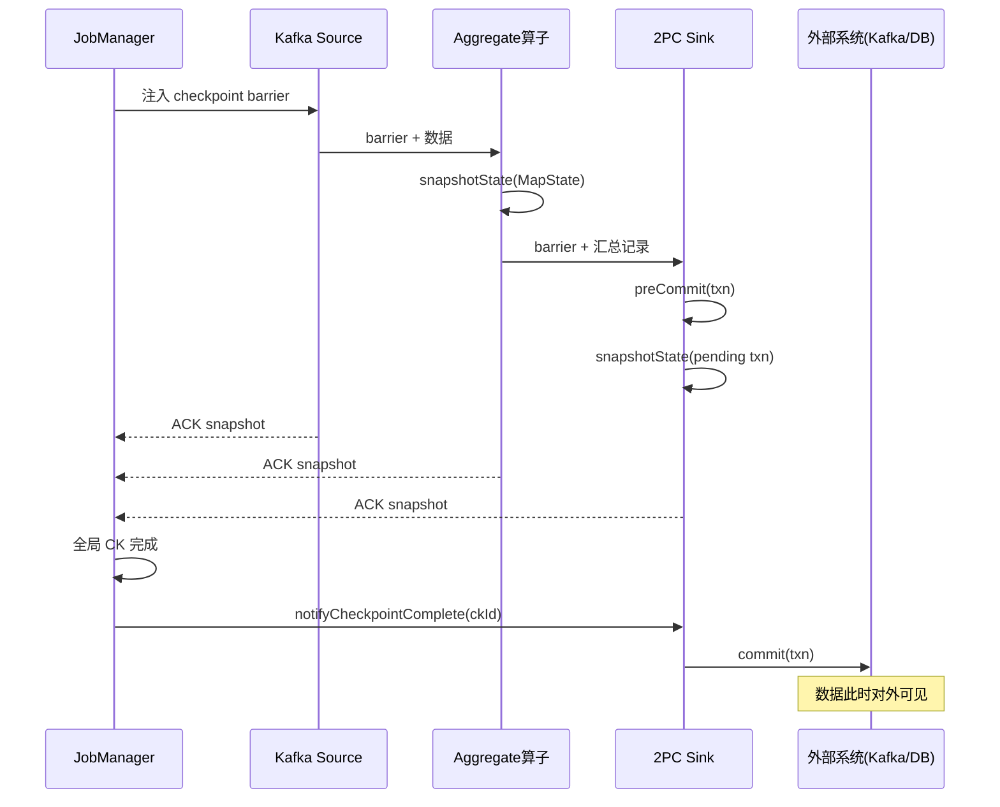
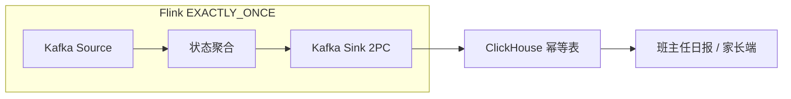

# Flink 端到端 Exactly-Once 与 2PC Sink — 学习指南

> 配套代码：`FlinkExactlyOnceDemoJob` + `FlinkExactlyOnceDemoJobTest`  
> 数据源：复用 `StateDemoEvent`（在线教育学习心跳）→ 聚合为 `StudySummaryRecord`  
> Sink：**2PC**（`DemoTwoPhaseCommitSink`）或 **幂等写**（`DemoIdempotentClickHouseSink`）

---

## 读前扫盲：端到端精确一次 ≠ 每条消息只发一次

很多人把「Exactly-Once」理解成「网络层绝不重复」。实际上 Flink 保证的是 **状态语义**：失败恢复后，**每条输入对最终结果的影响等价于恰好处理一次**。

现实中 Source 重放、Sink 重试都可能导致 **重复发送**。端到端一致靠三段配合 + 下游收口：

| 段 | 保证什么 | 本 Demo |
|----|----------|---------|
| ① Source 可重放 | 故障后从上次 offset 重读，不丢不重（在 CK 边界内） | Kafka offset 存入 Checkpoint |
| ② Flink 内部 EO | barrier 切割 + 算子状态快照，失败回滚到最近成功 CK | `StudyProgressAggregateFunction` MapState |
| ③ Sink 收口 | 重复写出不影响外部最终状态 | 2PC 事务 **或** 幂等 dedupKey 覆盖 |

**加分点**：Exactly-Once 是状态语义，不等于不重复发送，靠下游事务/幂等收口。

---

## Step 1 原理：三段保证 + 2PC Sink 全流程

### ① Source 可重放（Kafka offset @ Checkpoint）

```
Kafka partition-0:  [m1][m2][m3] ...
                         ↑
              Checkpoint#N 快照 offset=2（已处理 m1,m2）
故障恢复 → 从 offset=2 重读 → m3 起继续
```

Flink Kafka Source 在 `snapshotState` 时把 **当前 consumer offset** 写入 Checkpoint。与 `EXACTLY_ONCE` checkpoint 模式配合，保证「读到哪、状态到哪」对齐。

### ② Flink 内部 Exactly-Once（barrier + 状态快照）

```
数据:  d1  d2  |barrier|  d3  d4  |barrier'|
状态:  S1  S2   快照=S2   S3  S4   快照=S4

barrier 之前的数据已反映在状态中；barrier 之后属于下一次快照边界。
失败恢复 → 回滚到最近成功 CK 的状态 + offset。
```

详见《FlinkCheckpointDemoGuide》— 本 Demo 复用同一套 `CheckpointingMode.EXACTLY_ONCE`。

### ③ Sink 端 2PC（TwoPhaseCommitSinkFunction）

```
时间线（单次 Checkpoint 与 Sink 协调）:

  invoke(d1) ──→ 写入当前事务缓冲（未对外可见）
  invoke(d2) ──→ 同上
       |
  [Checkpoint barrier 到达 Sink]
       |
  preCommit(txn)     ← 随 CK 快照：刷缓冲、标记「可提交」
  snapshotState()    ← 把 pending txn 句柄写入 CK
       |
  [CK 全局完成]
       |
  notifyCheckpointComplete(ckId)
       |
  commit(txn)        ← 此时数据才对外可见（Kafka 事务 commit / JDBC batch commit）
```

**若 CK 失败**：

```
  preCommit 后 CK 超时/中止
       → abort(txn) 丢弃未 commit 缓冲
       → 从上次成功 CK 恢复，重放 offset 之后数据
```

### 2PC 时序总图（含 CK 协调）



### 手写对照：TwoPhaseCommitSinkFunction 骨架

```java
// DemoTwoPhaseCommitSink 对应 KafkaSink EXACTLY_ONCE 骨架
protected TxnContext beginTransaction() { ... }      // 开启 Kafka 事务
protected void invoke(Txn txn, IN value, Context ctx)  // 事务内写 record（未 commit）
protected void preCommit(Txn txn) { ... }              // flush，随 CK 快照
protected void commit(Txn txn) { ... }                 // notifyCheckpointComplete 后调用
protected void abort(Txn txn) { ... }                  // CK 失败，回滚事务
protected void recoverAndCommit(Txn txn) { ... }       // 恢复时补提交
protected void recoverAndAbort(Txn txn) { ... }        // 恢复时补回滚
```

Kafka `FlinkKafkaProducer` / `KafkaSink` 的 `Semantic.EXACTLY_ONCE` 即基于此基类：`preCommit` 里 `flush`，`commit` 里 `producer.commitTransaction()`。

---

## Step 2 实操：本地 Job + 日志观察

### 创建 Topic

```bash
kafka-topics.sh --create --topic test_flink_exactlyonce --partitions 2 \
  --bootstrap-server 192.168.1.124:9092
```

### 启动 Job（对比实验）

```bash
# 路线 A：2PC 事务型 Sink
org.example.job.exactlyonce.FlinkExactlyOnceDemoJob 2pc 0 hashmap

# 路线 B：ClickHouse 幂等覆盖
org.example.job.exactlyonce.FlinkExactlyOnceDemoJob idempotent 0 hashmap

# 陷阱复现：commit 慢 → 接近 CK 超时
org.example.job.exactlyonce.FlinkExactlyOnceDemoJob 2pc 200 hashmap
```

### 发送测试数据

```bash
mvn test -Dtest=FlinkExactlyOnceDemoJobTest#sendExactlyOnceDemoEvents
# 或 main
org.example.job.exactlyonce.FlinkExactlyOnceDemoJobTest
```

### 预期日志关键字

| 阶段 | 2PC 模式 | 幂等模式 |
|------|----------|----------|
| 聚合 | `[EO-AGG] total=...` | 同左 |
| 写入缓冲 | `[2PC-INVOKE] bufferSize=...` | — |
| CK 快照 | `[2PC-PRE-COMMIT]` | — |
| CK 完成 | `[2PC-COMMIT] → 对外可见` | `[CK-UPSERT] 插入/覆盖` |
| CK 失败 | `[2PC-ABORT]` | 重复 event 靠 dedupKey 覆盖 |

---

## Step 3 对比：两条达成 E2E 一致的路线

### 路线对比表

| 维度 | 2PC 事务型（Kafka 事务） | 幂等写（ClickHouse upsert） |
|------|--------------------------|------------------------------|
| 代表 Sink | `KafkaSink` EXACTLY_ONCE、`TwoPhaseCommitSinkFunction` | ClickHouse `ReplacingMergeTree` / 主键 `INSERT` 覆盖 |
| 核心机制 | `beginTransaction → preCommit → commit` | `dedupKey` 主键，重复写覆盖旧行 |
| 重复发送 | 事务未 commit 前不可见；commit 后恰好一次 | 同 key 多次写 → 最终保留最新值 |
| 依赖 | 外部系统支持事务（Kafka 0.11+） | 表设计支持幂等键 |
| 典型延迟 | commit 在 `notifyCheckpointComplete`，略晚于 CK | 每条 invoke 即可见（at-least-once 写 + 幂等读） |
| 运维要点 | `transaction.timeout.ms` vs CK 间隔 | dedupKey 设计、版本列、合并策略 |

### 简历组合话术：「2PC + ClickHouse 幂等」

```
实时链路：Kafka Source(EO) → Flink 聚合 → Kafka 明细(topic, 2PC 事务写出)
离线/OLAP：Flink 或消费组 → ClickHouse，表主键 (stat_date, student_id, course_id)，ReplacingMergeTree 覆盖

为什么组合：
- Kafka 层用 2PC 保证「下游消费组读到的明细」与 Flink 状态一致
- ClickHouse 层用幂等键兜底「至少一次投递」的重复行（补数、重跑作业）
- 两层各守一段，端到端业务报表「学员日学习时长」不重不漏
```



---

## Step 4 陷阱与调优

### ① Kafka 事务超时 vs Checkpoint 间隔

```
checkpoint.interval = 10s
kafka.transaction.timeout.ms = 15s   ← 危险！可能小于 2×CK 间隔

建议：transaction.timeout.ms ≥ checkpoint.interval × 2（常见 15min）
```

事务超时 → 进行中的 txn 被 broker 中止 → `commit` 失败 → 作业重启 → 从 CK 恢复。

### ② commit 在 notifyCheckpointComplete：回调失败怎么办？

```
正常：CK 成功 → JM 调 notifyCheckpointComplete → Sink commit
异常：commit 抛错 → Flink 重启 → recoverAndCommit(上次 pending txn)
      若外部已 commit 成功但 Flink 以为失败 → 依赖事务幂等 / 外部去重
```

**本 Demo**：`DemoTwoPhaseCommitSink.recoverAndCommit` 打印 `[2PC-RECOVER-COMMIT]`，模拟恢复路径。

### ③ 幂等写的 dedupKey 设计

| 场景 | 推荐 dedupKey | 说明 |
|------|---------------|------|
| 日学习时长汇总 | `statDate\|studentId\|courseId` | 同天同课重算覆盖 |
| 答题记录 | `studentId\|questionId\|attemptId` | 同一次作答覆盖；新 attempt 新 key |
| 订单支付 | `orderId` | 天然业务主键 |

**反例**：dedupKey 含 `eventId` → 重放产生新 eventId → **无法去重**。

本 Demo：`StudySummaryRecord.dedupKey = statDate|studentId|courseId`，Test Phase2 用 `duplicate-retry` 验证覆盖。

### ④ 慢 commit 拉长 CK

启动 `2pc 200 hashmap`：`commit` sleep 200ms → 多个 subtask 叠加 → `sync` 阶段变长 → 易触发 `checkpoint timeout`（与 Checkpoint Demo 慢 Sink 同理）。

---

## Step 5 面试话术：端到端精确一次怎么保证（3 段式）

> **问：Flink 端到端 Exactly-Once 怎么保证？**

**第 1 段 — Source**  
我们使用支持偏移量提交的 Source（如 Kafka），Consumer offset 与算子状态一起写入 Checkpoint。作业失败恢复时，从最近一次成功 Checkpoint 的 offset 重新消费，保证「读」可重放、与状态对齐。

**第 2 段 — Flink 内部**  
开启 `CheckpointingMode.EXACTLY_ONCE`，基于 Chandy-Lamport barrier 对算子状态做一致性快照。barrier 前的数据已反映在状态中，barrier 后的属于下一次快照。失败回滚到最近成功 CK，内部处理语义等价于恰好一次。

**第 3 段 — Sink 收口**  
两条路线二选一或组合：  
- **事务型**：继承 `TwoPhaseCommitSinkFunction`，`preCommit` 随 CK 快照，`commit` 在 `notifyCheckpointComplete` 后执行，CK 失败则 `abort`。  
- **幂等型**：Sink 至少一次写出，靠 `dedupKey` 主键覆盖（如 ClickHouse ReplacingMergeTree），重复写不改变最终业务结果。

**收尾加分**  
Exactly-Once 描述的是状态与结果的语义，不保证物理上只发一次包；重复投递由 2PC 事务或幂等键在下游收口。

---

## 手写代码对照

| 要求 | 实现 |
|------|------|
| Source offset @ CK | `FlinkKafkaConsumer` + `enableCheckpointing` |
| 状态快照 | `StudyProgressAggregateFunction` MapState |
| 2PC 生命周期日志 | `DemoTwoPhaseCommitSink` |
| 幂等路线对比 | `DemoIdempotentClickHouseSink` |
| 2PC 时序单测 | `FlinkExactlyOnceDemoJobTest.twoPhaseCommit_normalLifecycle` |

### 关键代码

```java
// Job：EXACTLY_ONCE Checkpoint + 2PC Sink
ExactlyOnceConfigurator.configure(env, options);
stream.keyBy(StateDemoEvent::getStudentId)
    .process(new StudyProgressAggregateFunction())
    .addSink(new DemoTwoPhaseCommitSink(commitSlowMs));

// 幂等路线切换
stream.addSink(new DemoIdempotentClickHouseSink());
```

---

## 测试数据发送计划

| Phase | 内容 | 目的 |
|-------|------|------|
| 1 | 正常心跳 e01~e03 | 积累状态，触发第一次 CK + 2PC |
| 2 | 重复 e02 `duplicate-retry` | Source 重放 / 幂等覆盖 |
| 3 | 多课程 e04~e05 | 多 key 并行事务 |
| 4 | burst 4 学员 | 连续 CK、观察 abort/新 txn |
| 5 | flush e20 | 最终累计对照 |

---

## 运行步骤

### 1. 启动 Job

```bash
org.example.job.exactlyonce.FlinkExactlyOnceDemoJob 2pc 0 hashmap
```

### 2. 发送数据

```bash
mvn test -Dtest=FlinkExactlyOnceDemoJobTest#sendExactlyOnceDemoEvents
```

### 3. 对照观察

- 控制台 `[2PC-*]` 顺序是否符合时序图  
- Phase2 重复事件：2PC 模式 `COMMITTED_STORE` 不双计；幂等模式 `[CK-UPSERT] 覆盖`  
- UI → Checkpoints：失败时是否有 `[2PC-ABORT]`

---

## 验收清单

| # | 验收项 | 验证方式 |
|---|--------|----------|
| ① | 能脱稿画 2PC 时序（含 CK 协调） | 本文 Step1 时序图 + mermaid |
| ② | 能讲 Source / Flink / Sink 三段 | Step5 面试话术 |
| ③ | 能对比 2PC vs 幂等两条路线 | Step3 对比表 |
| ④ | 能指出事务超时、commit 回调失败、dedupKey 陷阱 | Step4 |
| ⑤ | 加分：EO 是状态语义，靠下游收口 | 读前扫盲 + 单测 `exactlyOnceSemantics_threeSegmentAnswer` |

---

## Step 7 在线教育典型业务案例（Exactly-Once 三角）

> 以下三个场景是在线教育平台里 **端到端一致性最高发** 的业务，分别对应本 Demo 的三条主线：  
> **学习时长结算** / **答题成绩入账** / **订单支付对账**。  
> 与《FlinkCheckpointDemoGuide》互补：那边讲 barrier 对齐，这边讲 **写出端如何收口**。

---

### 案例一：学员日学习时长 — 2PC 写 Kafka 明细 + ClickHouse 幂等汇总

#### 业务背景

K12 在线教育按 **有效学习秒数** 结算课时费、班主任 KPI、家长日报。  
视频心跳经 Flink 实时聚合后写入：
- Kafka `study_summary` topic（供实时大屏、下游数仓）
- ClickHouse `dws_student_daily_study`（家长端「今日已学 X 分钟」）

作业失败重启后，家长端不能出现「时长翻倍」或「丢失 30 分钟」。

#### 数据模型

```json
{"eventId":"hb001","studentId":"S10001","courseId":"C_MATH","eventType":"video_progress",
 "watchSec":30,"ts":1717654321000,"tag":"normal"}
```

聚合输出（本 Demo `StudySummaryRecord`）：

```
dedupKey = 2024-06-10|S10001|C_MATH
totalWatchSec = 累加
```

#### 架构与 Exactly-Once 三段

```
Kafka(heartbeat) → Flink MapState 聚合
                → KafkaSink(EXACTLY_ONCE) → topic study_summary   [2PC]
                → JDBC/CK Sink(dedupKey upsert) → dws_student_daily [幂等]
```

| 段 | 教育场景落点 |
|----|--------------|
| Source | 心跳 topic offset @ CK，重启不丢课时 |
| Flink | 学员×课程 MapState 快照，失败不重复累加（在 CK 边界内） |
| Sink | Kafka 2PC 保证明细 topic 一致；CK 主键覆盖防止补数双写 |

#### 踩坑与心得

1. **dedupKey 用业务日 + 学员 + 课程**，不要用 `eventId`（重放必然新 id）。  
2. **Kafka `transaction.timeout.ms`** 要大于 2×CK 间隔，晚高峰反压时尤其注意。  
3. **家长日报可接受 T+0 延迟 1~2min** — commit 在 `notifyCheckpointComplete` 之后的轻微延迟通常可接受。  
4. **心得**：课时结算 = 典型的「Flink 状态 EO + 下游双 Sink 收口」教材案例。

---

### 案例二：随堂测验成绩 — Kafka 2PC vs 幂等写选型

#### 业务背景

直播课随堂测验：学员提交答案 → Flink 判分 → 写入成绩表 → 触发「及格发证书」流程。  
要求：同一次提交失败重试不能产生两条成绩记录。

#### 两条路线选型

| 路线 | 适用 | 教育场景 |
|------|------|----------|
| **2PC** | 成绩写 Kafka，下游证书服务消费 | 需要与 Flink 偏移严格对齐的 MQ 链路 |
| **幂等** | 成绩直写 MySQL/CK，`UNIQUE(studentId, quizId, attemptId)` | 判分结果可重算，以最新为准 |

```java
// 幂等键示例
dedupKey = studentId + "|" + quizId + "|" + attemptId;
// 同 attempt 重试覆盖；新 attempt 新 key，保留多次作答记录
```

#### 故障场景

```
学员点击提交 → 网络超时 → App 自动重试 3 次
→ Source 至少一次投递 3 条相同 attemptId
→ 幂等表最终 1 行；若无 dedupKey → 成绩 3 倍，证书误发
```

**与 Demo 映射**：Test `idempotentSink_dedupKeyOverwritesDuplicate` + Phase2 `duplicate-retry`。

---

### 案例三：课程订单支付 — 2PC 时序与对账

#### 业务背景

用户购买课程包：支付回调 → Kafka → Flink 实时更新「已购状态」→ 写 Kafka `order_paid` → 数仓对账。  
财务要求：支付成功消息 **不能丢、不能多**。

#### 2PC 时序（面试可画）

```
支付回调事件进入 Flink
  → invoke：写入 Kafka 事务（order_paid 不可见）
  → CK barrier：preCommit(flush)
  → CK 完成：commit → 下游对账系统可见
  → CK 失败：abort → 事务内消息全部不可见，恢复后重放
```

#### 与 CK 间隔的陷阱

```
大促期间 checkpoint 耗时 30s+
若 kafka.transaction.timeout.ms = 60s → 逼近超时
→ 建议 15min + 监控 commit 失败率
```

#### 组合架构（简历亮点）

```
支付流 Flink(EO) ──2PC──→ Kafka order_paid
                              │
                              └──→ Flink 消费 ──幂等──→ ClickHouse 对账表(order_id PK)
```

---

## 与相关 Demo 的关系

| Demo | 侧重点 |
|------|--------|
| **FlinkCheckpointDemoJob** | barrier 对齐、alignment time、CK 超时 |
| **FlinkExactlyOnceDemoJob（本文）** | E2E 三段 + Sink 2PC / 幂等 |
| **FlinkStateDemoJob** | MapState 业务语义 |
| **FlinkWatermarkDemoJob** | Event Time 进度（与 EO 正交） |

---

## 参考

- Flink 1.14 API：[TwoPhaseCommitSinkFunction](https://nightlies.apache.org/flink/flink-docs-release-1.14/api/java/org/apache/flink/streaming/api/functions/sink/TwoPhaseCommitSinkFunction.html)
- Kafka Producer 事务语义：`transactional.id` + `commitTransaction`
- ClickHouse：`ReplacingMergeTree(version)` / `CollapsingMergeTree` 幂等合并
