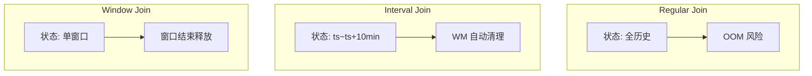

# Flink 双流 Join：Regular vs Interval vs Window — 学习指南

> 配套代码：`FlinkJoinDemoJob` + `FlinkJoinDemoJobTest`  
> 双流：Kafka **曝光流**（`EducationExposureEvent`）+ **点击流**（`EducationClickEvent`）  
> 业务：在线教育 Feed 卡片曝光 → 学员点击课程，归因「曝光后是否转化」

---

## 读前扫盲：三类 Join 本质差在「状态保留多久」

| Join 类型 | 状态保留 | 会不会 OOM |
|-----------|----------|------------|
| **Regular** | 双流全历史 | ⚠️ 无限增长 |
| **Interval** | 仅 `[exposure.ts, exposure.ts + Y]` 区间 | ✅ WM 过界自动清理 |
| **Window** | 仅当前窗口内 | ✅ 窗口结束释放 |

入门先记住：**Regular Join 在无限流上默认危险**——必须 State TTL 或改用 Interval/Window。

---

## Step 1 原理

### ① Regular Join（Inner / Left）

```
曝光流 ──→ MapState(全部历史 exposure)  ←──┐
点击流 ──→ MapState(全部历史 click)   ←──┤ 双向全量匹配
                                          │
新 exposure 到达 → 与 ALL 历史 click join
新 click 到达    → 与 ALL 历史 exposure join
```

- **状态**：两侧 **无限保留**（除非配 State TTL）
- **输出时机**：实时，且会 **回溯** 产生新匹配
- **Changelog**：Left Join 对无匹配侧发 NULL，后续匹配可能发 **retract**（-U/+U）

**本 Demo**：`EducationRegularJoinFunction` + `ListState`，日志 `[REGULAR-JOIN] retainedExposure=N` 单调增。

### ② Interval Join

```
条件（本 Demo）：
  click.ts ∈ [exposure.ts + lowerBound, exposure.ts + upperBound]
  lowerBound = 0     → 点击不能早于曝光
  upperBound = 10min → 曝光后 10 分钟内点击有效

状态清理：
  exposure 在 exposure.ts + upperBound 后由 WM 触发清理
  click 在 click.ts - lowerBound 后清理
```

```java
exposureStream.keyBy(requestId)
    .intervalJoin(clickStream.keyBy(requestId))
    .between(Time.milliseconds(0), Time.minutes(10))
    .process(new EducationIntervalJoinFunction());
```

**本 Demo 探针**：`probe` 模式运行 `IntervalJoinStateProbeFunction`，日志：

```
[INTERVAL_STATE_PROBE] cleanup timer fired retainedExposures=0
```

### ③ Window Join

```
Tumbling 30s EventTime 窗口：
  曝光 ts=+30s、点击 ts=+50s → 同窗口 [0,30)? 需看 epoch 对齐
  仅当两侧事件落在 **同一窗口** 才输出

状态：窗口触发后释放
输出时机：窗口结束（WM ≥ windowEnd）
```

```java
exposureStream.join(clickStream)
    .where(requestId).equalTo(requestId)
    .window(TumblingEventTimeWindows.of(Time.seconds(30)))
    .apply(new EducationWindowJoinFunction());
```

### 三者对比表（验收必背）

| 维度 | Regular Join | Interval Join | Window Join |
|------|--------------|---------------|-------------|
| **状态保留** | 无限（除非 TTL） | `[ts+lower, ts+upper]` | 单窗口内 |
| **适用场景** | 维度表缓慢变化、有界流 | **曝光-点击归因**、订单-支付 30min | 固定周期报表 |
| **输出时机** | 实时 + 历史回溯 | 实时，过界不再匹配 | 窗口关闭时 |
| **状态膨胀** | ⚠️ 极高 | 可控（区间大小） | 低 |
| **乱序** | 需全历史 | 区间内乱序可容忍 | 受 WM+窗口约束 |
| **治理** | **必须 State TTL** | 调 upperBound | 调 window size |



---

## Step 2 实操

### 创建 Topic

```bash
kafka-topics.sh --create --topic test_flink_join_exposure --partitions 2 \
  --bootstrap-server 192.168.1.124:9092
kafka-topics.sh --create --topic test_flink_join_click --partitions 2 \
  --bootstrap-server 192.168.1.124:9092
```

### 启动 Job

```bash
# 推荐：Interval Join（简历场景）
org.example.job.join.FlinkJoinDemoJob interval 10 30 0

# Regular Join — 观察状态膨胀
org.example.job.join.FlinkJoinDemoJob regular 10 30 0

# Window Join
org.example.job.join.FlinkJoinDemoJob window 10 30 0

# 状态探针 — 观察清理
org.example.job.join.FlinkJoinDemoJob probe 10 30 0
```

### 发送测试数据

```bash
mvn test -Dtest=FlinkJoinDemoJobTest#sendJoinDemoEvents
```

### 预期日志

| Phase | 模式 | 预期 |
|-------|------|------|
| REQ001 +3min 点击 | interval | `[INTERVAL-JOIN] delayMs=180000` |
| REQ002 +12min 点击 | interval | 无输出（超 10min） |
| REQ003 同 30s 窗 | window | `[JOIN-OUT] type=WINDOW_JOIN` |
| REQ004 跨窗 | window | 无输出 |
| REQ005 2exp+1clk | regular | 2 条 `[REGULAR-JOIN] retainedExp=2` |
| Phase7 flush | probe | `cleanup timer fired retainedExposures=0` |

---

## Step 3 重点：Regular Join 为何危险

```
Day1: 1 亿曝光 + 5000 万点击 → 两侧 ListState 各 1e8 条
Day7: 状态 TB 级 → RocksDB Compaction 打满 → CK 超时 → OOM

Interval Join 同等流量：
  仅保留 10min 窗口内事件 → 状态大小 ≈ 10min 流量常数
```

**治理手段**：

1. **优先 Interval / Window**，不要用 Regular 做事实双流 Join  
2. Regular 必须 **`StateTtlConfig`**（本 Demo：`regular 10 30 24` = 24h TTL）  
3. SQL Regular Join：`table.exec.state.ttl` 全局 TTL  

---

## Step 4 陷阱

### ① Regular Join 必须配 State TTL

```java
StateTtlConfig ttl = StateTtlConfig.newBuilder(Time.hours(24))
    .setUpdateType(StateTtlConfig.UpdateType.OnCreateAndWrite)
    .build();
descriptor.enableTimeToLive(ttl);
```

无 TTL = 生产事故候选。

### ② Interval Join 边界含义

| 参数 | 含义 |
|------|------|
| `lowerBound = 0` | click 不能早于 exposure |
| `upperBound = 10min` | 曝光后 10min 内点击才算归因 |
| 过大 | 状态保留久、归因窗口宽 |
| 过小 | 弱网延迟点击漏归因 |

### ③ Left Join 与 Retract

SQL Left Join：曝光无点击 → 输出 `(exposure, NULL)`；后续点击到达 → 发 **retract** 旧行 + **upsert** 新行。  
Sink 必须支持 **retract/upsert**（见 D13 SQL 指南），否则下游重复或丢更新。

### ④ Window Join 与 WM

两侧 WM 取 min → 慢流拖住窗口关闭（同 Watermark Demo）。

---

## Step 5 面试话术：为什么 Interval Join + Broadcast State

> **简历重写版（必须扛住追问）：**

我们的场景是 **Feed 曝光 → 点击归因**，只需关联曝光后 **10 分钟内** 的点击。选用 **Interval Join** 而非 Regular Join，因为：

1. **状态可控**：Interval Join 在 WM 过 `exposure.ts + 10min` 后自动清理 buffer；Regular Join 保留全历史，亿级曝光下状态线性膨胀，必须额外 TTL 仍难控峰值。  
2. **语义匹配业务**：归因窗口 = 10min，Interval 边界即产品定义；Regular 会对 7 天前的曝光匹配新点击，产生 **假归因**。  
3. **对比 Window Join**：Window Join 按固定 30s/1min 切，曝光在窗口末尾、点击在下一窗口会 **漏归因**；Interval 按 **每条曝光独立 10min 计时**，更精确。

**Broadcast State** 用于 **维表**（课程/用户标签）广播到全并行度，不是双流事实 Join 的替代——事实流 Join 仍用 Interval/Window。

**加分点**：Flink SQL Join 输出 retract 流，写 Kafka 需 upsert-kafka；写 JDBC 需主键覆盖。

---

## 手写代码对照

| 要求 | 实现 |
|------|------|
| Interval Join 10min | `FlinkJoinDemoJob.buildIntervalJoin` |
| Regular Join + TTL | `EducationRegularJoinFunction` |
| Window Join 30s | `buildWindowJoin` |
| 状态清理观察 | `IntervalJoinStateProbeFunction` + `probe` 模式 |

---

## 测试数据计划

| Phase | 内容 | 验证 |
|-------|------|------|
| 1 | REQ001 曝光 +3min 点击 | Interval 匹配 |
| 2 | REQ002 +12min 点击 | Interval 不匹配 |
| 3~4 | 同窗/跨窗 | Window Join |
| 5 | 2 曝光 +1 点击 | Regular 2 条匹配 |
| 6~7 | probe + flush | 状态清理 |

---

## 验收清单

| # | 验收项 | 方式 |
|---|--------|------|
| ① | 手写 Interval Join | `EducationIntervalJoinFunction` |
| ② | 脱稿讲三者差异 | Step1 对比表 |
| ③ | Regular 膨胀治理 | Step3 + `[REGULAR-JOIN]` 日志 |
| ④ | 面试话术 | Step5 |
| ⑤ | retract/upsert | Step4③ |

---

## Step 7 在线教育典型业务案例

### 案例一：Feed 曝光-点击归因 — Interval Join（本 Demo）

**背景**：App 首页推荐卡片曝光埋点 + 点击进入课程详情。运营看「曝光后 10min 内点击率」。

**为何 Interval 而非 Regular**：

- 只需 10min 归因窗  
- 日活千万，Regular 保留 7 天曝光状态不可接受  
- 产品不接受「昨天曝光匹配今天点击」

**Demo 映射**：Phase1 REQ001；Job `interval 10 30 0`。

---

### 案例二：直播课互动 — Window Join 分钟榜

**背景**：直播间每分钟统计「曝光弹幕引导位 + 点击报名」同分钟转化。

**SQL/DataStream**：

```sql
-- Window Join 语义等价
SELECT * FROM exposure e JOIN click c
ON e.liveRoomId = c.liveRoomId
AND e.window = c.window  -- TUMBLE 1min
```

**为何不用 Interval**：榜单按 **自然分钟** 对齐，Window 更直观。

**Demo 映射**：`window 10 30 0`（Demo 缩小为 30s 窗）。

---

### 案例三：教务订单-支付 — Interval Join vs Regular 选型翻车

**背景**：下单流 JOIN 支付流，支付可能在下单后 **2 小时内** 完成。

| 方案 | 问题 |
|------|------|
| Regular Join | 全天订单常驻状态，大促 OOM |
| Interval 2h | ✅ 状态 ≈ 2h 订单量 |
| Window 5min | 2h 后才支付 → **漏关联** |

**教训**：支付归因用 **Interval（业务 SLA）**；报表汇总再 Window 聚合。

---

## 与相关 Demo 的关系

| Demo | 关系 |
|------|------|
| **FlinkWatermarkDemoJob** | 双流 WM 取 min，影响 Window Join 触发 |
| **FlinkDimJoinDemoJob（D8）** | 维表 Lookup，非双流事实 Join |
| **FlinkSqlDemoJob（D13）** | SQL 版 Interval/Regular Join + retract 语义 |

---

## 参考

- [Interval Join](https://nightlies.apache.org/flink/flink-docs-release-1.14/docs/dev/datastream/operators/joining/#interval-join)
- [Window Join](https://nightlies.apache.org/flink/flink-docs-release-1.14/docs/dev/datastream/operators/joining/#window-join)
- [State TTL](https://nightlies.apache.org/flink/flink-docs-release-1.14/docs/dev/datastream/fault-tolerance/state/#state-time-to-live-ttl)
