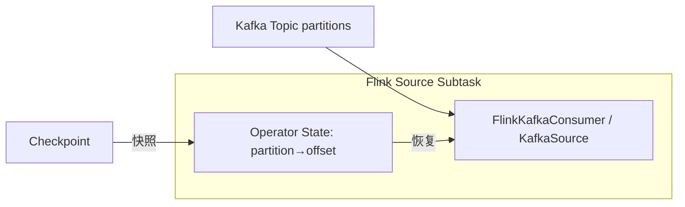

# Flink Kafka 连接器工程化 — 学习指南

> 配套代码：`FlinkKafkaConnectorDemoJob` + `FlinkKafkaConnectorDemoJobTest`  
> 拓扑：`KafkaSource` → 有状态聚合 → `KafkaSink`（在线教育学习心跳）  
> 实现：Flink **1.14** 使用 `FlinkKafkaConsumer` / `FlinkKafkaProducer`；指南含 **1.15+ `KafkaSource`/`KafkaSink`** 等价写法

---

## 读前扫盲：Flink 从 Kafka 到底从哪里恢复？

很多人以为：Flink 作业挂了，重启后会读 Kafka 消费者组的 **committed offset**。

**错。** 对于开启了 Checkpoint 的 Flink 作业：

> **恢复优先使用 Checkpoint / Savepoint 里保存的 Source Operator State（各分区 offset），而不是 `__consumer_offsets`。**

Kafka 消费者组 offset 只在 **冷启动且无 CK** 时，配合 `earliest`/`latest`/`committed` 策略起作用。

---

## Step 1 原理

### ① KafkaSource（消费者组、分区、Offset）



| 机制 | 说明 |
|------|------|
| **消费者组** | `group.id`；分区分配 Range/RoundRobin/Sticky |
| **分区发现** | metadata 刷新感知 **扩分区**（`metadata.max.age.ms`） |
| **Offset 初始化** | `earliest` / `latest` / `committed` / `specific` |
| **Offset 持久化** | **随 Checkpoint 写入** Source Operator State |
| **自动提交** | Flink 场景必须 **`enable.auto.commit=false`** |

**Flink 1.15+ KafkaSource 等价：**

```java
KafkaSource.<String>builder()
    .setBootstrapServers(broker)
    .setTopics(TOPIC_IN)
    .setGroupId("flink-kafka-demo-consumer")
    .setStartingOffsets(OffsetsInitializer.latest())  // earliest / committedOffsets()
    .setValueOnlyDeserializer(new SimpleStringSchema())
    .build();
env.fromSource(source, watermarkStrategy, "KafkaSource");
```

**本 Demo 1.14 实现：** `StudyKafkaSourceFactory` → `FlinkKafkaConsumer` + `StudyKafkaDeserializationSchema`（保留 partition/offset 元数据）。

### ② KafkaSink（至少一次 / 精确一次 / 事务）

| 语义 | 机制 | 本 Demo |
|------|------|---------|
| **AT_LEAST_ONCE** | producer `acks=all`，CK 后无事务 | `at-least-once` |
| **EXACTLY_ONCE** | Kafka 事务 + 2PC（preCommit/commit/abort） | `exactly-once` |
| **NONE** | 无保证 | 未用 |

**Flink 1.15+ KafkaSink 等价：**

```java
KafkaSink.<String>builder()
    .setBootstrapServers(broker)
    .setRecordSerializer(KafkaRecordSerializationSchema.builder()
        .setTopic(TOPIC_OUT)
        .setValueSerializationSchema(new SimpleStringSchema())
        .build())
    .setDeliveryGuarantee(DeliveryGuarantee.EXACTLY_ONCE)
    .setTransactionalIdPrefix("flink-kafka-demo-txn-")
    .build();
stream.sinkTo(kafkaSink);
```

**本 Demo 1.14 实现：** `StudyKafkaSinkFactory` → `FlinkKafkaProducer.Semantic.EXACTLY_ONCE`。

消费端读 EO 写出 topic 需：`--isolation-level read_committed`。

### ③ Kafka 分区与 Flink 并行度

```
Topic 分区数 = Pk，Source 并行度 = Pf

理想：Pk ≈ Pf（或 Pf 为 Pk 整数倍，且理解分配策略）
陷阱：Pf >> Pk → 部分 Source Subtask **无分区、空闲**
```

```
示例：2 分区，并行度 8
  subtask 0 ← p0
  subtask 1 ← p1
  subtask 2~7 ← 空闲 ⚠️
```

单测：`partitionCount_lessThanParallelism_causesIdleSubtasks`

### ④ Offset 提交：Kafka committed vs Flink Checkpoint

| 类型 | 存储位置 | 谁写入 | 何时用于恢复 |
|------|----------|--------|--------------|
| **Kafka committed offset** | `__consumer_offsets` | 原生 consumer `commit` | 冷启动 + `committed` 策略 |
| **Flink Checkpoint offset** | CK 存储中 Source Operator State | Flink CK 快照 | **作业失败恢复（优先）** |
| **Savepoint offset** | SP 路径 | 手动 SP | 发布/迁移恢复 |

Flink Kafka Source **不依赖** auto commit；即使 Kafka 侧 offset 落后，恢复仍以 **CK 内 offset** 为准。

### ⑤ 序列化格式取舍

| 格式 | 优点 | 缺点 | 教育场景 |
|------|------|------|----------|
| **JSON** | 可读、调试快 | 体积大、无强 Schema | Demo / 日志型埋点 |
| **Avro + Schema Registry** | 演进、紧凑 | 依赖 Registry | **生产埋点推荐** |
| **Protobuf** | 性能、跨端 | 变更需协调 | App/SDK 统一协议 |

---

## Step 2 实操对照

| 要求 | 实现 |
|------|------|
| KafkaSource | `StudyKafkaSourceFactory` |
| 有状态处理 | `StudyProgressAggregateFunction` |
| KafkaSink 事务写 | `StudyKafkaSinkFactory` EXACTLY_ONCE |
| partition/offset 日志 | `KafkaSourceOffsetProbeFunction` |
| 消费者组切换 | `group-switch` 场景换 `groupId` |
| 分区<并行度 | `partition-mismatch` P=8 |
| 积压 burst | Test Phase4 + `backlog` 场景 |

### 创建 Topic

```bash
kafka-topics.sh --create --topic test_flink_kafka_in --partitions 4 \
  --bootstrap-server 192.168.1.124:9092
kafka-topics.sh --create --topic test_flink_kafka_out --partitions 4 \
  --bootstrap-server 192.168.1.124:9092
```

### 启动 Job（对比实验）

```bash
# A：正常 at-least-once
org.example.job.kafka.FlinkKafkaConnectorDemoJob normal latest at-least-once 4 hashmap

# B：恢复语义 committed + exactly-once sink
org.example.job.kafka.FlinkKafkaConnectorDemoJob recovery committed exactly-once 2 hashmap

# C：分区不足（topic 仅 2 分区时 P=8 更明显）
org.example.job.kafka.FlinkKafkaConnectorDemoJob partition-mismatch latest at-least-once 8 hashmap

# D：换消费者组
org.example.job.kafka.FlinkKafkaConnectorDemoJob group-switch earliest at-least-once 4 hashmap

# E：积压 + EO
org.example.job.kafka.FlinkKafkaConnectorDemoJob backlog latest exactly-once 4 rocksdb
```

### 发送测试数据

```bash
mvn test -Dtest=FlinkKafkaConnectorDemoJobTest#sendKafkaConnectorDemoEvents
```

### 验证 OUT Topic

```bash
kafka-console-consumer.sh --bootstrap-server 192.168.1.124:9092 \
  --topic test_flink_kafka_out --from-beginning \
  --isolation-level read_committed
```

### 查看 Lag

```bash
kafka-consumer-groups.sh --bootstrap-server 192.168.1.124:9092 \
  --group flink-kafka-demo-consumer --describe
```

---

## Step 3 对比表

| 维度 | KafkaSource Offset（CK 内） | Kafka committed offset | Checkpoint offset | Savepoint 恢复 | 消费者组重置 |
|------|---------------------------|------------------------|-------------------|----------------|--------------|
| **存储** | Flink CK/SP 状态后端 | Kafka 内部 topic | 同 CK Source 状态 | SP 文件 | `__consumer_offsets` 删除/新 group |
| **触发** | 每次成功 CK | 原生 consumer commit | 作业 failover | 手动 `flink run -s` | 新 `group.id` |
| **恢复优先级** | **最高（运行中作业）** | 低 | **最高** | **最高（发布）** | 仅冷启动 |
| **是否精确对齐 Flink 状态** | ✅ | ❌ 可能落后 | ✅ | ✅ | ❌ |
| **典型用途** | 故障恢复 | 非 Flink 工具消费 | 故障恢复 | 版本发布 | 重跑历史（慎用） |

**一句话**：Flink 作业恢复 = **Checkpoint/Savepoint 里的分区 offset + 算子状态**，不是简单读 Kafka 消费者组。

---

## Step 4 调优 / 陷阱

### ① 分区数 < 并行度 → Subtask 空闲

加并行度不增加消费分区数 → **无效扩容**。  
**对策**：`Pk ≥ Source 并行度`，或接受空闲后只调有瓶颈的算子 P。

### ② Topic 扩分区风险

- **好处**：提高上游写入与消费并行上限  
- **风险**：key 路由变化、新分区 **无历史状态**、与下游 Keyed State 压力重新分布  
- **操作**：低峰 `kafka-topics --alter --partitions N`；Flink 动态发现；观察 Lag 与 rebalance

### ③ 重平衡（Rebalance）期间消费停顿

换 group、扩分区、增 consumer 会 **rebalance** → 短暂 **STILL** / 无消费。  
**对策**：低峰操作；`partition.assignment.strategy=StickyAssignor` 减迁移。

### ④ 积压恢复不能只盲目加 P

```
有效吞吐 ≤ min(分区消费速度, 处理速度, Sink 写出速度)
```

单测：`backlogRecovery_notOnlyIncreaseParallelism`  
**对策**：提 Sink 批量、异步 IO、修反压；必要时临时降采样。

### ⑤ 事务写：transactional.id / 超时 / CK 间隔

| 参数 | 建议 |
|------|------|
| `transactional.id` 前缀 | 每作业唯一；`KafkaSink.setTransactionalIdPrefix` |
| `transaction.timeout.ms` | **> 3 × checkpoint 间隔**（Demo：15min vs 10s CK） |
| `read_committed` | 下游消费 EO topic 必须 |
| CK 失败 | 事务 **abort**，未 commit 消息不可见 |

### ⑥ 序列化格式变更

JSON 改字段：靠下游兼容；Avro 靠 **Schema Registry 演进规则**（add optional / default）。

### ⑦ Watermark 与 Kafka 空闲分区

某分区长期无数据 → WM 不推进（见 Watermark Demo）。扩分区后新分区也可能短暂无数据。

---

## Step 5 面试话术

> **我们如何设计 Kafka Topic 分区、Flink Source 并行度、Checkpoint Offset 管理和 KafkaSink 事务写，保证失败恢复、积压追赶和版本发布时不丢不重？**

1. **Topic 规划**：埋点 topic `Pk` 与峰值 QPS、Key 分布匹配；`Pk ≈ Source P`，避免空闲 Subtask。  
2. **Source**：`enable.auto.commit=false`；Offset **随 CK 走**；恢复靠 CK/SP，不靠手动 commit。  
3. **有状态中间层**：CK 同时快照 **Kafka offset + MapState**，保证端到端一致语义基础。  
4. **KafkaSink EO**：`EXACTLY_ONCE` + `transactional.id` 前缀 + CK 间隔小于事务超时；下游 `read_committed`。  
5. **积压**：先看 Lag + BackPressure——全链路反压则优化 Sink，不是加 Source P。  
6. **发布**：Savepoint 恢复（见 Savepoint Demo），不是换 group 从头消费。

---

## 测试数据计划

| Phase | 内容 | 目的 |
|-------|------|------|
| 1 | 6 学员均匀心跳 | 正常 partition/offset 日志 |
| 2 | 指定 p0/p1 写入 | Subtask 与分区映射 |
| 3 | 重复 eventId | at-least-once / 幂等讨论 |
| 4 | 20 条 burst | 积压追赶 |
| 5 | 热点课 C_LIVE_888 | key 分区路由 |

---

## 预期日志样例

**Source 元数据**

```
[KAFKA-SRC] subtask=1/4 partition=2 offset=158 kafkaTs=... | CK 恢复时以 Checkpoint Source 状态为准
```

**有状态聚合**

```
[EO-AGG] subtask=0 StudySummary{student=S5001 course=C_JAVA total=60s ...}
```

**Sink 写出**

```
[KAFKA-SINK-IN] subtask=0 student=S5001 → 2024-02-14|S5001|C_JAVA
Kafka写出预览> {"studentId":"S5001","courseId":"C_JAVA","totalWatchSec":60,...}
```

---

## 验收清单

| # | 验收项 | 验证方式 |
|---|--------|----------|
| ① | 手写 KafkaSource/Sink | `StudyKafkaSourceFactory` / `StudyKafkaSinkFactory` |
| ② | 解释 Offset 真实来源 | Step3 表 + 单测 `offsetRestore_*` |
| ③ | 分区数、P、消费者组、CK 关系 | Step1③ + `partition-mismatch` 实验 |
| ④ | 积压与扩分区风险 | Step4 + Phase4/5 |
| ⑤ | EO 事务与 read_committed | `exactly-once` 场景 + console consumer |

---

## Step 7 在线教育典型业务案例（Kafka 三角）

> **学习埋点入湖** / **报表双写 Kafka** / **大促积压追赶**  
> 与 Exactly-Once、Savepoint、Runtime 指南互补。

---

### 案例一：App 学习埋点入湖 — Topic 分区与消费者组

#### 业务背景

学员观看、答题、签到埋点写入 `study_behavior`（JSON），Flink 实时累计时长写 Doris，并 **KafkaSink** 到 `study_summary` 供数仓订阅。

#### 架构

```
App → Kafka(study_behavior, 32p, key=studentId)
    → Flink P=32, group=flink-study-summary
    → MapState 累计 → KafkaSink(EO) → study_summary
```

#### 配置要点

```java
// Source：Offset 随 CK，禁止 auto commit
props.setProperty("enable.auto.commit", "false");
// Sink：EO + transactional.id 前缀唯一
Semantic.EXACTLY_ONCE
// 下游数仓消费 study_summary
// isolation.level=read_committed
```

#### 故障恢复

```
作业 14:00 失败 @ CK#120（p5 offset=98234）
14:05 重启 → 从 CK#120 的 Source 状态恢复
≠ 读 __consumer_offsets（可能停在 97000）
```

**与 Demo 映射**：`recovery` 场景；单测 `offsetRestore_checkpointSourceStateTakesPriority`。

#### 踩坑

1. **换 group 重跑**会重复消费，除非从 earliest 且下游幂等。  
2. **32 分区降到 8 P** 可以跑，但 **8 分区升到 32 P** 有 24 个空闲 Subtask。  
3. **心得**：教育埋点 `studentId` 作 key，分区数按日活峰值规划，**一次规划、少扩分区**。

---

### 案例二：报表双写 — KafkaSink Exactly-Once 与 read_committed

#### 业务背景

实时报表既要写 ClickHouse，又要 **Kafka 双写** 给推荐系统；推荐要求 **不丢不重**。

#### 事务写要点

| 项 | 配置 |
|----|------|
| Delivery | `EXACTLY_ONCE` |
| transactional.id | `flink-study-reco-{jobId}-` 前缀 |
| CK 间隔 | 30s |
| transaction.timeout.ms | ≥ 15min |
| 推荐 consumer | `isolation.level=read_committed` |

#### 与 at-least-once 对比

```
at-least-once：CK 失败后可能重复写出 → 推荐侧需幂等
exactly-once：事务未 commit 不可见 → 推荐只读 committed
```

**与 Demo 映射**：`normal at-least-once` vs `exactly-once`；验证 OUT topic 用 `read_committed`。

---

### 案例三：开学大促积压 — Lag 与 BackPressure 联合排查

#### 业务背景

开学日报名 + 试看，埋点 QPS ×10，`study_behavior` Lag 到 5 千万。

#### 误诊 vs 正诊

| 现象 | 误诊 | 正诊 |
|------|------|------|
| Lag 高、UI 全绿 | 加 Source P | 可能消费够、**Sink 写 CH 慢** → 全链路反压 |
| Lag 高、Source busy 低 | 加机器 | **P < Pk** 或 GC，看 Subtask 利用率 |
| 仅部分分区 Lag 高 | 全局扩容 | **热点 key** 或分区数据倾斜 |

#### 正确追赶步骤

1. `kafka-consumer-groups --describe` 看 **分区级 Lag**  
2. Flink UI **BackPressure** + `busy/backpressured`  
3. 若 Sink 瓶颈：**批量写、异步、扩 Sink P**  
4. 若消费瓶颈：**P 提到 ≤ Pk**，勿超过分区数  
5. 大状态：**Savepoint 低峰重启**，勿随意换 consumer group  

**与 Demo 映射**：`backlog` 场景 + Phase4 burst；单测 `lagAndBackpressure_jointDiagnosis`。

#### 扩分区教训

```
原 16 分区 → 急扩 64 分区
→ rebalance 5min + 新分区无历史 → 下游窗口状态不均
→ 部分学员时长暂时不准
```

**心得**：教育大促 **提前 2 周** 调 P 与 Pk；扩分区在 **最低峰** 且配合 Savepoint。

---

### 三案例对照总表

| 案例 | Kafka 主题 | 核心配置 | Demo 对应 |
|------|------------|----------|-----------|
| 埋点入湖 | Offset@CK | auto.commit=false | `recovery` |
| 双写推荐 | EO 事务 | read_committed | `exactly-once` |
| 大促积压 | Lag+反压 | 不盲目加 P | `backlog` |

---

## 加分点速查

| 主题 | 要点 |
|------|------|
| **KafkaSink EO** | 2PC + Kafka 事务；CK 完成才 commit |
| **transactional.id 前缀** | 作业级唯一，避免跨作业冲突 |
| **read_committed** | EO 下游必读 |
| **动态分区发现** | metadata 刷新感知新分区 |
| **空闲分区与 WM** | 见 Watermark Demo |
| **Schema Registry** | Avro 演进；教育生产埋点推荐 |
| **Lag + BackPressure** | 联合诊断，区分 Source/Sink 瓶颈 |

---

## 与其他 Demo 的关系

| Demo | 关系 |
|------|------|
| **Exactly-Once** | 2PC 原理；本 Demo 落到 **真实 KafkaSink** |
| **Checkpoint** | barrier 快照含 **Source offset** |
| **Savepoint** | 发布恢复 offset 锚点 |
| **Runtime** | Lag 高时的反压与 P 无效 |
| **Watermark** | Kafka 空闲分区拖 WM |

建议顺序：**Kafka Connector → Checkpoint → Exactly-Once → Savepoint**。
