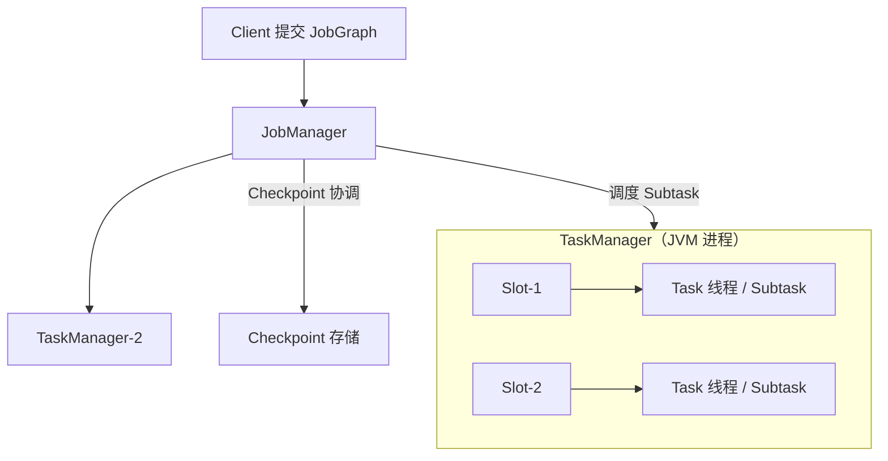

# Flink 资源模型与运行时架构 — 学习指南

> 配套代码：`FlinkRuntimeDemoJob` + `FlinkRuntimeDemoJobTest`  
> 拓扑：Kafka Source → Map/Probe → **keyBy** → Tumbling 10s Window/Aggregate → **慢 Sink**  
> 数据源：在线教育学习心跳 `StateDemoEvent`

---

## 读前扫盲：逻辑并行度 ≠ 物理资源

提交 Flink 作业后，并不是「并行度 = 4」就自动有 4 台机器各跑 1 份。运行时由 **JobManager 调度**、**TaskManager 提供 Slot**、**Subtask 占用 Slot 线程** 协同执行。

入门先记住三个结论：

| 结论 | 为什么重要 |
|------|------------|
| **并行度 P** 决定每个算子有多少 **Subtask** | P 是逻辑并发，不是 TM 台数 |
| **Slot** 是 TM 上的资源容器，多个 Subtask 可 **Slot 共享** | P > 总 Slot 时会排队或资源争用 |
| **反压从下游往上传播** | Sink 慢 → Buffer 满 → 上游 blocked，加 Source 并行度无效 |

性能问题若只会「加机器 / 加并行度」，往往治不了 **慢 Sink、热点 key、Buffer 不足、Managed Memory 不够**。

---

## Step 1 原理：JM / TM / Slot / Subtask / Chain / Memory

### ① 运行时架构（提交到执行）



| 组件 | 职责 |
|------|------|
| **JobManager** | 作业调度、Checkpoint/Savepoint 协调、故障恢复、监控 |
| **TaskManager** | 执行 Subtask、管理 Slot、本地 Network/Managed Memory |
| **Slot** | TM 内资源单元；默认 **Slot Sharing** 允许多算子 Subtask 共享 |
| **Task** | 执行线程；**Operator Chain** 时多算子合并到同一 Task |
| **Subtask** | 某算子的第 i 个并行实例（i ∈ [0, P-1]） |

### ② Slot 与并行度

```
集群：2 TM × 4 Slot = 8 Slot
作业并行度 P = 4

→ 每个算子 4 个 Subtask，默认 Slot Sharing 下约需 4 Slot 同时跑满
→ 若 P = 16 而仅 8 Slot：Subtask 竞争 Slot，逻辑并行度↑ 物理吞吐未必↑
```

### ③ Operator Chain

```
无 keyBy 时：Source → Map → Filter 可 chain 成 1 个 Task（减少序列化/网络）

keyBy / shuffle 打断 chain：
  [Source+Map+Probe] ──shuffle──→ [Window+Agg] ──→ [Sink]
         Task×P                      Task×P          Task×P
```

| | Chain 开启 | Chain 禁用 (`nochain`) |
|--|-----------|------------------------|
| Task 数 | **少** | **多** |
| 网络开销 | 低 | 高 |
| 排查隔离 | 难（算子同线程） | 易（逐算子 Metrics） |

本 Demo：`backpressure 4 300 chain` vs `backpressure 4 300 nochain` 对照。

### ④ Network Buffer 与数据交换

```
上游 Subtask 输出 → ResultPartition → Network Buffer
                                      ↓
下游 Subtask 输入 ← InputGate       ← 网络/本地缓冲

Buffer 满 → 下游读不动 → 上游不能写 → backpressured↑ busy↓
```

加分点指标（Flink UI / Metrics）：

| 指标 | 含义 |
|------|------|
| **busyTimeMsPerSecond** | 线程在处理数据 |
| **backPressuredTimeMsPerSecond** | 线程被下游反压阻塞 |
| **idleTimeMsPerSecond** | 空闲等待数据 |

### ⑤ Managed Memory

与 **Network Memory** 分离，供 RocksDB block cache、Window 排序、Batch Join 等使用。

```
RocksDB 状态后端 → block cache 吃 Managed Memory
大窗口 / 排序    → Managed Memory
Network Shuffle  → Network Memory（不是 Managed）
```

本 Demo `managed 4 200 chain rocksdb` 场景：`TaskManagerOptions.MANAGED_MEMORY_SIZE=256m`。

---

## Step 2 手写代码对照

| 要求 | 实现 |
|------|------|
| Source→Map→keyBy→Window→Sink | `FlinkRuntimeDemoJob.buildPipeline()` |
| 调整并行度 | 启动参数第 2 位：`backpressure 4 300 ...` |
| 禁用 Operator Chain | `nochain` → `env.disableOperatorChaining()` |
| 慢 Sink 反压 | `SlowRuntimeSinkFunction(sleepMs)` |
| Subtask 分布日志 | `RuntimeSubtaskProbeFunction` |
| Slot 隔离 | `hotslot` → Sink `.slotSharingGroup("heavy-sink")` |
| 拓扑估算 | `RuntimeTopologyEstimator` |

### 关键代码

```java
// 并行度
env.setParallelism(4);

// 禁用 Operator Chain（对照实验）
env.disableOperatorChaining();

// keyBy 后 Window + 增量聚合
stream.keyBy(StateDemoEvent::getStudentId)
    .window(TumblingEventTimeWindows.of(Time.seconds(10)))
    .aggregate(new StudyWatchWindowAggregator(), new RuntimeWindowLogFunction());

// 慢 Sink — 反压根源
.addSink(new SlowRuntimeSinkFunction(300, "default"));

// Sink 独立 Slot Sharing Group
.addSink(...).slotSharingGroup("heavy-sink");
```

---

## Step 3 对比表

| 概念 | 是什么 | 与并行的关系 | 本 Demo 如何观察 |
|------|--------|--------------|------------------|
| **并行度 P** | 每算子 Subtask 数 | 逻辑并发 | 启动参数 `4` |
| **Slot** | TM 资源槽 | 物理并发上限 | 本地 4 TM slot ≈ parallelism |
| **Task** | 执行线程 | Chain 合并多算子 | `chain` vs `nochain` Task 数 |
| **Subtask** | 算子第 i 实例 | = P（每算子） | `[RT-PROBE] subtask=i/P` |
| **Operator Chain** | 算子链接成单 Task | 减 Task 数 | `RuntimeTopologyEstimator` |
| **Network Shuffle** | keyBy 后数据交换 | ResultPartition/InputGate | keyBy 后 WM 窗口 |
| **Managed Memory** | RocksDB/排序等 | 与 P 间接相关 | `managed` + rocksdb |

### 逻辑并行度 vs 物理资源

```
错误直觉：Source P=32 → 吞吐 ×8
正确理解：Sink 250ms/条 → 吞吐上限 ≈ 4 rec/s/subtask × Sink_P

若瓶颈在 Sink：应扩 Sink 并行度、异步化、批量写 — 而非 Source P=32
```

单测：`sourceParallelism_cannotFixSlowSink`

---

## Step 4 调优 / 陷阱

### ① 盲目加 Source 并行度不能解决慢 Sink

反压链路：**Sink 慢 → Buffer 满 → Window → Source 全链路 backpressured**。  
UI 上 Source 也是红色，但根因在 Sink。

**对策**：优化 Sink（批量、异步、连接池）、扩 Sink P、限速 Source。

### ② keyBy 后热点 key 不能靠 rebalance 消除

`keyBy(courseId)` 后相同 courseId **必定**落同一 subtask。  
`C_LIVE_888` 大班课 50% 流量 → 单 subtask 过热，其他 subtask 空闲。

**对策**：两阶段聚合（见 Stability Demo）、自定义 key 加盐、业务拆流。

### ③ Slot 共享带来资源争用

默认 Slot Sharing：同一 Slot 内 CPU/内存被多个 Subtask 共享。  
重 Sink + 重 Window 同 Slot → GC/CPU 争用。

**对策**：`slotSharingGroup` 隔离重算子（本 Demo `hotslot` 场景）。

### ④ Operator Chain 取舍

| 开 Chain | 关 Chain |
|----------|----------|
| 性能好、延迟低 | 易逐算子定位瓶颈 |
| 算子 Metrics 混在一起 | Task 多、网络多 |

生产：默认开；排查反压时临时 `disableOperatorChaining()` 或 `startNewChain()`。

### ⑤ Network Buffer 不足放大反压

`taskmanager.memory.network` 过小 → 正常流量也易 backpressured。  
本 Demo 在 backpressure 场景收紧到 32~64mb **仅用于放大现象**。

### ⑥ RocksDB / 排序 / Join 关注 Managed Memory

Managed Memory 不足 → RocksDB cache 小 → 读盘多 → **看起来像「CPU 高、反压」**。  
与 Network 反压不同，需看 **RocksDB metrics** 和 **managed memory used**。

---

## Step 5 面试话术

> **我们如何通过 Web UI 和 Metrics 定位反压，而不是简单加机器？**

1. **UI → BackPressure**：找到第一个 **HIGH** 算子（通常是 Sink 或外部 IO）。  
2. **Metrics 三角**：`busy` / `backpressured` / `idle` — 下游 busy、上游 backpressured。  
3. **区分并行度不足 vs Slot 不足**：P 已高但 `numRecordsOut` 仍低 + Slot 满 → 加 TM/Slot；P 低且 CPU 闲 → 可适当提 P。  
4. **区分 Sink 慢 vs 热点 key**：Sink 慢则所有上游均匀反压；热点则 **单 subtask** `numRecordsIn` 极高。  
5. **区分 Network vs Managed Memory**：Shuffle 反压看 Network；RocksDB 状态大、排序慢看 Managed Memory / block cache。  
6. **简历改写**：不说「加并行度优化」；说「UI 定位 Sink 瓶颈 + 异步批量写，热点课两阶段聚合，RocksDB 调 Managed Memory」。

---

## 测试数据发送计划

| Phase | 内容 | 目的 |
|-------|------|------|
| 1 | 8 学员均匀心跳 | 观察 Subtask 均匀 |
| 2 | 12 条 burst | 慢 Sink 反压 |
| 3 | 25 条热点课 + 5 条普通 | skew 场景 |
| 4 | flush 高 ts | 触发窗口 |

---

## 运行步骤

### 0. 创建 Topic

```bash
kafka-topics.sh --create --topic test_flink_runtime --partitions 4 \
  --bootstrap-server 192.168.1.124:9092
```

### 1. 启动 Job（对比实验）

```bash
# A：反压 + Chain
org.example.job.runtime.FlinkRuntimeDemoJob backpressure 4 300 chain hashmap

# B：反压 + 禁用 Chain（更多 Task）
org.example.job.runtime.FlinkRuntimeDemoJob backpressure 4 300 nochain hashmap

# C：Sink 独立 SlotSharingGroup
org.example.job.runtime.FlinkRuntimeDemoJob hotslot 4 300 chain hashmap

# D：热点 key（keyBy courseId）
org.example.job.runtime.FlinkRuntimeDemoJob skew 4 0 chain hashmap

# E：Managed Memory + RocksDB
org.example.job.runtime.FlinkRuntimeDemoJob managed 4 200 chain rocksdb
```

### 2. 发送测试数据

```bash
mvn test -Dtest=FlinkRuntimeDemoJobTest#sendRuntimeDemoEvents
```

### 3. 本地单测

```bash
mvn test -Dtest=FlinkRuntimeDemoJobTest
```

### 4. Flink UI 观察

**http://localhost:8081**

| 路径 | 看什么 |
|------|--------|
| Job → Task Managers | Slot 数、每个 TM 的 Subtask |
| Job → BackPressure | 红/黄/绿链路 |
| 某算子 → Metrics | busy / backpressured / idle |
| Job → Task Managers → Subtasks | 各 subtask 记录数是否均匀 |

---

## 预期日志样例

**Subtask 探测**

```
[RT-PROBE] subtask=2/4 task=SubtaskProbe records=5 student=S4002 course=C_COURSE_2 tag=uniform
```

**慢 Sink 反压**

```
[RT-SINK] subtask=0/4 sleep=300ms slotGroup=default | 瓶颈在此：加 Source 并行度无效
[RT-SINK-OUT] subtask=0 processed=3 | [RT-WINDOW-FIRED] ...
```

**窗口触发**

```
[RT-WINDOW-FIRED] subtask=1 key=S4001 | 窗口=[... ~ ...) | count=3 sum=90s
```

---

## 验收清单

| # | 验收项 | 验证方式 |
|---|--------|----------|
| ① | 能画 Runtime 架构图 | Step1 JM/TM/Slot 图 |
| ② | 讲清 JM、TM、Slot、Task、Subtask | Step1 表格 + 单测 `runtimeModel_*` |
| ③ | 反压从下游传播到上游 | Step1④ + 单测 `backpressure_propagates*` |
| ④ | 根据现象判断调优方向 | Step4 + Step5 话术 |
| ⑤ | Chain / Slot / Buffer / Managed Memory | 对比实验 + 单测 |

---

## Step 7 在线教育典型业务案例（Runtime 三角）

> 三个场景分别对应：**慢 Sink 反压** / **直播热点 key** / **RocksDB + 晚高峰资源**。  
> 与《FlinkStabilityDemoGuide》互补：那边偏重启与倾斜解法，这边偏 **运行时资源模型**。

---

### 案例一：学习报表写 Doris 慢 — Sink 反压拖死全链路

#### 业务背景

学习心跳 Job：`Kafka → keyBy(studentId) → 1min 窗口 → JDBC 写 Doris`。  
晚高峰 20 万学员同时在线，Doris 批量导入变慢，**Sink 300ms/条**。

#### 故障现象

```
Flink UI：Kafka Source、Window 算子 BackPressure 全红
运维反应：把 Kafka Source 并行度 8 → 32
结果：吞吐不变，Doris CPU 更高，作业更卡
```

#### 根因

```
Sink 吞吐上限 = Sink_P / avg_write_latency
Source P↑ 只让 Buffer 积压更快，不提高 Sink 写能力
```

**与 Demo 映射**：`backpressure 4 300 chain` + Phase2 burst；单测 `sourceParallelism_cannotFixSlowSink`。

#### 正确对策

| 手段 | 说明 |
|------|------|
| 异步批量 Sink | buffer 500 条 / 2s flush |
| 扩 Sink 并行度 | 写不同 Doris 分区 |
| 限速 Source | `maxParallelism` + 动态反压 |
| 隔离 Slot | 重 Sink 独立 `slotSharingGroup`（`hotslot` 场景） |

#### 运维 Metrics

| 指标 | 异常信号 |
|------|----------|
| Sink `busyTimeMsPerSecond` | 持续 > 900 |
| 上游 `backPressuredTimeMsPerSecond` | 与 Sink busy 同步升高 |
| `buffers.inPoolUsage` | 接近 100% |

---

### 案例二：大班直播课热点 — 并行度从 8 提到 32 仍卡

#### 业务背景

`keyBy(liveRoomId)` 统计直播间每分钟互动。  
`LIVE_888` 万人大班占平台 40% 互动量。

#### 故障现象

```
并行度 8 → 32：subtask-3 的 numRecordsIn 是其他的 20 倍
CPU：subtask-3 100%，subtask-0/1/2/... 15%
```

#### 根因

keyBy 后 **相同 liveRoomId 必落同一 subtask**；rebalance 只在 keyBy **之前**有效。

**与 Demo 映射**：`skew 4 0` + Phase3 `C_LIVE_888`；单测 `hotKey_parallelismDoesNotSpreadLoad`。

#### 对策

1. 两阶段聚合（local salt + global merge）— 见 Stability Demo  
2. 业务拆流：超大班独立 Job  
3. **不要**再盲目加 P

---

### 案例三：RocksDB 状态 + 日窗口 — Managed Memory 不足像「反压」

#### 业务背景

家长日报：`keyBy(studentId)` + Tumbling 1day + RocksDB 存 `(courseId→分钟数)` MapState。  
状态 200GB，TM Managed Memory 仅 128MB。

#### 故障现象

```
无外部 Sink 慢
UI：Window 算子 busy 高，部分 subtask backpressured
RocksDB：block cache hit rate < 30%，磁盘读放大
```

#### 根因

Managed Memory 不足 → RocksDB cache 小 → 状态读写慢 → **算子线程 busy**，形似反压但根因在 **状态后端内存**。

**与 Demo 映射**：`managed 4 200 chain rocksdb`；单测 `managedMemory_rocksdbNeedsBudget`。

#### 对策

| 项 | 建议 |
|----|------|
| `taskmanager.memory.managed.size` | 状态大时 1~4GB+ |
| RocksDB 增量 CK | 减 IO 峰值 |
| 区分诊断 | Network 反压 vs RocksDB 慢查 Metrics |

---

### 三案例对照总表

| 案例 | Runtime 主题 | 误诊 | 正确手段 | Demo 对应 |
|------|--------------|------|----------|-----------|
| Doris 慢写 | **Sink 反压** | 加 Source P | 批量异步 Sink | `backpressure` |
| 万人直播 | **热点 key** | 加 P | 两阶段 / 拆流 | `skew` |
| RocksDB 日报 | **Managed Memory** | 加 Network | 调 managed + cache | `managed` |

---

## 加分点速查

| 主题 | 要点 |
|------|------|
| **Slot Sharing Group** | 默认共享；重 Sink 可隔离 `heavy-sink` |
| **Operator Chain** | 性能 vs 可观测性；keyBy 打断 |
| **busy/backpressured/idle** | 反压三角 Metrics |
| **ResultPartition / InputGate** | Shuffle 数据交换端点 |
| **Managed Memory vs RocksDB cache** | 状态大时必须一起规划 |
| **生产隔离** | 重作业独立 TM、独立 Slot Group、独立 Kafka 集群 |

---

## 与 Stability Demo 的关系

| Stability Demo | Runtime Demo |
|----------------|--------------|
| 重启策略 + 反压 + 倾斜 + 两阶段**解法** | JM/TM/Slot/Chain/**资源模型** |
| `NaiveCourseAggregateFunction` | Window Aggregate + 慢 Sink |
| 偏「怎么办」 | 偏「为什么」 |

建议：**先 Runtime（本指南）建立资源模型 → 再 Stability 学解法**。
