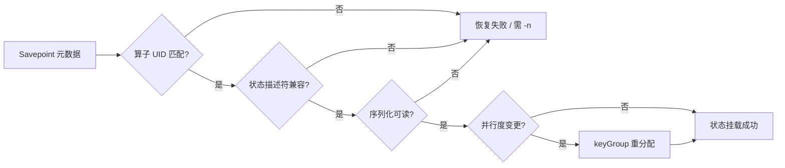

# Flink 上线发布与恢复：Savepoint vs Checkpoint — 学习指南

> 配套代码：`FlinkSavepointDemoJob` + `FlinkSavepointDemoJobTest`  
> 数据源：复用 `StateDemoEvent`（在线教育学习心跳）  
> 有状态算子：`CourseCreditAccumulateFunction`（MapState 按 courseId 累计有效观看秒数）

---

## 读前扫盲：状态恢复靠的不只是「有没有快照」

Flink 有状态作业在运行中会不断修改 **Keyed State / Operator State**（聚合中间结果、Kafka offset 等）。  
宕机恢复、版本升级、并行度调整、异常回滚，本质都是一个问题：

> **新作业的算子拓扑，能否把旧快照里的状态正确挂回去？**

能挂载取决于四要素共同匹配：

| 要素 | 作用 |
|------|------|
| **算子 UID** | 标识「这是同一个逻辑算子」 |
| **状态描述符名称 + 类型** | 标识「状态 schema 是否兼容」 |
| **序列化器** | 决定字节能否反序列化 |
| **并行度 / maxParallelism** | 决定 Keyed State 如何重分配到 subtask |

**Checkpoint** 和 **Savepoint** 都是一致性快照，但**用途完全不同**——生产发布不能只依赖 Checkpoint，下文 Step 3 有对比表。

---

## Step 1 原理

### ① Checkpoint — 自动、面向故障恢复

```
JobManager 按间隔注入 barrier → 各算子对齐后快照 → 写入 checkpoint 存储
                                                      ↓
                              Flink 默认只保留最近 N 个，过期自动清理
```

| 特点 | 说明 |
|------|------|
| 触发 | **自动**（`enableCheckpointing`） |
| 目的 | TaskManager 宕机、JM failover 后**恢复到最近成功 CK** |
| 生命周期 | **Flink 管理**，路径在 `state.checkpoints.dir`，通常短期 |
| 发布 | ❌ 不推荐直接拿 CK 路径做灰度发布（路径不稳定、可能被清理） |

本 Demo 已开启 `enableCheckpointing(10s)` + `RETAIN_ON_CANCELLATION`，便于在 UI 对比 CK 与 SP。

### ② Savepoint — 手动、面向发布/迁移/回滚

```
运维：flink stop --savepointPath <dir> <jobId>
      或 flink savepoint <jobId> <dir>
                ↓
      生成可长期保留的快照（HDFS/S3/本地 file://）
                ↓
新版本：flink run -s <savepoint-path> job.jar [args]
```

| 特点 | 说明 |
|------|------|
| 触发 | **手动**（运维可控时机：低峰、状态稳定后） |
| 目的 | **版本升级、集群迁移、异常回滚、并行度调整** |
| 生命周期 | **可长期保留**，与 Flink 集群解耦 |
| 发布 | ✅ 生产灰度升级标准路径 |

### ③ 状态恢复本质



---

## Step 2 手写代码对照

| 要求 | 实现 |
|------|------|
| 显式算子 UID | `SavepointOperatorUids` + `.uid(...)` |
| 有状态累计 | `CourseCreditAccumulateFunction` MapState |
| V1→V2 兼容升级 | 同 UID + 同 `STATE_DESCRIPTOR_NAME`，V2 仅加 promotion 逻辑 |
| UID 变更复现失败 | 启动 `broken-uid 2 hashmap` |
| 并行度调整 | 启动参数第 2 位：`v2 4 hashmap` |
| CLI 模板 | `SavepointCliCommands` |

### 关键代码

```java
// ① 有状态算子必须固定 UID（首次上线前设定，后续禁止随意改）
eventStream
    .keyBy(StateDemoEvent::getStudentId)
    .process(new CourseCreditAccumulateFunction(jobVersion))
    .uid(SavepointOperatorUids.COURSE_CREDIT_ACCUMULATOR)  // 发布生命线
    .name("MapState-CourseCredit");

// ② 状态描述符名称稳定（V1/V2 共用）
new MapStateDescriptor<>("sp-demo-course-credit-map", String.class, Long.class);

// ③ 集群从 Savepoint 恢复
// flink run -s file:///tmp/flink-savepoint-demo/savepoints/savepoint-xxx job.jar v2 4 hashmap
```

### 发布实操流程（集群）

```bash
# 0. 打包
mvn package -DskipTests

# 1. 启动 V1 基线
flink run target/flink_code-1.0-SNAPSHOT.jar \
  org.example.job.savepoint.FlinkSavepointDemoJob v1 2 hashmap

# 2. 发送测试数据 Phase1~2
mvn test -Dtest=FlinkSavepointDemoJobTest#sendSavepointDemoEvents

# 3. 低峰期：Savepoint 并停止（记下返回的 savepoint 路径）
flink stop --savepointPath file:///tmp/flink-savepoint-demo/savepoints \
  <JOB_ID>

# 4. 兼容升级 V2 + 并行度 2→4
flink run -s file:///tmp/flink-savepoint-demo/savepoints/savepoint-xxx \
  target/flink_code-1.0-SNAPSHOT.jar \
  org.example.job.savepoint.FlinkSavepointDemoJob v2 4 hashmap

# 5. 继续发送 Phase3~4，观察 total 延续 + promotion 加成

# 6. 异常回滚（旧 JAR 必须仍能读 Savepoint）
flink run -s file:///tmp/flink-savepoint-demo/savepoints/savepoint-xxx \
  target/flink_code-1.0-SNAPSHOT.jar \
  org.example.job.savepoint.FlinkSavepointDemoJob v1 2 hashmap
```

### 本地 IDE 启动（不含 Savepoint 自动挂载）

```bash
# 基线 V1
org.example.job.savepoint.FlinkSavepointDemoJob v1 2 hashmap

# 复现 UID 错误
org.example.job.savepoint.FlinkSavepointDemoJob broken-uid 2 hashmap
```

> 本地 `createLocalEnvironment` 不会自动从 `-s` 恢复；**Savepoint 恢复请在 Flink 集群用 `flink run -s`** 完成。

---

## Step 3 对比：Checkpoint vs Savepoint

| 维度 | Checkpoint | Savepoint |
|------|------------|-----------|
| **触发方式** | 自动（间隔 / barrier） | 手动（`stop --savepointPath` / `savepoint`） |
| **主要场景** | **故障恢复**（TM 挂、JM failover） | **发布 / 迁移 / 回滚 / 扩缩并行度** |
| **生命周期** | Flink 管理，默认保留最近 N 个 | 可长期保留在 HDFS/S3，与集群解耦 |
| **路径稳定性** | 自动生成，可能随 CK 清理消失 | 运维指定目录，路径明确 |
| **是否适合灰度发布** | ❌ 不推荐 | ✅ 标准做法 |
| **是否含 in-flight 数据** | Aligned：否；Unaligned：是 | 否（标准 Savepoint 语义） |
| **取消作业后** | 外部化 CK 可保留（本 Demo 已开） | 专为停止+迁移设计 |

### 自动恢复 vs 人工发布

| | 自动恢复（Checkpoint） | 人工发布（Savepoint） |
|--|---------------------|---------------------|
| 谁触发 | Flink 定时 | 运维在**业务低峰** |
| 恢复命令 | 自动从最近 CK 拉起 | `flink run -s <path>` |
| 版本 | 同版本 Job 重启 | **可换 JAR 版本** |
| 风险 | CK 失败可回退上一成功 CK | 需确认 Savepoint 与新版拓扑兼容 |

### 为什么生产发布不能只依赖 Checkpoint？

1. **路径与生命周期不可控**：CK 目录由 Flink 管理，清理策略可能导致旧快照消失。  
2. **发布时机不可控**：自动 CK 可能在高峰、反压、状态不一致窗口触发。  
3. **版本迁移语义弱**：Savepoint 明确表达「以此为基准迁移到新拓扑」；CK 更适合「同作业崩溃续跑」。  
4. **回滚需已知良好点**：Savepoint 是运维确认的**黄金快照**；CK 是连续的、未必适合作为发布锚点。

---

## Step 4 调优 / 陷阱

### ① 发布前必须显式设置 operator UID

```java
// ❌ 未设 UID：Flink 自动生成，改代码后拓扑变化 → Savepoint 无法匹配
// ✅ 首次上线前固定
.uid("sp-demo-course-credit-accumulator")
```

**复现**：`broken-uid 2 hashmap` 使用 `sp-demo-course-credit-accumulator-v2-wrong`  
单测：`FlinkSavepointDemoJobTest#operatorUid_mustMatchForRestore`

### ② 状态字段和类型变更要考虑序列化兼容

| 变更类型 | 风险 | 建议 |
|----------|------|------|
| 仅改 `process` 逻辑（不改 schema） | ✅ 低（本 Demo V1→V2） | 同描述符名 + 同类型 |
| 改 `Long` → POJO | ❌ 高 | **State Processor API** 迁移状态 |
| 改描述符名称 | ❌ 高 | 视为新状态，旧状态丢失 |
| 增删 state 字段（POJO） | 中 | Avro/Protobuf 演进规则 |

单测：`stateTypeChange_breaksRestore`

### ③ 并行度变更依赖 keyGroup 重分配

```
maxParallelism 不变时：2 → 4 可恢复，Keyed State 按 hash(key) 重分配
maxParallelism 变小：可能直接失败
```

单测：`parallelismRescale_redistributesKeyGroups`

### ④ 删除或重命名有状态算子 → 恢复失败

- 严格模式：直接报错退出  
- `flink run -n`：`allowNonRestoredState`，**丢弃**无法匹配的算子状态  

单测：`allowNonRestoredState_whenStatefulOperatorRemoved`

### ⑤ 无状态 vs 有状态算子变更风险

| 算子类型 | 典型变更 | Savepoint 风险 |
|----------|----------|----------------|
| **无状态** map / filter | 改过滤规则、字段映射 | **低**（快照中无其状态） |
| **有状态** process / aggregate | 改 UID、改 state 类型 | **高**（直接失败或脏数据） |
| **Source** Kafka | 改 connector 版本 | Operator State（offset）需兼容 |

### ⑥ 回滚版本必须确认旧代码能读 Savepoint

回滚不是「有路径就能跑」——旧 JAR 的状态类、描述符、序列化器必须与 Savepoint 一致。  
若 V2 已做**不兼容** schema 变更，回滚 V1 会失败。

### 加分点

| 主题 | 说明 |
|------|------|
| **operator UID** | 发布生命线；见 `SavepointOperatorUids` |
| **状态序列化兼容** | POJO 增删字段用 `@TypeInfo` / Avro |
| **State Processor API** | 离线读写 Savepoint，做状态迁移或审计 |
| **allowNonRestoredState (`-n`)** | 删算子时强制启动，状态丢弃 |
| **无状态 vs 有状态发布风险** | 见 Step4⑤ |

---

## Step 5 面试话术

> **我们如何用 Savepoint 做 Flink 有状态作业的灰度升级、异常回滚和并行度调整？**

1. **灰度升级**：低峰 `flink stop --savepointPath` 打黄金快照 → 部署 V2 JAR → `flink run -s` 恢复；**算子 UID 与状态描述符保持不变**，仅改业务逻辑（如本 Demo V2 promotion 加成）。  
2. **并行度调整**：同一 Savepoint，`flink run -s` 时传新并行度（如 2→4），Keyed State 自动 keyGroup 重分配。  
3. **异常回滚**：保留升级前 Savepoint；V2 出问题时 `flink run -s` 启旧 JAR——前提是**未做不兼容 state 变更**。  
4. **相比直接重启**：直接重启丢状态，业务从 0 累计；**学分/时长/去重** 全错。  
5. **相比只依赖 Checkpoint**：CK 适合**故障续跑**；Savepoint 适合**可控发布**——路径稳定、时机人工、可跨版本、可长期归档。

---

## 测试数据发送计划

| Phase | 内容 | 目的 |
|-------|------|------|
| 1 | 学员 A/B 多课程心跳 | 积累 MapState |
| 2 | 继续累计 + 等待 | **手动 Savepoint** 时机 |
| 3 | 恢复后累计 + promotion | V2 逻辑 + 状态延续 |
| 4 | 多新学员批量 | 观察 SP 体积 / 并行度分布 |

---

## 运行步骤

### 0. 创建 Topic

```bash
kafka-topics.sh --create --topic test_flink_savepoint --partitions 4 \
  --bootstrap-server 192.168.1.124:9092
kafka-topics.sh --describe --topic test_flink_savepoint --bootstrap-server 192.168.1.124:9092
```

### 1. 启动 Job

```bash
# V1 基线（并行度 2）
org.example.job.savepoint.FlinkSavepointDemoJob v1 2 hashmap
```

### 2. 发送测试数据

```bash
mvn test -Dtest=FlinkSavepointDemoJobTest#sendSavepointDemoEvents
```

### 3. 本地单测（无需 Kafka）

```bash
mvn test -Dtest=FlinkSavepointDemoJobTest
```

---

## 预期日志样例

**Phase1 状态积累（V1）**

```
学分累计> [SP-STATE] subtask=0 version=V1 studentId=S30001 courseId=C_JAVA | raw=120s credited=120s → total=120s | mapEntries=1 | tag=baseline
学分累计> [SP-STATE] subtask=0 version=V1 studentId=S30001 courseId=C_PYTHON | raw=90s credited=90s → total=90s | mapEntries=2 | tag=baseline
```

**Savepoint 恢复后延续（V2）**

```
学分累计> [SP-STATE] subtask=1 version=V2 studentId=S30001 courseId=C_JAVA | raw=50s credited=50s → total=200s | ... | tag=post-restore
# total=200s = Savepoint 中 150s + 恢复后 50s
```

**V2 promotion 加成**

```
学分累计> [SP-STATE] ... version=V2 ... raw=100s credited=110s → total=310s | tag=promotion-summer
```

**UID 错误（broken-uid 模式 — 集群恢复时会失败）**

```
累计算子 UID: sp-demo-course-credit-accumulator-v2-wrong
# flink run -s 时报 Cannot map old state for operator ...
```

---

## 验收清单

| # | 验收项 | 验证方式 |
|---|--------|----------|
| ① | 能手动触发 Savepoint | Step2 `flink stop --savepointPath` |
| ② | 能从指定 Savepoint 恢复 | `flink run -s <path> ... v2 4` |
| ③ | 脱稿讲清 CK vs SP 差异 | Step3 对比表 |
| ④ | 说明升级/兼容/并行度/回滚失败原因 | Step4 + 单测 |
| ⑤ | 能讲 operator UID 与 allowNonRestoredState | Step4 加分点 + 单测 |

---

## Step 7 在线教育典型业务案例（Savepoint 三角）

> 以下三个场景是在线教育平台里 **Savepoint 发布/恢复最高发** 的业务，分别对应：  
> **灰度升级** / **日切扩缩容** / **异常回滚**。  
> 与《FlinkCheckpointDemoGuide》互补：那边讲 **CK barrier 与超时**，这边讲 **何时必须用 Savepoint**。

---

### 案例一：学习时长累计 Job 灰度升级 — V1→V2 兼容发布

#### 业务背景

平台按学员 `studentId` 维护 **各课程有效观看秒数**（MapState），驱动：
- 家长端「今日学习时长」
- 班主任「完课进度」
- 结业证书「是否达标 1800 分钟」

产品要求在促销季对 **标记为 promotion 的课程** 额外 +10% 学分，需发版 V2。

#### 数据模型

```json
{"eventId":"e01","studentId":"S10001","courseId":"C_JAVA","eventType":"video_progress",
 "watchSec":120,"ts":1717654321000,"tag":"baseline"}
```

#### 发布方案（Savepoint 标准路径）

```bash
# 1. 周五低峰：打 Savepoint 并停作业
flink stop --savepointPath hdfs:///flink/savepoints/study-credit \
  <study-credit-job-id>

# 2. 周一低峰：V2 恢复（UID 不变、MapState 描述符不变）
flink run -s hdfs:///flink/savepoints/study-credit/savepoint-xxx \
  study-credit-job.jar v2 32 rocksdb

# 3. 验证 promotion 事件 credited > raw
```

#### 为什么不用 Checkpoint 直接发版？

| 维度 | 分析 |
|------|------|
| **时机** | 促销切换需在**零学习高峰**打点，CK 自动触发不可控 |
| **路径** | Savepoint 路径写入发布工单；CK 路径随清理策略变化 |
| **回滚** | 保留同一 Savepoint，V2 异常可 `flink run -s` 回 V1 |

**与 Demo 映射**：`CourseCreditAccumulateFunction` V1/V2；`FlinkSavepointDemoJobTest` Phase3 `promotion-summer`。

#### 踩坑与心得

1. **首次上线就必须设 UID**——事后补 UID 等于新算子，历史 Savepoint 全废。  
2. **V2 只改逻辑不改 schema** 是最安全升级；改 `Long→POJO` 必须 State Processor 迁移。  
3. **心得**：教育累计类作业是 Savepoint 发布课的最佳教具——产品一眼能看懂「时长不能断档」。

---

### 案例二：晚高峰扩容 — 并行度 16→32 + Savepoint

#### 业务背景

晚间 19:00–21:00 录播课集中学习，「实时学习排行」Job 反压，需把并行度从 16 扩到 32。  
Keyed State（学员排行中间分）必须**无损迁移**。

#### 故障现象（若直接 kill 重启）

```
作业重启无 Savepoint → MapState 清空
→ 排行榜从 0 重算 → 学员看到「学习分钟数骤降」→ 客诉
```

#### 正确操作

```bash
flink stop --savepointPath hdfs:///flink/savepoints/ranking <jobId>
flink run -s hdfs:///flink/savepoints/ranking/savepoint-xxx \
  ranking-job.jar --parallelism 32
```

#### 三要素

| 维度 | 分析 |
|------|------|
| **maxParallelism** | 首次部署时设足够大（如 128），否则后续无法扩到 32 |
| **keyGroup 重分配** | 同一 studentId 可能落到新 subtask，**总量不变** |
| **Kafka offset** | Source Operator State 一并恢复，**不重复消费**（配合 exactly-once） |

**与 Demo 映射**：`v1 2` → `v2 4`；单测 `parallelismRescale_redistributesKeyGroups`。

#### 运维与告警

| 监控项 | 说明 |
|--------|------|
| Savepoint 耗时 | 状态 >50GB 时 stop 可能 10min+，需低峰操作 |
| 恢复后 lag | 扩并行度后短暂 lag 正常，应逐步下降 |
| 排行数值连续性 | 恢复前后同一学员 total 应衔接（对照 Demo `post-restore` 日志） |

---

### 案例三：升级失败紧急回滚 — 不兼容变更的教训

#### 业务背景

测验防作弊 Job 用 `ValueState` 记录「当前题作答次数」。  
工程师在 V2 把 state 从 `Integer` 改成 `AnswerStat` POJO，**未做迁移**直接 `flink run -s`。

#### 故障现象

```
org.apache.flink.runtime.client.JobExecutionException:
  Cannot map old state for operator ...
State backend does not contain state for operator-uid ...
```

#### 根因

| 失败原因 | 本案例 |
|----------|--------|
| 状态类型不兼容 | `Integer` → `AnswerStat` |
| 回滚 V1 仍失败 | 若 V2 已用新 schema 写入部分 SP，旧 JAR 也读不了 |
| 误删算子 | 需 `-n` 才能启，但**状态已丢** |

#### 正确做法

1. **兼容升级**：POJO 只加 nullable 字段；或双写新 state 名 + State Processor 迁移。  
2. **发布前在预发** `flink run -s` 验证。  
3. **保留升级前三份 Savepoint**（HDFS 归档），回滚用**升级前**那份。

**与 Demo 映射**：单测 `stateTypeChange_breaksRestore`、`allowNonRestoredState_whenStatefulOperatorRemoved`。

#### 心得

教育场景 **防作弊 / 去重 / 学分** 状态丢一次就是教学事故；**Savepoint 是发布安全带，不是可选优化**。

---

### 三案例对照总表

| 案例 | Savepoint 主题 | 典型症状 | 核心操作 | 与 Demo 对应 |
|------|----------------|----------|----------|--------------|
| 学习时长灰度升级 | **兼容发布** | 发版后时长归零 | `stop --savepointPath` + `run -s` | V1→V2、`promotion` |
| 晚高峰扩容 | **并行度调整** | 重启后排行清零 | 同 SP 改 parallelism | `v2 4 hashmap` |
| 升级失败回滚 | **不兼容陷阱** | 恢复 Job 提交失败 | 预发验证 + 保留旧 SP | `stateTypeChange` 单测 |

### 与《FlinkCheckpointDemoGuide》的关系

| Checkpoint 指南 | Savepoint 指南 |
|-----------------|----------------|
| barrier 对齐、反压、CK 超时 | **何时打 SP、如何用 SP 发版** |
| 故障后自动从最近 CK 恢复 | **人工选择黄金快照点** |
| Unaligned CK 取舍 | Savepoint 标准不含 in-flight |

两者结合：**CK 保运行连续性，SP 保发布可控性**。

---

## 与 State / Checkpoint Demo 的关系

| State Demo | Checkpoint Demo | Savepoint Demo |
|------------|-----------------|----------------|
| 讲 State 类型与 Backend | 讲 barrier 与 CK 超时 | 讲 **发布/回滚/并行度** |
| 无 UID 强调 | 无 Savepoint 流程 | **UID + SP CLI 全流程** |
| 本地可跑 | 本地 + UI | 本地积累状态 + **集群 SP 恢复** |

建议学习顺序：**State → Checkpoint → Savepoint**。
