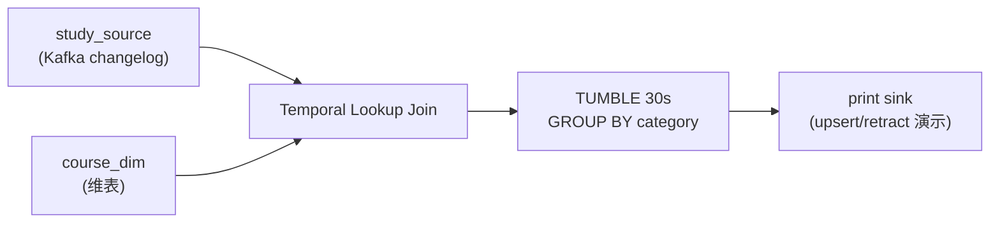

# Flink SQL 深化 — 学习指南

> 配套代码：`FlinkSqlDemoJob` + `FlinkSqlDemoJobTest`  
> 数据源：Kafka `StateDemoEvent` JSON（学习心跳）  
> SQL 能力：**TUMBLE 窗口聚合**（D1）+ **FOR SYSTEM_TIME AS OF 维表 Join**（D8）

---

## 读前扫盲：动态表与流表二象性

同一份 Flink SQL 代码，改一个 mode 就能在 **批** 与 **流** 之间切换——这就是「流表二象性」：

| 视角 | 含义 |
|------|------|
| **动态表** | 表内容随时间变化；每条 INSERT/UPDATE 是对表的修订 |
| **Changelog 流** | 底层每条 SQL 算子输出的是带 `+I/-U/+U/-D` 的变更流 |
| **Sink 语义** | append / retract / upsert 三种，决定下游能否接 |

本 Demo 在 **Streaming Mode** 下跑通：Kafka 源表 + 维表 Lookup + TUMBLE 窗口 + print sink。

---

## Step 1 原理

### ① Changelog 模式：append vs retract vs upsert

```
append  流：只有 +I（插入）           → 普通 Kafka topic / 日志
retract 流：+I 后可能有 -U/+U/-D    → 窗口聚合结果更新、GROUP BY 变更
upsert  流：主键级 +U（覆盖）         → upsert-kafka / JDBC PK / CK ReplacingMergeTree
```

| 算子 | 典型 Changelog | Sink 要求 |
|------|----------------|-----------|
| 过滤 / 投影 | append | append 即可 |
| **GROUP BY 窗口** | **retract**（窗口内更新） | upsert 或 retract 兼容 |
| **带主键聚合** | upsert | upsert-kafka / PK 表 |

**加分点**：SQL 窗口聚合默认 retract；直接写 append-only Kafka 可能丢更新或重复。

### ② 窗口：TUMBLE / HOP / SESSION

本 Demo 对应 D1 的 **TUMBLE 30s**（DataStream 里是 5s，SQL 用 30s 便于观察）：

```sql
GROUP BY courseId, TUMBLE(event_time, INTERVAL '30' SECOND)
```

| 窗口 | SQL | 教育场景 |
|------|-----|----------|
| TUMBLE | `TUMBLE(ts, INTERVAL '30' SECOND)` | 每 30s 课程学习时长 |
| HOP | `HOP(ts, INTERVAL '10' SECOND, INTERVAL '1' MINUTE)` | 滑动 1min/10s 互动趋势 |
| SESSION | `SESSION(ts, INTERVAL '5' MINUTE)` | 连续学习会话 gap=5min |

Watermark 在源表 DDL 声明：

```sql
event_time AS TO_TIMESTAMP_LTZ(ts, 3),
WATERMARK FOR event_time AS event_time - INTERVAL '5' SECOND
```

### ③ 维表 Join：FOR SYSTEM_TIME AS OF

对应 D8 Async I/O Lookup，SQL 写法：

```sql
FROM study_source AS s
LEFT JOIN course_dim FOR SYSTEM_TIME AS OF s.proctime AS d
ON s.courseId = d.course_id
```

| 概念 | 说明 |
|------|------|
| `proctime` | 处理时间，维表 Join 常用 |
| `FOR SYSTEM_TIME AS OF` | 取「当前时刻」维表快照（Lookup） |
| `course_dim` | 本 Demo 用 `fromCollection` 模拟 JDBC/Redis 维表 |

生产替换为：

```sql
CREATE TABLE course_dim (...) WITH (
  'connector' = 'jdbc',
  'lookup.cache.max-rows' = '10000',
  'lookup.cache.ttl' = '60s'
  ...
)
```

### ④ 架构图（full 场景）



---

## Step 2 实操：跑通 SQL 窗口 + 维表 Join

### 创建 Topic

```bash
kafka-topics.sh --create --topic test_flink_sql_study --partitions 2 \
  --bootstrap-server 192.168.1.124:9092
```

### 启动 Job

```bash
# 一体化：Join + TUMBLE（推荐）
org.example.job.sql.FlinkSqlDemoJob full 30 true

# 仅窗口（对应 D1）
org.example.job.sql.FlinkSqlDemoJob window 30 false

# 仅维表 Join（对应 D8）
org.example.job.sql.FlinkSqlDemoJob lookup 30 true
```

启动时会打印 **`[SQL-EXPLAIN]`** 执行计划。

### 发送测试数据

```bash
mvn test -Dtest=FlinkSqlDemoJobTest#sendSqlDemoEvents
```

### 预期输出（print sink）

```
# lookup 场景
+I[LOOKUP, S80001, C_JAVA, Java 零基础直播课, 编程, 30, ...]

# window 场景（同 30s 窗口 C_JAVA: 30+20=50）
+I[WINDOW, null, C_JAVA, null, null, null, 50, 2, window_start, window_end, null]

# full 场景（按 category 汇总）
+I[FULL, null, null, null, 编程, null, 50, 2, ...]
```

---

## Step 3 对比：Flink SQL vs DataStream

| 维度 | Flink SQL | DataStream API |
|------|-----------|----------------|
| **开发效率** | 高：声明式 SQL，窗口/Join 一行 | 低：手写 Window/Trigger/State |
| **优化器** | 自动：mini-batch、local-global、filter pushdown | 需手动两阶段聚合等 |
| **状态可控** | 弱：state TTL 全局 `table.exec.state.ttl` | 强：细粒度 StateDescriptor |
| **复杂逻辑** | 弱：复杂 CEP/自定义 Timer 受限 | 强：ProcessFunction 任意逻辑 |
| **维表 Join** | `FOR SYSTEM_TIME` + JDBC lookup 内建 | AsyncFunction + 自管缓存 |
| **调试** | EXPLAIN 看计划；状态间接 | 直接读 state、CK 日志 |
| **适用** | 标准 ETL、报表、Lookup 报表 | 复杂状态机、特殊 Trigger |

### 本仓库 Demo 映射

| 需求 | DataStream Demo | SQL Demo |
|------|-----------------|----------|
| 滚动窗口 sum | `FlinkWindowDemoJob` | `scenario=window` |
| 维表 Lookup | `FlinkDimJoinDemoJob` | `scenario=lookup` |
| 组合 | 需多个算子串联 | `scenario=full` 一条 SQL |

---

## Step 4 陷阱

### ① State TTL：`table.exec.state.ttl` 全局生效

```java
tEnv.getConfig().getConfiguration().setString("table.exec.state.ttl", "1 h");
```

- SQL **无法**像 DataStream 那样 per-state TTL  
- 过大 → 状态膨胀 OOM；过小 → 窗口/Join 中途丢状态

### ② Retract 流对 Sink 的要求

```
GROUP BY TUMBLE → 窗口内结果可能更新 → 产生 -U/+U
→ 写 Kafka append topic 会乱序/重复
→ 应使用 upsert-kafka 或支持 retract 的 Sink
```

### ③ mini-batch 优化

```properties
table.exec.mini-batch.enabled=true
table.exec.mini-batch.allow-latency=5 s
table.exec.mini-batch.size=5000
```

| 效果 | 代价 |
|------|------|
| 微批合并 reduce shuffle | 延迟增加 ~allow-latency |
| 吞吐提升 | 窗口输出晚几秒 |

配合 **local-global**：

```properties
table.optimizer.agg-phase-strategy=TWO_PHASE
```

与 DataStream 两阶段聚合同原理，优化器自动插入。

### ④ EXPLAIN 看什么

启动 Job 时 `[SQL-EXPLAIN]` 关注：

- `GroupAggregate` / `WindowAggregate` — 窗口聚合  
- `LookupJoin` / `TemporalJoin` — 维表  
- `Exchange` hash/partition — shuffle 是否合理  

---

## Step 5 面试话术：什么场景用 SQL，什么下沉 DataStream

> **问：Flink SQL 和 DataStream 怎么选？**

**优先 SQL 的场景**  
标准实时数仓链路：Kafka 入 → 维表 Lookup → TUMBLE/HOP 窗口聚合 → upsert Sink。团队以 SQL 为主、需要 EXPLAIN 调 mini-batch/local-global、快速上线报表类需求（学习时长、订单 GMV、渠道转化）。

**下沉 DataStream 的场景**  
业务逻辑复杂：自定义 Trigger/Evictor、KeyedProcessFunction 多 timer、复杂 CEP、Async I/O 需精细 capacity/超时/降级、状态结构必须精确控制且 per-state TTL 不同、与外部系统深度耦合的 2PC Sink 定制。

**收尾**  
很多生产项目是 **SQL 做 80% 标准 ETL + DataStream UDF/Connector 扩展 20%**；本 Demo 的 full 场景就是 SQL 替代「DimJoin + Window 串联」的范例。

---

## 手写代码对照

| 要求 | 实现 |
|------|------|
| Kafka 源 + Watermark | `SqlDemoStatements.createStudySourceDdl` |
| TUMBLE 窗口 | `tumbleWindowAgg(windowSec)` |
| 维表 Lookup Join | `temporalLookupJoin()` + `CourseDimRegistrar` |
| Join + 窗口一体 | `lookupThenTumbleWindow` |
| state TTL / mini-batch | `SqlDemoConfigurator.applyTableConfig` |
| EXPLAIN | `FlinkSqlDemoJob` 启动时 `tEnv.explainSql` |

---

## 测试数据计划

| Phase | 内容 | 目的 |
|-------|------|------|
| 1 | 4 课程均匀心跳 | 基线 |
| 2 | 同窗口 C_JAVA +20s | TUMBLE 累加 50 |
| 3 | C_UNKNOWN | Lookup NULL |
| 4 | 跨 30s 窗口 | WM 触发关闭 |
| 5 | flush | 推进 watermark |

---

## 验收清单

| # | 验收项 | 验证方式 |
|---|--------|----------|
| ① | 跑通 SQL 窗口 + 维表 Join | `full 30 true` + Test 发数 |
| ② | 讲清 append/retract/upsert | Step1① |
| ③ | 讲 SQL vs DataStream 取舍 | Step3 表 + Step5 |
| ④ | 知 state TTL / mini-batch 陷阱 | Step4 |
| ⑤ | EXPLAIN 看计划 | 启动日志 `[SQL-EXPLAIN]` |

---

## Step 7 在线教育典型业务案例（Flink SQL 三角）

> 三个高频 SQL 落地场景：**学习报表** / **订单 enrich** / **直播大屏**。  
> 与 DataStream Demo 互补：那边教「怎么手写」，这边教「怎么一条 SQL 交付」。

---

### 案例一：课程学习时长 TUMBLE 日报 — SQL 替代 Window Job

#### 业务背景

家长端「过去 30 分钟学了多久」：Kafka 心跳 → **TUMBLE 30min** 按 `courseId` SUM(`watchSec`)。

#### SQL（本 Demo 缩小为 30s）

```sql
SELECT courseId, SUM(watchSec), TUMBLE_START(...), TUMBLE_END(...)
FROM study_source
WHERE eventType = 'video_progress'
GROUP BY courseId, TUMBLE(event_time, INTERVAL '30' MINUTE)
```

#### 为什么用 SQL

| 维度 | 分析 |
|------|------|
| 开发 | 标准 GROUP BY 窗口，DataStream 需 20+ 行 |
| 优化 | 优化器自动 mini-batch + TWO_PHASE |
| 运维 | EXPLAIN 看 shuffle；改窗口只改 INTERVAL |

**Demo 映射**：`scenario=window`，Phase2 同窗口 C_JAVA 累加 50s。

---

### 案例二：订单/报名流 enrich 课程维表 — Lookup Join

#### 业务背景

报名事件只有 `courseId`，报表需要 **课程名、品类、价格带**。维表在 MySQL `dim_course`，10 万 QPS 需 lookup cache。

#### SQL

```sql
SELECT o.studentId, o.courseId, d.course_name, d.category, o.pay_amount
FROM enroll_stream o
LEFT JOIN dim_course FOR SYSTEM_TIME AS OF o.proctime AS d
ON o.courseId = d.course_id
```

#### 生产 JDBC 配置要点

```sql
'lookup.cache.max-rows' = '10000',
'lookup.cache.ttl' = '60s'
```

**Demo 映射**：`scenario=lookup`；`C_UNKNOWN` → LEFT JOIN NULL（Phase3）。

#### 心得

SQL Lookup 适合 **标准星型模型**；需 Async 精细降级时仍用 `FlinkDimJoinDemoJob` DataStream。

---

### 案例三：品类维度 GMV 滚动大屏 — Join + 窗口一体化

#### 业务背景

实时大屏：按 **品类**（编程/K12/考研）展示过去 5 分钟 GMV。  
需先 Join 商品维表取 `category`，再 HOP/TUMBLE 聚合——`full` 场景一条 SQL。

#### 架构

```
Kafka 订单 → Lookup 商品维 → TUMBLE 5min SUM(amount) GROUP BY category → Redis/Doris
```

#### 与 DataStream 对比

| DataStream | SQL full |
|------------|----------|
| Async Join UDF → keyBy → window → aggregate | 单 INSERT SELECT |
| 状态分散多算子 | 优化器统一 plan |

**Demo 映射**：`scenario=full`，按 `category` 汇总 `total_watch`。

#### 踩坑

- retract 流写 Redis 需 upsert 语义（key=category+window_end）  
- `table.exec.state.ttl` 要大于窗口最大乱序 + 窗口长度  

---

## 与相关 Demo 的关系

| Demo | 侧重点 |
|------|--------|
| **FlinkWindowDemoJob（D1）** | DataStream 三种窗口手写 |
| **FlinkDimJoinDemoJob（D8）** | Async I/O + Guava 缓存 |
| **FlinkSqlDemoJob（本文）** | SQL 声明式等价 + 优化器 |
| **FlinkStabilityDemoJob（D12）** | local-global 与 SQL TWO_PHASE 同源 |

---

## 参考

- Flink 1.14：[Streaming Aggregation](https://nightlies.apache.org/flink/flink-docs-release-1.14/docs/dev/table/sql/queries/window-agg/)
- [Temporal Table Join](https://nightlies.apache.org/flink/flink-docs-release-1.14/docs/dev/table/sql/queries/joins/#temporal-joins)
- 配置：[Table API Configuration](https://nightlies.apache.org/flink/flink-docs-release-1.14/docs/dev/table/config/)
