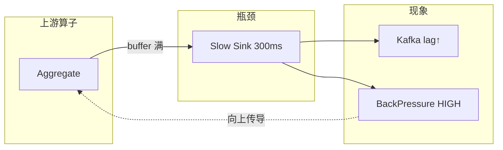
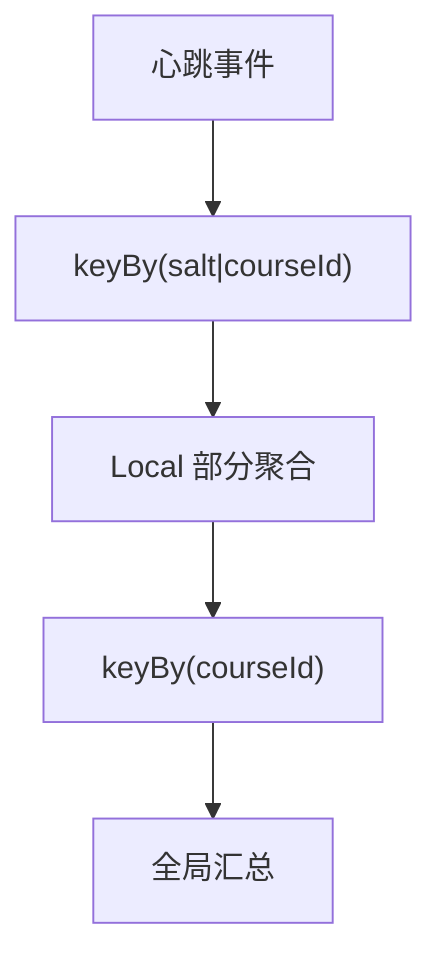

# Flink 重启、反压、数据倾斜串讲 — 学习指南

> 配套代码：`FlinkStabilityDemoJob` + `FlinkStabilityDemoJobTest`  
> 数据源：复用 `StateDemoEvent`（在线教育学习心跳）  
> 三大场景：**反压** / **数据倾斜** / **两阶段聚合治理**

---

## 读前扫盲：作业「慢/不稳」通常不是单一原因

线上 Flink 作业变慢或频繁重启，排查时切忌「先加并行度」。本 Demo 把三类最高频问题串成一套方法论：

| 类别 | 典型症状 | 本 Demo 怎么复现 |
|------|----------|------------------|
| **重启** | Job 反复 FAILED → RESTARTING | 配置 fixed-delay / failure-rate，配合 CK 恢复 |
| **反压** | 吞吐下降、lag 增大 | `SlowBackpressureSinkFunction(300ms)` |
| **倾斜** | 某 subtask CPU/records 远高于 peers | 热点课程 `C_LIVE_888` burst |

入门先记住三个结论：

| 结论 | 为什么重要 |
|------|------------|
| 重启策略决定「多快重试、会不会风暴」 | 与 CK 恢复配合，决定故障后数据一致性 |
| 反压是 **下游慢向上游传导** | UI 第一个 HIGH 算子 ≈ 瓶颈位置 |
| keyBy 后倾斜 **无法靠 rebalance 解决** | 必须两阶段聚合 / 热点拆分 / 改 key 设计 |

---

## Step 1 原理：重启 × 反压 × 倾斜

### ① 重启策略与 Checkpoint 恢复

```
作业失败
    │
    ├─ fixed-delay：等 10s → 重启 → 从最近成功 CK 加载状态 + Kafka offset
    ├─ failure-rate：5 分钟内失败 ≤3 次，否则 Job 最终 FAILED（防重启风暴）
    └─ exponential-delay：1s → 2s → 4s … 退避（外部依赖抖动时友好）

CK 恢复关系：
  成功 CK#N 的状态快照 + Source offset
       → 重启后等价于「在 CK#N 时刻继续跑」
  无 CK / CK 全失败 → 可能丢状态或只能从 savepoint 恢复
```

| 策略 | 适用 | 风险 |
|------|------|------|
| fixed-delay | 偶发 TM 挂、可预期恢复 | 外部永久故障 → 无意义重试 |
| failure-rate | 生产默认，防重启风暴 | 阈值过小 → 真故障时过早 FAILED |
| exponential-delay | Kafka/DB 短暂不可用 | 退避过长 → 恢复慢 |

**本 Demo 配置**：`StabilityConfigurator.configureRestartStrategy()`

### ② 反压产生链路

```
慢 Sink (300ms/条)
    → TaskManager 输出 ResultPartition buffer 满
    → 上游 Netty 写阻塞 (backPressured)
    → 再上游算子 output buffer 满
    → 直到 Source 拉取变慢 / Kafka lag 增大

UI 定位：
  Job → BackPressure 页：OK / LOW / HIGH
  第一个 HIGH 的算子 = 瓶颈（或其直接下游）
```



**Metrics 辅助**：

| 指标 | 含义 |
|------|------|
| `busyTimeMsPerSecond` | 算子线程忙碌程度，瓶颈处接近 1000 |
| `backPressuredTimeMsPerSecond` | 被下游堵住的时间 |
| `numRecordsInPerSecond` | 各 subtask 入流量对比（倾斜排查） |

### ③ 数据倾斜：热 key 打满单 subtask

```
keyBy(courseId)  parallelism=4

  C_MATH    ──→ subtask-1  (500 records/s)
  C_ENG     ──→ subtask-2  (480 records/s)
  C_LIVE_888 ──→ subtask-0  (8000 records/s)  ← 热点 ⚠️
  C_PYTHON  ──→ subtask-3  (520 records/s)

hash(courseId) % 4 固定映射 → 热点 key 无法被 rebalance 打散
```

**加分点**：倾斜发生在 **keyBy 之后**，对已分区数据做 `rebalance()` 无效——数据不会重新按 key 分配。

---

## Step 2 实操：Web UI + 本 Demo 日志

### 创建 Topic

```bash
kafka-topics.sh --create --topic test_flink_stability --partitions 4 \
  --bootstrap-server 192.168.1.124:9092
```

### 启动 Job（三组对比实验）

```bash
# 实验 A：反压（慢 Sink 300ms）
org.example.job.stability.FlinkStabilityDemoJob backpressure fixed 300 0 hashmap

# 实验 B：倾斜（朴素 keyBy courseId）
org.example.job.stability.FlinkStabilityDemoJob skew fixed 0 8 hashmap

# 实验 C：两阶段聚合治理
org.example.job.stability.FlinkStabilityDemoJob twophase fixed 0 8 hashmap
```

### 发送测试数据

```bash
mvn test -Dtest=FlinkStabilityDemoJobTest#sendStabilityDemoEvents
```

### UI 排查步骤

1. **http://localhost:8081** → 选中 Job → **BackPressure**  
   - 反压模式：SlowSink 算子应 HIGH，上游 Aggregate 逐级 LOW→HIGH  
2. **Metrics** → 选中算子 → 对比各 subtask `busyTimeMsPerSecond`、`numRecordsInPerSecond`  
   - 倾斜模式：`C_LIVE_888` 所在 subtask 显著偏高  
3. **Exceptions / Checkpoints**  
   - 重启模式：观察失败原因与 CK 是否成功

### 日志关键字

| 场景 | 日志 |
|------|------|
| 负载探测 | `[LOAD-PROBE] subtask=N records=...` |
| 倾斜 | `[SKEW-NAIVE] hotKey=YES⚠️` |
| 两阶段 | `[2PHASE-LOCAL]` → `[2PHASE-GLOBAL]` |
| 反压 | `[BP-SINK] sleep=300ms` |

---

## Step 3 治理手段

### 反压治理

| 手段 | 说明 | 本 Demo 对应 |
|------|------|--------------|
| 优化 Sink | 批量写、异步 IO、连接池 | 降低 `slowSinkMs` 参数 |
| 扩 Sink 并行度 | 仅当 Sink 可并行（如 Kafka 多分区） | 无效于单 JDBC 连接 |
| 异步化 | AsyncFunction 查维表 | 见 DimJoin Demo |
| 背压定位后上游减负 | 预聚合、过滤脏数据 | 两阶段/local combiner |

### 倾斜治理

| 手段 | 原理 | 代码 |
|------|------|------|
| **两阶段聚合** | local：`keyBy(salt+key)`  partial → global：`keyBy(key)` merge | `LocalSaltedAggregateFunction` + `GlobalCourseMergeFunction` |
| 加随机前缀 | salt = hash(studentId) % N | `saltedKey(courseId, studentId, N)` |
| 热点 key 单独链路 | `C_LIVE_888` 拆独立 Job | 生产常见 |
| rescale / rebalance | **仅 keyBy 之前** 均衡 Source 输出 | 不能解决 keyBy 后倾斜 |

### 两阶段聚合原理（local-global）

```
Phase1 Local（salt 打散）:
  key = salt|courseId     salt ∈ [0, N)

  C_LIVE_888 → 0|C_LIVE_888  (subtask-0)
            → 1|C_LIVE_888  (subtask-1)
            → ...
            → 7|C_LIVE_888  (subtask-7)

Phase2 Global（按 courseId 合并）:
  key = courseId
  merge Σ partialWatchSec
```



---

## Step 4 陷阱

### ① 盲目加并行度无效

```
瓶颈在 Sink（单连接 ClickHouse / 慢 HTTP）
  → Source/Map 并行度 4→32
  → Sink 仍 1 并行度、仍 300ms/条
  → 反压更严重，状态 buffer 更大
```

**正确做法**：先 UI 定位瓶颈算子，再针对性优化。

### ② keyBy 后 rebalance 无法治倾斜

```
stream.keyBy(courseId).rebalance()  // ❌ 语义错误或无效果
```

数据已按 `hash(courseId)` 固定到 subtask，rebalance 不会把 `C_LIVE_888` 拆到多个 subtask。

### ③ 两阶段聚合的代价

- 多一次 shuffle（local → global）  
- 延迟略增、状态略复杂  
- salt 桶数 N 应与并行度同量级

### ④ 重启风暴

fixed-delay 无上限 + 外部 DB 永久 down → 无限重启占满集群。生产用 **failure-rate** 熔断。

---

## Step 5 面试话术：作业突然变慢/反压，定位三板斧

> **问：线上 Flink 作业突然变慢，你怎么排查？**

**第一斧 — 看重启与 CK**  
先看 Job 是否频繁 RESTARTING、最近 Checkpoint 是否失败。若重启循环，查 Exceptions 栈和 failure-rate 配置；恢复依赖最近成功 CK，CK 持续失败要先治 CK（反压、状态过大），而不是先调并行度。

**第二斧 — UI BackPressure 找瓶颈**  
打开 BackPressure 页，找 **第一个 HIGH** 的算子。若是 Sink → 查 JDBC 批量、Kafka 吞吐、外部 RT；若是某个 Map/Async → 查慢 SQL、维表超时。配合 `busyTimeMsPerSecond` 验证该算子是否打满。

**第三斧 — Metrics 查倾斜**  
对比各 subtask 的 `numRecordsInPerSecond`、`busyTimeMsPerSecond`。若严重不均，查 key 分布（是否热点课程/大 V 用户）。治理用 **两阶段聚合**（salt 前缀）或热点 key 独立 Job；keyBy 之后 rebalance 无效。

**收尾（加分）**  
我曾通过「定位慢 Sink + 批量写 + 两阶段预聚合」把内存降 25%、吞吐提到 93 万条/分钟——本质是 **先定位瓶颈类型（反压/倾斜/重启），再选手段**，而非 blanket 加并行度。

---

## 手写代码对照

| 要求 | 实现 |
|------|------|
| 反压慢 Sink | `SlowBackpressureSinkFunction` |
| 倾斜热点 key | `NaiveCourseAggregateFunction` + Test Phase2 burst |
| 两阶段聚合 | `LocalSaltedAggregateFunction` + `GlobalCourseMergeFunction` |
| 重启策略 | `StabilityConfigurator.configureRestartStrategy` |
| subtask 负载日志 | `SubtaskLoadProbeFunction` |

### 关键代码

```java
// 两阶段：先 salt 打散，再按 courseId 合并
stream.keyBy(e -> LocalSaltedAggregateFunction.saltedKey(
        e.getCourseId(), e.getStudentId(), saltBuckets))
    .process(new LocalSaltedAggregateFunction(saltBuckets))
    .keyBy(CourseWatchPartial::getCourseId)
    .process(new GlobalCourseMergeFunction());

// 反压：瓶颈在 Sink
stream.addSink(new SlowBackpressureSinkFunction(300));

// 重启
env.setRestartStrategy(RestartStrategies.failureRateRestart(
    3, Time.minutes(5), Time.seconds(15)));
```

---

## 测试数据发送计划

| Phase | 内容 | 目的 |
|-------|------|------|
| 1 | 4 课程均匀心跳 | baseline 负载 |
| 2 | 12 条 `C_LIVE_888` 热点 | 倾斜 subtask |
| 3 | 8 条 burst | 反压场景高压 |
| 4 | 3 条同课多学员 | 两阶段 salt 验证 |

---

## 运行步骤

```bash
# 1. 启动（倾斜实验）
org.example.job.stability.FlinkStabilityDemoJob skew fixed 0 8 hashmap

# 2. 发数据
mvn test -Dtest=FlinkStabilityDemoJobTest#sendStabilityDemoEvents

# 3. 对照 UI BackPressure + 日志 [SKEW-NAIVE] hotKey=YES
```

---

## 验收清单

| # | 验收项 | 验证方式 |
|---|--------|----------|
| ① | UI 定位反压算子 | BackPressure 页 + 实验 A |
| ② | Metrics 找倾斜 subtask | 实验 B + `[LOAD-PROBE]` |
| ③ | 讲清两阶段聚合 | Step3 图 + 实验 C |
| ④ | 重启策略与 CK 关系 | Step1① + 单测 |
| ⑤ | 三板斧面试话术 | Step5 |
| ⑥ | 加分：keyBy 后 rebalance 无效 | Step4② + 单测 |

---

## Step 7 在线教育典型业务案例（稳定性三角）

> 以下三个场景是在线教育平台里 **作业不稳定最高发** 的业务，分别对应 **反压 / 倾斜 / 重启+CK**。  
> 与《FlinkCheckpointDemoGuide》《FlinkExactlyOnceDemoGuide》互补：那边讲 CK/2PC，这边讲 **慢与不均怎么治**。

---

### 案例一：学习报表写 ClickHouse — 反压经典链

#### 业务背景

Flink 实时汇总 **学员视频有效时长** → 批量写入 ClickHouse `dws_study_daily`。  
晚高峰 20:00–22:00 心跳 QPS 10 万+，ClickHouse 批量 insert 跟不上 → Kafka lag 从分钟级涨到小时级。

#### 故障现象

```
UI：SlowJdbcSink BackPressure HIGH
    ↑ Aggregate BackPressure HIGH
    ↑ Kafka Source lag 持续增大
TM：busyTimeMsPerSecond(Sink) ≈ 1000
```

#### 治理（与本 Demo 映射）

| 手段 | 效果 |
|------|------|
| JDBC 批量 500→5000 + 异步 flush | Sink sleep 等效从 300ms→30ms |
| 预聚合（local combiner） | 上游下发行数降 80% |
| Sink 并行度 = CK 分区数 | 多 subtask 并行写 |

**Demo 对照**：`backpressure fixed 300 0` → 将 `300` 改为 `0` 对比 lag 恢复速度。

#### 心得

反压排查 **永远从下游往上看**；加 Source 并行度只会把数据更快堆到 buffer 里。

---

### 案例二：大班直播课 — 热点 courseId 倾斜

#### 业务背景

`keyBy(liveRoomId)` 统计在线人数、互动次数。头部直播间 `L888` 同时在线 5 万人，其余 room 平均 200 人。  
并行度 32，**subtask-7** 单独处理 `L888`，CPU 100%，其余 subtask 空闲 10%。

#### 数据特征

```
hash(L888) % 32 = 7  →  全部 5w/s 心跳进 subtask-7
```

#### 治理

```java
// 两阶段：salt = hash(studentId) % 16
stream.keyBy(e -> salt(e) + "|" + e.getLiveRoomId())
    .reduce(...)   // local
    .keyBy(liveRoomId)
    .reduce(...)   // global
```

或 **L888 独立 Job** + 普通 room 另一 Job，Dashboard union。

**Demo 对照**：Phase2 向 `C_LIVE_888` burst → `[SKEW-NAIVE] hotKey=YES`；切换 `twophase` 见多 subtask `[2PHASE-LOCAL]`。

#### 心得

教育场景热点极常见（名师直播、爆款课）；上线前用 **P99 key 流量** 估算倾斜，而不是假设均匀。

---

### 案例三：晚高峰作业 OOM 重启 — failure-rate + CK

#### 业务背景

家长日报 Job：Tumbling 1day 窗口 + RocksDB 状态。  
22:00 流量尖峰 + GC 停顿 → TM OOM → fixed-delay 无限重启 → 集群资源被占满。

#### 故障与修复

```
原：fixed-delay 无限次，10s 间隔
    → 22:00 连续 OOM 50 次/10min

改：failure-rate(max=3/5min) + exponential-delay
    → 3 次失败后 FAILED 告警，人工扩容 TM 内存
    → 从 savepoint 恢复，而非空重启
```

#### 与 CK 关系

OOM 前若 CK 成功 → 恢复后状态一致；  
OOM 发生在 CK alignment 期间 → 可能 CK 超时 → 先治反压再谈重启策略。

**Demo 对照**：`StabilityConfigurator` 三种 restart 配置 + Checkpoint Demo 联动阅读。

#### 简历重述（加分点模板）

> 直播心跳 Flink 作业晚高峰 lag 恶化：BackPressure 定位到 ClickHouse Sink；批量写 + 两阶段预聚合，**内存降 25%、吞吐 93 万/min**。  
> 方法论：**BackPressure 定瓶颈 → 倾斜看 subtask metrics → 重启/CK 保恢复**，而非盲目加并行度。

---

## 与相关 Demo 的关系

| Demo | 侧重点 |
|------|--------|
| **FlinkCheckpointDemoJob** | barrier 对齐、CK 超时 |
| **FlinkExactlyOnceDemoJob** | E2E 2PC、幂等 |
| **FlinkStabilityDemoJob（本文）** | 重启、反压、倾斜治理 |
| **FlinkDimJoinDemoJob** | 异步 IO 缓解反压 |

---

## 参考

- Flink 1.14：[Restart Strategies](https://nightlies.apache.org/flink/flink-docs-release-1.14/docs/ops/state/task_failure_recovery/)
- Metrics：`busyTimeMsPerSecond`、`backPressuredTimeMsPerSecond`
- 两阶段聚合：MapReduce Combiner / Flink local-global pattern
