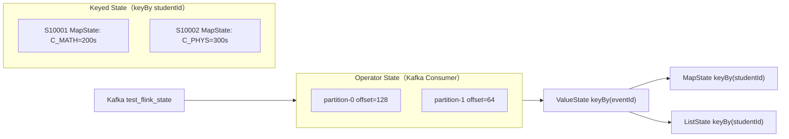

# Flink State 类型与 State Backend — 学习指南

> 配套代码：`FlinkStateDemoJob` + `FlinkStateDemoJobTest`  
> 数据源：`StateDemoEvent` `(eventId, studentId, courseId, eventType, watchSec, questionId, score, ts, tag)`  
> 场景：在线教育 — 观看进度去重、按课程累计时长、测验答题乱序缓冲

---

## Step 1 原理：五种 Keyed State 与 Operator State

### ① Keyed State 对比（按状态大小 / 访问模式选型）

| State 类型 | 存储形态 | 适用场景 | 访问模式 | 本 Demo |
|------------|----------|----------|----------|---------|
| **ValueState** | 单值 | 去重标记、当前进度、计数器 | 读-改-写单值 | `DeduplicateFunction` eventId 已见标记 |
| **ListState** | 有序列表 | 缓存待处理事件、批量缓冲 | append / iterate / clear | `PendingQuizBufferFunction` 答案先入队 |
| **MapState** | KV Map | 按字段聚合、维表、多课程进度 | 按 key get/put，独立 entry | `CourseProgressMapFunction` courseId→秒数 |
| **ReducingState** | 单值（归约） | 窗口增量 sum/max，只需合并 | `add()` 自动 apply reduce | 窗口 `AggregateFunction` 内部 |
| **AggregatingState** | 单值（累加器） | 窗口 avg/count 等需累加器 | `add()` 自动 apply aggregate | 窗口 `AggregateFunction` 内部 |

```
选型口诀：
  一个标量？        → ValueState
  一批待处理元素？   → ListState
  多 key 独立聚合？  → MapState（不要用 ValueState<HashMap> 代替大 Map）
  窗口内只要聚合结果？→ ReducingState / AggregatingState（窗口 API 封装）
```

### ② Operator State vs Keyed State

| 维度 | Operator State | Keyed State |
|------|----------------|-------------|
| 绑定对象 | **算子实例**（subtask） | **key**（keyBy 之后） |
| 典型用途 | Kafka offset、Source 分片状态、Broadcast | 用户进度、去重、业务状态机 |
| 缩放行为 | 重新分配（如 Kafka 分区重平衡） | key 迁移到别的 subtask |
| 本 Demo | `FlinkKafkaConsumer` 自动管理 offset | 三个手写 ProcessFunction |



### ③ 状态存在哪？Checkpoint 与 Backend

```
processElement / 窗口触发
        │
        ▼
Keyed State（内存或 RocksDB）
        │
        ▼ Checkpoint barrier
状态后端快照 → DFS / 本地目录
        │
        ▼ 故障恢复
从最近 Checkpoint 重建状态 + Kafka offset（Operator State）
```

---

## Step 2 手写代码对照

| 要求 | 实现 |
|------|------|
| ValueState 去重标记 | `DeduplicateFunction` — `keyBy(eventId)` + `ValueState<Boolean>` |
| MapState 按字段聚合 | `CourseProgressMapFunction` — `courseId → totalWatchSec` |
| ListState 缓存待处理 | `PendingQuizBufferFunction` — 答案先入 `ListState`，题目到达 flush |
| Operator State 示例 | `FlinkKafkaConsumer` offset（Job 注释 + 启动 banner） |
| 后端切换 | `StateBackendConfigurator` — `hashmap` / `rocksdb` |

### 关键代码

```java
// ValueState 去重
keyBy(StateDemoEvent::getEventId)
    .process(new DeduplicateFunction());

// MapState 按课程聚合
keyBy(StateDemoEvent::getStudentId)
    .process(new CourseProgressMapFunction());

// ListState 答题缓冲
keyBy(StateDemoEvent::getStudentId)
    .process(new PendingQuizBufferFunction());

// 切换 State Backend
StateBackendConfigurator.configure(env, "rocksdb");
```

---

## Step 3 后端对比：何时用 HashMap vs RocksDB

### 决策表

| 条件 | HashMapStateBackend | EmbeddedRocksDBStateBackend |
|------|---------------------|----------------------------|
| 状态总大小 | < 几百 MB ~ 1GB（heap 能装下） | **可超内存**，落盘 |
| 访问延迟 | **微秒级**，纯内存 | 有序列化 + 磁盘 IO，毫秒级 |
| 单 key 状态结构 | 小 Value / 小 Map 均可 | **大 MapState** 按 entry 读写优势明显 |
| 容错 | Checkpoint 序列化整状态到外部存储 | 增量 Checkpoint，只传变更 SST |
| 运维复杂度 | 低 | 需调 block cache / managed memory |
| 本 Demo 默认 | ✅ `FlinkStateDemoJob` 无参 | `FlinkStateDemoJob rocksdb` |

```
                    状态能放进 TM heap？
                           │
              ┌────────────┴────────────┐
             Yes                       No
              │                        │
      延迟极敏感？              EmbeddedRocksDBStateBackend
              │                  + 增量 Checkpoint
      ┌───────┴───────┐          + managed memory
     Yes              No
      │                │
 HashMap          RocksDB（大 Map 仍建议 RocksDB）
```

### 对比实验

```bash
# 内存后端（默认，小状态最快）
org.example.job.state.FlinkStateDemoJob

# RocksDB 后端（模拟生产大状态）
org.example.job.state.FlinkStateDemoJob rocksdb
# 或 -Dstate.backend=rocksdb
```

---

## Step 4 调优：RocksDB 关键项 & MapState vs ValueState+HashMap

### ① RocksDB ≥3 个调优点（本仓库已落地 / 文档配置项）

| # | 配置项 | 作用 | Demo 落地 |
|---|--------|------|-----------|
| 1 | **block cache** `state.backend.rocksdb.block.cache-size` | 热数据缓存，降低读盘 | `PredefinedOptions.SPINNING_DISK_OPTIMIZED_HIGH_MEM` 含基线 |
| 2 | **write buffer** `state.backend.rocksdb.writebuffer.size` | MemTable 大小，影响 flush 频率 | 同上 / 生产按写入 QPS 调 |
| 3 | **predefined-options** | FLASH_SSD / SPINNING_DISK 场景模板 | `StateBackendConfigurator` 已设置 |
| 4 | **managed memory** | TM 堆外内存池，与 RocksDB 共享 | `MANAGED_MEMORY_SIZE=256m` |
| 5 | **增量 checkpoint** | `EmbeddedRocksDBStateBackend(true)` | 大状态降低 checkpoint 时长 |

生产 `flink-conf.yaml` 片段：

```yaml
state.backend: rocksdb
state.backend.incremental: true
state.backend.rocksdb.predefined-options: SPINNING_DISK_OPTIMIZED_HIGH_MEM
state.backend.rocksdb.block.cache-size: 256mb
state.backend.rocksdb.writebuffer.size: 64mb
taskmanager.memory.managed.size: 512m
execution.checkpointing.interval: 60s
execution.checkpointing.max-concurrent-checkpoints: 1
```

### ② MapState 优于 ValueState+HashMap 的原因（RocksDB 下）

```
❌ ValueState<HashMap<String, Long>>：
   processElement → value() 反序列化整张 Map（可能数 MB）
                 → map.put(courseId, total)
                 → update(整张 Map) 再序列化写回

✅ MapState<String, Long>：
   get(courseId)  只读写单个 entry 对应的 RocksDB key
   put(courseId, total)  局部更新，不触碰其他 courseId
```

**根因**：RocksDB 是 **LSM-Tree**，每个 Map entry 映射为独立 key；`ValueState<HashMap>` 只有一个 key，任何修改都触发 **整 blob** 读写。

### ③ 加分点：RocksDB LSM 与 Paimon LSM 呼应

```
RocksDB（Flink State）          Paimon（湖存储）
─────────────────────          ─────────────────
MemTable → Flush → SST         MemTable → Commit → SST
Compaction 合并层              Compaction 合并文件
按 key 范围读                  按 partition + bucket 读

共通思想：写放大换读优化、分层存储、按 key 局部更新
→ 学 State Backend 时理解 LSM，后面学 Paimon 增量表会轻松很多
```

---

## Step 5 面试话术

> **问：状态很大且要超过内存，你怎么配？为什么不用 ValueState 存大 Map？**

**答：**

1. **Backend**：上 `EmbeddedRocksDBStateBackend` + **增量 Checkpoint**，状态落盘可超 TM heap。  
2. **内存**：开 **managed memory**（如 512m~1g），让 RocksDB block cache 与 Flink 共享堆外池，避免与 heap 抢内存。  
3. **RocksDB 调优**：按磁盘类型选 `predefined-options`；调大 `block.cache-size` 扛读热点；`writebuffer.size` 匹配写入吞吐；`max-concurrent-checkpoints=1` 防 IO 打满。  
4. **State 类型**：大 Map 用 **MapState** 不用 `ValueState<HashMap>`——RocksDB 下 MapState 按 entry 读写，避免每次 `update` 整表序列化，CPU 和 checkpoint 体积都更小。  
5. **容错**：Checkpoint 间隔按「可接受恢复时长」定（大状态 1~5min）；生产状态目录放 HDFS/S3，与 JobManager 解耦。

---

## 测试数据发送计划

| Phase | 内容 | 目的 |
|-------|------|------|
| 1 | e01~e03 三门课观看进度 | MapState 累加 C_MATH=200, C_ENG=60 |
| 2 | 重试 e01 duplicate-retry | ValueState `[DEDUP-SKIP]`，total 不变 |
| 3 | e04/e06 答案先于题目 | ListState `[BUFFER]` pendingSize=1→2 |
| 4 | e05/e07 题目定义 | `[LIST-FLUSH]` + `[LIST-MATCHED]` |
| 5 | 新学员 S10002 + flush | 验证多 key 状态隔离 |

---

## 运行步骤

### 0. 创建 Topic

```bash
kafka-topics.sh --create --topic test_flink_state --partitions 1 \
  --replication-factor 1 --bootstrap-server 192.168.1.124:9092
```

### 1. 启动 Job（二选一）

```bash
# HashMap 内存后端（默认）
org.example.job.state.FlinkStateDemoJob

# RocksDB 磁盘后端
org.example.job.state.FlinkStateDemoJob rocksdb
```

### 2. 发送测试数据

```bash
mvn test -Dtest=FlinkStateDemoJobTest#sendStateDemoEvents
```

### 3. 本地单测（无需 Kafka）

```bash
mvn test -Dtest=FlinkStateDemoJobTest
```

---

## 预期日志样例

**MapState 课程累加**

```
课程进度> [MAP-AGG] studentId=S10001 courseId=C_MATH | +120s → total=120s | mapSize=1
课程进度> [MAP-AGG] studentId=S10001 courseId=C_MATH | +80s → total=200s | mapSize=1
课程进度> [MAP-AGG] studentId=S10001 courseId=C_ENG | +60s → total=60s | mapSize=2
```

**ValueState 去重**

```
[VALUE-DEDUP-PASS] eventId=e01 ...
[VALUE-DEDUP-SKIP] eventId=e01 tag=duplicate-retry | 重复上报已过滤
（total 保持 200，不会出现 320）
```

**ListState 缓冲与 flush**

```
测验缓冲> [LIST-BUFFER] questionId=Q1 pendingSize=1 | 题目未到达，先缓存
测验缓冲> [LIST-FLUSH] questionId=Q1 flushed=1 remaining=1
测验缓冲> [LIST-MATCHED] questionId=Q1 score=90
```

---

## 验收清单

| # | 验收项 | 验证方式 |
|---|--------|----------|
| ① | 说清 5 种 State 场景 | Step1 表格 + 口诀 |
| ② | Operator vs Keyed State | Step1② + Kafka offset |
| ③ | 三个手写算子可运行 | Job + Test Phase1~4 |
| ④ | HashMap vs RocksDB 决策表 | Step3 |
| ⑤ | RocksDB ≥3 调优点 | Step4① |
| ⑥ | MapState vs ValueState+HashMap | Step4② + 单测 |
| ⑦ | 面试话术 | Step5 |

---

## Step 7 在线教育典型业务案例（State 三角）

> 以下三个场景是在线教育平台里 **Keyed State 选型最高发** 的业务，分别对应本 Demo 的三条主线：  
> **去重** / **多课程进度 Map** / **乱序答题缓冲**。  
> 与《FlinkWatermarkDemoGuide》互补：那边解决「时间进度 WM」，这边解决「业务状态存哪、怎么扩」。

---

### 案例一：录播观看进度上报 — ValueState 去重

#### 业务背景

学员每 30s 上报一次 `video_heartbeat`，弱网导致 **同一 eventId 重试 3 次**。若不去重，家长端「今日已学 120min」会变成 360min，直接影响 **课时结算与续费转化**。

#### 数据模型

```json
{"eventId":"hb_9f2a","studentId":"S10001","courseId":"C_MATH","eventType":"video_progress",
 "watchSec":30,"ts":1717654321000}
```

#### State 选型

```java
// keyBy(eventId) + ValueState<Boolean> — 与 Demo DeduplicateFunction 一致
stream.keyBy(StateDemoEvent::getEventId)
      .process(new DeduplicateFunction());
```

| 维度 | 分析 |
|------|------|
| **状态大小** | 每 eventId 1 bit 级标记，极小 |
| **访问模式** | 写一次读一次，无聚合 |
| **容错** | HashMap 足够；状态 < 100MB 不必 RocksDB |

**与 Demo 映射**：Phase2 `duplicate-retry` 重发 e01 → `[VALUE-DEDUP-SKIP]`。

#### 踩坑与心得

1. **key 选对**：去重按 `eventId` 而非 `studentId`，否则同一学员第二条合法心跳会被误杀。  
2. **TTL**：eventId 去重状态可配 `StateTtlConfig`（如 24h），避免状态无限涨。  
3. **心得**：教育 App 重试是常态，**ValueState 去重是计费链路的守门员**。

---

### 案例二：多课程学习时长看板 — MapState 按 courseId 聚合

#### 业务背景

班主任看板需展示学员 **每门课** 累计有效观看时长（非单总值）。一个学员同时学数学、英语、物理，需 `courseId → seconds` 独立累加，且单学员可能选 **50+ 门课**。

#### 数据模型

```json
{"studentId":"S10001","courseId":"C_MATH","eventType":"video_progress","watchSec":30,"ts":...}
```

#### State 选型

```java
// MapState<String, Long> — 与 Demo CourseProgressMapFunction 一致
MapState<String, Long> courseWatchSecMap;
courseWatchSecMap.put(courseId, prev + watchSec);
```

| 维度 | 分析 |
|------|------|
| **状态大小** | 每学员 N 门课 × 8B，万级学员可达 **GB 级** |
| **访问模式** | 每次心跳只更新 1 个 courseId |
| **容错** | **RocksDB** + MapState，避免 ValueState+HashMap 整表序列化 |

**与 Demo 映射**：Phase1 e01+e02 累加 C_MATH=200；e03 增加 C_ENG，mapSize=2。

#### 生产架构要点

```
Kafka(study_progress) → keyBy(studentId) → MapState 累加
                      → 每 5min ProcessingTime 定时器 flush 到 Redis/Doris
                      → Checkpoint 60s + RocksDB 增量
```

#### 踩坑与心得

1. **不要用 ValueState<HashMap>**：50 门课时每次心跳序列化 50 entry，CPU 飙升。  
2. **定时 flush**：MapState 只在 Flink 内，看板需 `KeyedProcessFunction` 定时器或窗口侧输出 sink。  
3. **心得**：多课程是 MapState 的 **教科书场景**，面试必讲 RocksDB entry 级读写。

---

### 案例三：课堂随堂测验 — ListState 缓存乱序答题

#### 业务背景

直播课发题流程：老师端 `quiz_question` → 学员端 `quiz_answer`。弱网下 **答案先于题目** 到达（或题目定义 Kafka 分区更慢），直接 join 会丢答案，影响 **课堂积分与随堂测验统计**。

#### 数据模型

```json
// 答案先到
{"eventType":"quiz_answer","questionId":"Q1","score":90,"studentId":"S10001","ts":...}
// 题目后到
{"eventType":"quiz_question","questionId":"Q1","studentId":"S10001","ts":...}
```

#### State 选型

```java
// ListState 缓冲 — 与 Demo PendingQuizBufferFunction 一致
pendingAnswers.add(answerEvent);
// 题目到达后 iterate + clear + 重新 add 未匹配项
```

| 维度 | 分析 |
|------|------|
| **状态大小** | 单学员单次课测验题 < 50，List 很短 |
| **访问模式** | append + 批量 drain |
| **容错** | HashMap 即可；题量大可改 MapState<questionId, Answer> |

**与 Demo 映射**：Phase3 e04 答案 → `[LIST-BUFFER]`；Phase4 e05 题目 → `[LIST-FLUSH]`。

#### 踩坑与心得

1. **ListState 不是持久队列**：无 ACK，需控制长度 + TTL，防止恶意刷题撑爆状态。  
2. **升级路径**：题量变大改 `MapState<questionId, Answer>` 按题索引，O(1) 匹配。  
3. **心得**：教育直播 **乱序是常态**，ListState 是轻量「等齐」方案，复杂等齐用 CEP。

---

### 三案例对照总表

| 案例 | State 主题 | 典型症状 | 核心 State | 与 Demo 对应 |
|------|-----------|----------|------------|--------------|
| 录播心跳重试 | **ValueState 去重** | 学习时长虚高 3 倍 | `ValueState<Boolean>` keyBy(eventId) | Phase2 duplicate-retry |
| 多课程时长看板 | **MapState 聚合** | CPU 高、checkpoint 大 | `MapState<courseId, sec>` | Phase1 e01~e03 |
| 随堂测验乱序 | **ListState 缓冲** | 积分漏计 | `ListState<Answer>` | Phase3~4 Q1/Q2 |

### 与 Watermark / Window 指南的关系

| 其他指南 | State 指南 | 组合理解 |
|----------|-----------|----------|
| Watermark 推进 | State 持久化 | WM 驱动窗口触发；State 在 checkpoint 间保持业务进度 |
| Tumbling 日窗口 | MapState 累加 | 窗口算「一段时间」；MapState 算「全生命周期累计」 |
| 订单超时 Timer | ValueState 订单状态 | 定时器与 ValueState 常配对构成状态机 |

---

## 与窗口 / Watermark Demo 的关系

| 维度 | Window Demo | Watermark Demo | **State Demo（本指南）** |
|------|-------------|----------------|--------------------------|
| 核心问题 | 哪种窗口 | WM 如何推进 | **状态存哪种、放哪** |
| 状态 | 窗口自带 | 较少涉及 | Value / Map / List 手写 |
| 后端 | 默认 | 默认 | **HashMap vs RocksDB 对比** |
| 教育案例 | 日报/直播榜 | 乱序/空分区 | 去重/多课进度/随堂测 |

三者结合：**WM 推进时间 → 窗口切桶 → State 记住业务进度**。
