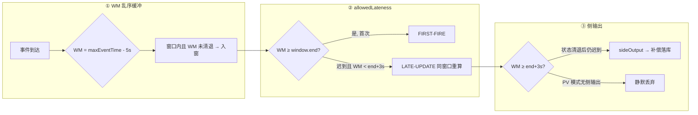

# Flink 迟到数据三道防线 — 学习指南

> 配套代码：`FlinkLateDataDemoJob` + `FlinkLateDataDemoJobTest`  
> 数据源：`(eventId, userId, ts, amount, source, tag)`，Event Time + Tumbling 10s  
> 前置阅读：《FlinkWatermarkDemoGuide》— 先理解 WM 如何推进，再理解迟到如何处理

---

## 读前扫盲：迟到数据不是一种情况，而是三种处理边界

“迟到”这个词容易误导。对 Flink 来说，数据不是因为处理时间晚到就一定无效，而是要看它到达时 **Watermark 已经推进到哪里**，以及窗口状态是否还保留。

可以先把一条事件分成三类：

| 类型 | 入门判断 | Flink 行为 |
|------|----------|------------|
| 正常乱序 | Watermark 还没越过窗口结束时间 | 继续进入窗口，等待首次触发 |
| 轻度迟到 | 窗口已经首次触发，但还在 `allowedLateness` 保留期内 | 进入同一个旧窗口，触发一次更新结果 |
| 严重迟到 | Watermark 已经超过 `window.end + allowedLateness`，窗口状态已清理 | 进入侧输出流，或者被丢弃 |

本 Demo 的时间参数固定为：

| 参数 | 值 | 作用 |
|------|----|------|
| 窗口大小 | Tumbling 10s | 聚合 `[0,10s)`、`[10,20s)` 这样的固定窗口 |
| 乱序容忍 | `forBoundedOutOfOrderness(5s)` | 第一道缓冲，减少轻微乱序造成的误判 |
| 迟到保留 | `allowedLateness(3s)` | 第二道缓冲，让已触发窗口还能被迟到事件更新 |
| 侧输出 | `sideOutputLateData` | 第三道兜底，把彻底迟到的数据交给补偿链路 |

读本文时最关键的是区分两句话：

- `allowedLateness` 不是新开一个窗口，而是更新同一个 `windowStart/windowEnd` 的旧结果。
- 侧输出不是窗口结果的另一份副本，而是窗口已经不再接收后，被单独拎出来补偿处理的原始迟到事件。

如果下游 Sink 不能覆盖同一窗口的旧结果，那么开启 `allowedLateness` 后就可能出现重复统计。因此本文会一直强调“主输出要可更新，侧输出要可补偿”。

---

## Step 1 原理：迟到数据的三道防线

### 时间轴总览（窗口 [0, 10s)，outOfOrderness=5s，allowedLateness=3s）

```
事件时间轴:  |---- [0, 10s) 窗口 ----|---- [10, 20s) ----|...

WM 推进:     ts=+16s 到达 → WM = 16-5 = +11s

防线分层:
  ① WM 缓冲 (outOfOrderness=5s)
     ts 比 WM「看起来晚到」但在 maxEventTime-5s 范围内 → 仍正常入窗
     例: 先收到 +16s，后收到 +7s → +7s 在窗口内，WM=11s 时仍可能被 ② 吸收

  ② allowedLateness=3s
     窗口首次触发条件: WM ≥ window.end (+10s)
     状态保留至: WM ≥ window.end + lateness (+13s)
     此区间内迟到的同窗口数据 → ProcessWindowFunction **再次触发**（LATE-UPDATE）

  ③ sideOutputLateData
     WM ≥ window.end + lateness 后，窗口状态清退
     再到达的同窗口迟到事件 → 进侧输出流，主输出不再处理
```



### 核心公式

| 概念 | 条件 | 行为 |
|------|------|------|
| 准时 / WM 缓冲内 | `eventTs ∈ [start,end)` 且 `WM < end` | 正常累积，等 WM 触发 |
| 首次触发 | `WM ≥ end` | `FIRST-FIRE`，输出窗口快照 |
| lateness 内迟到 | `eventTs ∈ [start,end)` 且 `end ≤ WM < end+lateness` | `LATE-UPDATE`，**同一 windowStart** 重算 |
| 彻底迟到 | `eventTs ∈ [start,end)` 且 `WM ≥ end+lateness` | `sideOutputLateData` 或丢弃 |

> **面试关键点**：`allowedLateness` 触发的是**对已有窗口结果的更新**，不是新开一个窗口。下游必须能处理「撤回/覆盖」语义。

---

## Step 2 手写代码对照

| 要求 | 实现 |
|------|------|
| ① forBoundedOutOfOrderness(5s) | `FlinkLateDataDemoJob` WM 策略 |
| ② allowedLateness(3s) | `.allowedLateness(ALLOWED_LATENESS)` |
| ③ sideOutputLateData | `LATE_DATA_TAG` + `LateDataCompensationFunction` |
| 区分 FIRST-FIRE / LATE-UPDATE | `LateDataWindowLogFunction` + `ValueState` |
| 三类测试数据 | `FlinkLateDataDemoJobTest` Phase1/3/5 |

### 关键代码

```java
// 三道防线窗口
public static final OutputTag<WatermarkDemoEvent> LATE_DATA_TAG =
        new OutputTag<WatermarkDemoEvent>("late-data") {};

stream.keyBy(WatermarkDemoEvent::getUserId)
    .window(TumblingEventTimeWindows.of(Time.seconds(10)))
    .allowedLateness(Time.seconds(3))           // ②
    .sideOutputLateData(LATE_DATA_TAG)          // ③
    .process(new LateDataWindowLogFunction());

// 侧输出 → 补偿落库（生产换 JDBC / ClickHouse Sink）
windowResults.getSideOutput(LATE_DATA_TAG)
    .process(new LateDataCompensationFunction())
    .print("侧输出补偿");
```

### 测试数据三类对照

| 事件 | eventTs | 到达顺序 | 预期 |
|------|---------|----------|------|
| e01~e03 | +2,+5,+9s | 早 | ① 准时入窗 |
| e05 | +7s | e04(+16s) 之后 | ② `[LATE-UPDATE]` sum=100 |
| e07 | +6s | e06(+20s) 之后，WM≥+13s | ③ `[COMPENSATE-DB]` 侧输出 |

---

## Step 3 场景对比：计费 vs 大屏 PV

| 维度 | 计费 / 课时长结算（billing） | 大屏 PV / 互动热度（pv） |
|------|------------------------------|--------------------------|
| **数据质量** | 一条不能丢 | 少量丢弃可接受（<0.1%） |
| **outOfOrderness** | 按 P99 乱序 + buffer（如 5~60s） | 可偏小，优先低延迟 |
| **allowedLateness** | 开，如 3s~4h（按业务） | 可开短 lateness 或不开 |
| **sideOutputLateData** | **必须开**，落补偿表 | **不开**，严重迟到丢弃 |
| **下游 Sink** | ReplacingMergeTree / 幂等 UPSERT | 直接写 Redis，覆盖即可 |
| **启动方式** | `FlinkLateDataDemoJob` 或 `billing` | `FlinkLateDataDemoJob pv` |

```
计费链路:
  Kafka → Flink(WM+lateness+侧输出) → 主表(可更新) + 补偿表(只追加)
       → 定时对账 Job 合并补偿 → 0 丢失

大屏 PV:
  Kafka → Flink(WM+短lateness, 无侧输出) → Redis INCR
       → 丢少量迟到 → 峰值曲线略平滑，产品可接受
```

---

## Step 4 陷阱

### ① allowedLateness 会延长状态保留 → 状态变大

```
状态生命周期 ≈ windowSize + outOfOrderness + allowedLateness

本 Demo: 10s + 5s + 3s = 18s（单 key 单窗口）

生产日窗口: 1day + 2min + 4h → 每 key 状态持有极久
→ RocksDB 磁盘 / Checkpoint 体积上涨 → 需设 State TTL 或缩小 lateness
```

### ② LATE-UPDATE 下游要能「撤回/覆盖」

```
[FIRST-FIRE]  window=[0,10s) sum=60
[LATE-UPDATE] window=[0,10s) sum=100   ← 同一 windowStart，不是 [10,20s)

下游 ClickHouse:
  ENGINE = ReplacingMergeTree(version)
  ORDER BY (user_id, window_start)
  → 后写入 row 覆盖先写入 row

下游 Kafka → 消费端:
  需识别 update 语义，或 Sink 用 UPSERT
```

### ③ 侧输出不是「免费午餐」

- 补偿表要有 **对账 / 合并** Job，否则主表与补偿表双份统计
- 侧输出流也要 **Checkpoint**，否则补偿同样会丢
- PV 模式不开侧输出 = 明确接受丢失，需在 SLA 文档写清

### ④ 与 withIdleness 分工

| 机制 | 解决什么问题 |
|------|--------------|
| `withIdleness` | 空闲分区/慢源导致 **WM 不推进** |
| `allowedLateness` | WM 已推进后 **迟到数据** 仍要计入 |
| `sideOutputLateData` | 超过 lateness **仍不能丢** 的数据 |

三者正交，生产环境常组合使用（见《FlinkWatermarkDemoGuide》案例二 + 本文案例一）。

---

## Step 5 面试话术：迟到数据怎么不丢？

> **完整方案（可背）：**
>
> 1. **第一道 — WM 乱序容忍**：用 `forBoundedOutOfOrderness` 吸收 P99 以内乱序，避免轻微迟到被判无效。  
> 2. **第二道 — allowedLateness**：窗口触发后不立刻删状态，在 `window.end + lateness` 前到达的迟到数据触发**同窗口重算**，下游用 ReplacingMergeTree 或幂等写处理覆盖。  
> 3. **第三道 — 侧输出**：超过 lateness 的彻底迟到事件进 `sideOutputLateData`，写入补偿表，离线/实时对账 Job 合并回主表，实现端到端 0 丢失。  
> 4. **兜底**：客户端补报队列、Kafka 超长 retention、对账告警（主表 vs 源表 count diff）。  
> 5. **取舍**：非金融场景（大屏 PV）可关侧输出换低延迟，SLA 写清可丢比例。

---

## 测试数据发送计划

| Phase | 事件 | 目的 |
|-------|------|------|
| 1 | e01~e03 +2,+5,+9s | ① 准时入窗 |
| 2 | e04 +16s flush | WM≥+10s → `[FIRST-FIRE]` sum=60 |
| 3 | e05 +7s mild-late | ② `[LATE-UPDATE]` sum=100 |
| 4 | e06 +20s flush | WM≥+13s 清退 [0,10s) 状态 |
| 5 | e07 +6s severe-late | ③ `[COMPENSATE-DB]` 侧输出 |
| 6 | e08~e10 +12,+18,+25s | 第二窗口 `[FIRST-FIRE]` |
| 7 | e11 +14s wm-buffer | ⑦ 乱序 / lateness 边界观察 |

---

## 运行步骤

### 0. 创建 Topic

```bash
kafka-topics.sh --create --topic test_flink_late_data \
  --partitions 1 --replication-factor 1 --bootstrap-server 192.168.1.124:9092
```

### 1. 启动 Job（二选一）

```bash
# 计费模式：侧输出 + 补偿落库
org.example.job.late.FlinkLateDataDemoJob

# 大屏 PV 模式：严重迟到丢弃
org.example.job.late.FlinkLateDataDemoJob pv
```

### 2. 发送测试数据

```bash
mvn test -Dtest=FlinkLateDataDemoJobTest#sendLateDataDemoEvents
```

### 3. 本地单测（无需 Kafka）

```bash
mvn test -Dtest=FlinkLateDataDemoJobTest#threeLayers_classifyCorrectly
mvn test -Dtest=FlinkLateDataDemoJobTest#allowedLateness_isRecalculationNotNewWindow
```

---

## 预期日志样例

**首次触发**

```
主输出> [FIRST-FIRE] userId=u001 | 窗口=[...+0s ~ ...+10s) | count=3 sum=60.0 | WM≥window.end 首次关闭窗口
```

**allowedLateness 重算（非新窗口）**

```
主输出> [LATE-UPDATE] userId=u001 | 窗口=[...+0s ~ ...+10s) | count=4 sum=100.0 | ② allowedLateness 内迟到 → 同窗口增量重算（非新窗口）
```

**侧输出补偿**

```
[COMPENSATE-DB] ③ sideOutput 严重迟到 → 补录表 | eventId=e07 userId=u001 ts=...+6s amount=50.0 tag=severe-late
侧输出补偿> ...
```

**PV 模式（e07 无输出）**

```
（无 [COMPENSATE-DB]，e07 被 Flink 丢弃）
```

---

## 验收清单

| # | 验收项 | 验证方式 |
|---|--------|----------|
| ① | 能画三道防线时间轴 | 本文 Step1 图 + 公式表 |
| ② | 代码演示三层行为 | Phase1/3/5 对照 Job 日志 |
| ③ | 说清 LATE-UPDATE ≠ 新窗口 | `LateDataWindowLogFunction` + 单测 |
| ④ | 计费 vs PV 取舍 | Step3 对比表 + `billing`/`pv` 启动 |
| ⑤ | 侧输出补偿叙事 | `[COMPENSATE-DB]` 日志 |

---

## Step 7 在线教育典型业务案例（迟到数据三角）

> 以下三个场景是在线教育平台里 **迟到数据策略** 最高发的业务，分别对应三道防线的不同组合。  
> 与《FlinkWatermarkDemoGuide》Step 7 互补：那边讲 WM 怎么配，这边讲 **迟到怎么不丢 / 怎么取舍**。

---

### 案例一：课时长计费 / 家长账单 — 三道防线全开 + 补偿对账

#### 业务背景

K12 平台按 **有效学习时长** 向机构结算：录播心跳、直播出勤、互动答题均计入「计费秒数」。  
弱网 App **批量补报**、跨天 CDN 日志回流会导致：昨日心跳今日才到，**绝不能静默丢弃**。

#### 数据模型

```json
{"studentId":"S10001","courseId":"C200","billableSec":30,
 "ts":1717654321000,"eventType":"heartbeat|live_attend|quiz"}
```

- `keyBy(studentId)` + Tumbling 1day 汇总 billableSec
- 与财务对账：源表 count / sum 必须与 Flink 输出 **0 diff**

#### 三道防线配置

```java
WatermarkStrategy.<StudyBillEvent>forBoundedOutOfOrderness(Duration.ofMinutes(2))  // ①
    .withIdleness(Duration.ofMinutes(5))
    .withTimestampAssigner((e, ts) -> e.getTs());

OutputTag<StudyBillEvent> LATE_TAG = new OutputTag<>("bill-late"){};

stream.keyBy(StudyBillEvent::getStudentId)
    .window(TumblingEventTimeWindows.of(Time.days(1), Time.hours(-8)))
    .allowedLateness(Duration.ofHours(4))      // ② 日切后 4h 内仍可修正
    .sideOutputLateData(LATE_TAG)              // ③ 超过 4h 进补偿流
    .aggregate(new BillableSecAggregator());

// 主输出 → ClickHouse ReplacingMergeTree(bill_version)
// 侧输出 → bill_compensation 表 + 每日对账 Job 合并
getSideOutput(LATE_TAG).addSink(new BillCompensationJdbcSink());
```

#### 为什么三道全开（三要素）

| 维度 | 分析 |
|------|------|
| **数据完整性** | 一条心跳 = 真实计费依据；丢 30s × 百万 DAU = 重大资损 |
| **延迟容忍度** | 账单 T+1 08:00 出即可；4h lateness 不影响 SLA |
| **运维复杂度** | 补偿表 + 对账 Job 增加链路，但 **可审计、可回溯**，财务合规 |

**与 Demo 映射**：e05 mild-late = 日切 2h 后补报心跳 → `[LATE-UPDATE]`；e07 severe-late = 超过 4h → `[COMPENSATE-DB]`。

#### 生产架构要点

```
App 心跳 → Kafka(7d retention) → Flink(①②③)
                              → CH bill_daily (ReplacingMergeTree)
                              → CH bill_compensation (MergeTree 只追加)
                              → 08:00 对账 Job: source SUM vs bill SUM
                              → diff>0 → 告警 + 自动合并补偿
```

- 幂等键：`(student_id, bill_date, event_id)`
- `[LATE-UPDATE]` 下游 **必须** ReplacingMergeTree，不能用纯 Append MergeTree

#### 运维与告警

| 监控项 | 阈值 | 说明 |
|--------|------|------|
| 侧输出 QPS | 突增 > 基线 3x | 客户端 batch 补报风暴 |
| 对账 diff 金额 | > 0 | 阻断出账 |
| allowedLateness 内 UPDATE 比例 | > 5% | lateness 可能不够 |
| 单 key 日窗口状态大小 | P99 > 10MB | 心跳过密 + lateness 过长 |

#### 踩坑与心得

1. **lateness 不是越大越好**：4h 是「财务可接受修正窗」与「状态成本」的折中。  
2. **LATE-UPDATE 会改数**：家长端「今日已学」可能从 45min 跳到 47min，产品需接受 **数值修正**。  
3. **补偿表要对账**：只写不合并 = 双份计费的隐患。  
4. **心得**：计费是 **sideOutput 存在的理由**；面试说「0 丢失」必须讲到补偿 + 对账闭环。

---

### 案例二：直播大屏 PV / 互动热度 — 开 WM 缓冲，关侧输出

#### 业务背景

大班课主讲端大屏展示「过去 1 分钟弹幕数 / 点赞 PV」，驱动互动话术。  
**近实时**优先（延迟 < 3s），个别弱网迟到 **不影响教学体验**。

#### 数据模型

```json
{"liveRoomId":"L888","studentId":"S10001","eventType":"danmu|like",
 "ts":1717654321000}
```

- `keyBy(liveRoomId)` + Tumbling 1min
- 写 Redis `INCRBY live:{roomId}:pv:{minute}`

#### 配置（PV 模式）

```java
WatermarkStrategy.<LivePvEvent>forBoundedOutOfOrderness(Duration.ofSeconds(30))  // ①
    .withTimestampAssigner((e, ts) -> e.getTs());

stream.keyBy(LivePvEvent::getLiveRoomId)
    .window(TumblingEventTimeWindows.of(Time.minutes(1)))
    .allowedLateness(Duration.ofSeconds(10))   // ② 短 lateness，修正最后一波
    // 无 sideOutputLateData                    // ③ 关，严重迟到丢弃
    .aggregate(new PvCountAggregator())
    .addSink(new RedisSink());                 // 覆盖写，天然幂等
```

#### 为什么关侧输出（三要素）

| 维度 | 分析 |
|------|------|
| **延迟容忍度** | 大屏要 **秒级**；长 lateness + 侧输出处理拉长链路 |
| **数据完整性** | PV 差 0.01% 无感；峰值曲线 **趋势对** 即可 |
| **运维成本** | 无补偿表、无对账；故障面小 |

**与 Demo 映射**：`FlinkLateDataDemoJob pv` = 本案例；e07 类事件 **无 `[COMPENSATE-DB]`**。

#### 生产架构要点

```
Kafka(live_interact) → Flink(30s WM, 10s lateness, 无侧输出) → Redis
                     → 下课 end_marker 推进 WM，关闭最后一分钟窗口
```

- 下课瞬间流量洪峰：allowedLateness 仅 10s，避免状态拖太久
- 若运营要求「课后 5min 修正榜」：可 **单独开计费 Job**，不与大屏共用

#### 运维与告警

| 监控项 | 阈值 | 说明 |
|--------|------|------|
| 窗口触发延迟 P99 | > 90s | outOfOrderness 过大 |
| 相对离线 PV diff | > 1% | 评估是否需加侧输出 |
| Redis 写 QPS | 直播峰值 | 与 lateness UPDATE 频率相关 |

#### 踩坑与心得

1. **不要把计费和大屏混在一个 Job**：SLA 不同，应用 **双链路**。  
2. **10s lateness 的 UPDATE** 可能导致大屏数字「跳变」，主讲可接受即可。  
3. **心得**：面试问「为什么不全开侧输出」— 答 **成本、延迟、业务容忍度** 三角。

---

### 案例三：课后作业提交 — allowedLateness 修 deadline 边界

#### 业务背景

作业 deadline 为周日 23:59，但允许 **15 分钟缓冲期**（系统时钟偏差、提交队列延迟）。  
统计「按时提交率」按 Tumbling 1week，需在 deadline 后短时间内仍接受 **边界迟到提交**。

#### 数据模型

```json
{"classId":"CL001","studentId":"S10001","homeworkId":"HW99",
 "submitTs":1717654321000,"status":"submitted"}
```

#### 配置

```java
stream.keyBy(e -> e.getClassId() + "|" + e.getHomeworkId())
    .window(TumblingEventTimeWindows.of(Time.days(7)))
    .allowedLateness(Duration.ofMinutes(15))   // ② deadline 缓冲
    .sideOutputLateData(LATE_SUBMIT_TAG)       // ③ 超过 15min 仍提交 → 侧流标记「迟交」
    .process(new OnTimeSubmitRateFunction());
```

- 主输出：按时提交率（含 15min 缓冲内修正）
- 侧输出：明确「迟交」记录，供班主任人工处理，**不算丢数**

#### 与 Demo 映射

| Demo | 作业场景 |
|------|----------|
| `[FIRST-FIRE]` deadline 时 WM 越过周界 | 首次公布提交率 |
| `[LATE-UPDATE]` e05 类 | 缓冲期内提交仍计入按时 |
| `[COMPENSATE-DB]` e07 类 | 超缓冲 → 侧流「迟交表」，不污染按时率 |

#### 踩坑与心得

1. **产品定义的「迟到」≠ Flink 的 late**：Flink late 是 WM 语义；业务 late 用侧输出 + tag 表达。  
2. **周窗口 + 15min lateness** 状态仍可控；若 lateness=24h 需评估状态。  
3. **心得**：教育场景大量 **deadline + 宽限期**，是 allowedLateness 的标准用法。

---

### 三案例对照总表

| 案例 | 侧输出 | allowedLateness | 典型症状若配错 | 与 Demo 对应 |
|------|--------|-----------------|----------------|--------------|
| 课时长计费 | **开** | 4h | 丢心跳 → 资损 | billing + e07 补偿 |
| 直播大屏 PV | **关** | 10s | 延迟高 / 过度工程 | `pv` 模式 |
| 作业 deadline | **开（标记迟交）** | 15min | 按时率不准 | e05 UPDATE + e07 侧流 |

### 与《FlinkWatermarkDemoGuide》Step 7 的关系

| Watermark 指南 | 迟到数据指南 | 组合理解 |
|----------------|--------------|----------|
| 录播心跳 idleness | 课时长计费 lateness+侧输出 | 先让 WM **推得动**，再让迟到 **收得全** |
| 直播乱序 outOfOrderness | 大屏 PV 关侧输出 | WM 吸收乱序；超过 lateness **主动丢** |
| 行为+教务 union | 作业 deadline 宽限期 | union 解决进度；lateness 解决 **边界修正** |

---

## 加分点：端到端 0 丢失叙事

```
                ┌─────────────────────────────────────────┐
  Kafka(7d) ──→ │ Flink Job                               │
                │  ① WM 5s                                │
                │  ② allowedLateness 3s                   │
                │  ③ sideOutputLateData                   │
                └──────┬──────────────────────┬───────────┘
                       │ 主输出               │ 侧输出
                       ▼                      ▼
              ReplacingMergeTree        bill_compensation
              (可覆盖 UPDATE)           (只追加)
                       │                      │
                       └──────────┬───────────┘
                                  ▼
                          08:00 对账 Job → diff=0 → 出账
```

简历话术：**「实时计费链路通过 WM 缓冲 + allowedLateness 重算 + 侧输出补偿表 + 每日对账，实现端到端 0 丢失。」**

---

## 与 Watermark Demo 的关系

| Watermark Demo | Late Data Demo |
|----------------|----------------|
| WM 为什么不推进 | WM 推进后迟到怎么办 |
| withIdleness | allowedLateness + sideOutput |
| `FlinkWatermarkDemoJob` | `FlinkLateDataDemoJob` |
| Phase1 乱序 | Phase3/5 轻度/严重迟到 |

建议学习顺序：**Watermark Demo（WM 传播）→ Late Data Demo（迟到三道防线）→ Window Demo（窗口类型）**。
