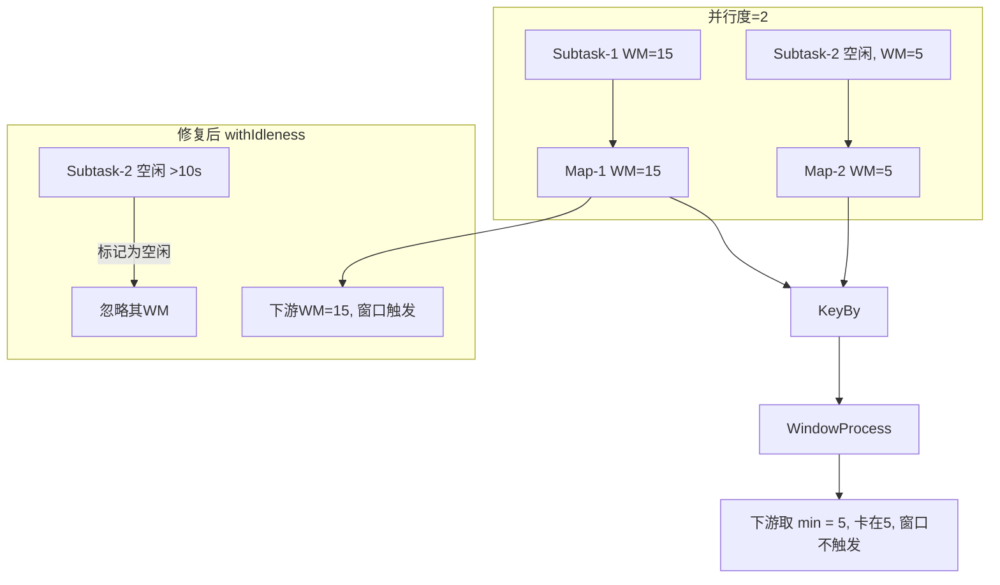

# Flink Watermark 传播与乱序 — 学习指南

> 配套代码：`FlinkWatermarkDemoJob` + `FlinkWatermarkDemoJobTest`  
> 数据源：`(eventId, userId, ts, amount, source, tag)`，Event Time + `forBoundedOutOfOrderness(5s)`

---

## Step 1 原理：Watermark = 事件时间进度的声明

### ① 单算子内 WM 如何推进

```
事件到达顺序（处理顺序）:  e1(ts=+10s) → e2(ts=+3s 乱序) → e3(ts=+8s)

maxEventTime 变化:           10s          10s(不回退!)      10s

当前 WM（outOfOrderness=5s）:
  e1 后: WM = 10 - 5 = +5s
  e2 后: WM = max(5s, 3-5) = 5s   ← ts 回退不会拉低 WM（加分点）
  e3 后: WM = max(5s, 8-5) = 5s

Tumbling 10s 窗口 [0,10):  当 WM ≥ 10s 时触发（需后续 +15s 类事件推进）
```

**公式**：`WM = max(上一WM, maxEventTime - outOfOrderness)`

### ② 多输入 union：下游取最小 WM

```
  Kafka(fast) ──→ WM_fast ──┐
                            ├── union ──→ WM_downstream = min(WM_fast, WM_slow)
  Kafka(slow) ──→ WM_slow ──┘

故障复现：
  fast 已到 WM=+17s，slow 从未收到数据 → WM_slow = Long.MIN_VALUE
  min(17s, MIN_VALUE) = MIN_VALUE → 下游 WM 不推进 → 窗口永不触发 ⚠️

修复：
  ① 向 slow 源补发数据（Phase4b）
  ② withIdleness(10s)：slow 10s 无数据则标记 idle，不再拖累 min(WM)
```

### ③ keyBy 后 WM 与 key 无关

```
union → WatermarkMonitor(parallelism=2) → keyBy(userId) → Window

- WM 在 subtask 级别传播，不按 key 拆分
- keyBy 只是 shuffle 数据；同一 subtask 上所有 key 共享同一 WM
- 窗口算子收到的 WM 来自上游 subtask 的输出 WM（取 min 对齐）
```


---

## Step 2 手写代码对照

| 要求 | 实现 |
|------|------|
| 乱序数据 ts 回退 | `FlinkWatermarkDemoJobTest` Phase1：+4s 后再发 +2s、+6s |
| forBoundedOutOfOrderness(5s) | `FlinkWatermarkDemoJob.buildWatermarkStrategy()` |
| 打印 currentWatermark | `WatermarkMonitorFunction` |
| 观察窗口触发 | `Tumbling 10s` + `WatermarkWindowLogFunction` |

### 关键代码

```java
// 打印每条事件到达时的 WM
stream.process(new WatermarkMonitorFunction());

// WM 策略
WatermarkStrategy.<WatermarkDemoEvent>forBoundedOutOfOrderness(Duration.ofSeconds(5))
    .withTimestampAssigner((e, ts) -> e.getTs());
// 可选修复
// .withIdleness(Duration.ofSeconds(10))
```

---

## Step 3 复现故障 + 修复

### 故障 A：Kafka 空闲分区（Phase 2~3）

**现象**：只向 `test_flink_watermark` 的 **partition 0** 写数据，partition 1 沉默  
→ 该 consumer subtask 上 `WM = min(WM_p0, WM_p1) = MIN_VALUE`  
→ `[WINDOW-FIRED]` 长时间不出现

**修复方式 1**：`FlinkWatermarkDemoJob 10` 或 `-Dwatermark.idleness.sec=10`  
**修复方式 2**：测试 Phase4a 向 **partition 1** 发 `e09 ts=+25s`

### 故障 B：union 慢源沉默（Phase 3）

**现象**：`test_flink_watermark_slow` 无数据  
→ `WM_downstream = min(WM_fast, WM_slow) = MIN_VALUE`

**修复方式 1**：withIdleness(10s)  
**修复方式 2**：Phase4b 向 slow topic 发 `e10 ts=+28s`

### 对比实验

```bash
# 复现故障（无 idleness）
org.example.job.watermark.FlinkWatermarkDemoJob

# 自动修复（10s 空闲标记）
org.example.job.watermark.FlinkWatermarkDemoJob 10
# 或 -Dwatermark.idleness.sec=10
```

---

## Step 4 调优 / 陷阱

### ① 乱序度 out-of-orderness 权衡

| 设置 | 效果 |
|------|------|
| **太大**（如 30min） | WM 推进慢 → 窗口触发延迟高 → 大屏/告警滞后 |
| **太小**（如 0s） | 轻微乱序即判迟到 → 丢数据或侧输出暴增 |
| **经验** | 取 **P99 乱序延迟** + 20% buffer；Demo 用 5s |

### ② 周期性 WM vs 标点 WM

| 类型 | 机制 | 本 Demo |
|------|------|---------|
| **周期性** | `setAutoWatermarkInterval(1000)` 每 1s 基于 maxEventTime 发射 WM | ✅ 已启用 |
| **标点** | 数据源插入 `Watermark(ts)` 特殊记录（如 Kafka 自定义） | 未用 |

周期性 WM 在无新事件时也能「尝试」推进（基于已有 maxEventTime），但 **无法越过空闲分区/空闲源**——仍需 idleness。

> 在线教育行业三个 Watermark 典型落地案例（含生产运维心得）见 **Step 7**。  
> 一次失败联调的完整排障过程见 **Step 8**。

### ③ WM 与 allowedLateness（预告）

```
窗口首次触发: WM ≥ window.end
allowedLateness > 0: WM ≥ window.end + lateness 前，迟到数据仍可更新窗口结果
本 Demo 未开 lateness → 迟到且 WM 已越过的事件被丢弃
```

---

## Step 5 面试话术：窗口不出数排查 Checklist

> **线上窗口不出数，我的排查顺序：**
> 1. **看 WM 是否推进** — Metrics / `[WM-MONITOR]` 日志，`currentWatermark` 是否长期 `MIN_VALUE` 或卡住  
> 2. **看是否有空闲分区/空闲源** — Kafka 某 partition 无数据、union 某支路沉默 → `min(WM)` 被拖死 → 加 `withIdleness`  
> 3. **看乱序设置** — `outOfOrderness` 过大导致 WM 滞后；过小导致有效数据被当迟到丢弃  
> 4. **看时间字段单位** — ts 是 **毫秒** 还是 **秒**（差 1000 倍会导致 WM 永远很小）  
> 5. **看是否误用 ProcessingTime** — 用了 `Time.milliseconds()` 窗口却走 ProcessingTime，与 Event Time 语义混用  
> 6. **看 keyBy 后是否有数据** — 某 key 无事件则该 key 无输出（不是 WM 问题但常混淆）

---

## 加分点：WM 为什么单调不减？

```
WM_new = max(WM_old, maxEventTime - outOfOrderness)
```

- `maxEventTime` 只增不减（取历史最大事件时间）  
- 乱序到达的 ts=+3s **不会**减小 maxEventTime（已是 +10s）  
- 因此 WM **永远不会回退**  
- 验证单测：`FlinkWatermarkDemoJobTest.outOfOrderness_watermarkIsMonotonic()`

---

## 测试数据发送计划

| Phase | 内容 | 目的 |
|-------|------|------|
| 1 | fast p0 乱序 +1,+4,+2,+8,+6 | WM 不回退 |
| 2 | 仅 p0 +12,+18 | 空闲 p1 卡住 WM |
| 3 | fast 继续，slow 沉默 | union min WM 卡住 |
| 4a | p1 发 +25s | 修复空闲分区 |
| 4b | slow 发 +28s | 修复 union 慢源 |
| 5 | p0 flush +35s | 触发 [10,20) [20,30) 窗口 |

---

## 运行步骤

### 0. 创建 Topic（必做，参见 Step8.5）

```bash
kafka-topics.sh --create --topic test_flink_watermark --partitions 2 --bootstrap-server 192.168.1.124:9092
kafka-topics.sh --create --topic test_flink_watermark_slow --partitions 1 --bootstrap-server 192.168.1.124:9092
kafka-topics.sh --describe --topic test_flink_watermark --bootstrap-server 192.168.1.124:9092
# 确认 PartitionCount: 2，否则 Phase4a 写 partition 1 会失败
```

### 1. 启动 Job（二选一）

```bash
# 故障复现模式
org.example.job.watermark.FlinkWatermarkDemoJob

# 修复模式（withIdleness 10s）
org.example.job.watermark.FlinkWatermarkDemoJob 10
```

### 2. 发送测试数据

```bash
mvn test -Dtest=FlinkWatermarkDemoJobTest#sendWatermarkDemoEvents
```

### 3. 本地单测（无需 Kafka）

```bash
mvn test -Dtest=FlinkWatermarkDemoJobTest#outOfOrderness_watermarkIsMonotonic
```

---

## 预期日志样例

**乱序 WM 不回退**

```
[WM-MONITOR] ... eventId=e04 eventTs=...+8s | currentWM=...+5s
[WM-MONITOR] ... eventId=e05 tag=out-of-order eventTs=...+6s | currentWM=...+5s  ← 未回退到 +1s
```

**故障：窗口不出数（Phase 2~3，无 idleness）**

```
（仅有 [WM-MONITOR]，长时间无 [WINDOW-FIRED]）
```

**修复后窗口触发（Phase 5 或 idleness 超时后）**

```
窗口触发> [WINDOW-FIRED] userId=u001 | 窗口=[...+10s ~ ...+20s) | count=... sum=...
```

---

## Step 8 实测运行日志解读（2025-06 实测）

> 以下为一次真实联调日志：**Test 在 Phase4a 失败**，**Job 侧 WM 全程 MIN_VALUE、无窗口触发**。  
> 这次失败本身完美演示了 Step3「union 慢源 + 未建 topic → WM 不推进 → 窗口不出数」。

### 8.1 Test 发送侧日志摘要

| 阶段 | 结果 | 说明 |
|------|------|------|
| Phase1 e01~e05 | ✅ 成功 | 均发往 `test_flink_watermark` **partition 0** |
| WAIT 3s | ✅ | — |
| Phase2 e06~e07 | ✅ | 仍仅 p0 |
| Phase3 e08 | ✅ | slow topic 仍无数据（设计如此） |
| Phase4a e09 | ❌ **失败** | `Topic test_flink_watermark not present in metadata after 60000 ms` |
| Phase4b~5 | 未执行 | 因 Phase4a 异常中断 |

**Test 端结论**：Phase1~3 乱序与「仅写 p0」数据已发出；修复步骤 e09/e10/e11 **未发出**。

### 8.2 Job 消费侧日志摘要

**启动配置**

```
withIdleness: 未启用 ⚠️
并行度: 2
```

**Kafka 分区分配（关键）**

```
fast subtask 0 → test_flink_watermark partition 0  ✅ 收到 e01~e08
fast subtask 1 → 无 partition（initially has no partitions）
slow subtask 0 → test_flink_watermark_slow partition 0
                 ⚠️ Received unknown topic or partition error
slow subtask 1 → 无 partition
```

**WM-MONITOR（8 条，全部相同模式）**

```
[WM-MONITOR] subtask=0 | eventId=e01~e08 | currentWM=MIN_VALUE(未初始化)
（全程无 [WINDOW-FIRED]）
Process finished with exit code 130   ← 人工 Ctrl+C 中断
```

### 8.3 根因分析（三层叠加）

#### 根因 ①：`test_flink_watermark_slow` 未创建（主因）

Job 日志明确：

```
Received unknown topic or partition error ... partition test_flink_watermark_slow-0
```

union 后下游 `WM = min(WM_fast, WM_slow)`。slow 源无法正常工作 → `WM_slow` 长期不推进 → **union 链路上 WM 永远 MIN_VALUE** → 即使 fast 已收到 8 条事件，**窗口算子也永不触发**。

这与 Step7 案例三「教务流沉默拖死完课率看板」**完全一致**，属于 **预期内的故障复现**，但叠加了 topic 未建的配置问题。

#### 根因 ②：未启用 `withIdleness`

启动 banner 显示 `withIdleness: 未启用`。在 slow 源无有效 WM 时，没有 idle 超时兜底，故障窗口被 **无限拉长**。

**对比修复**：`FlinkWatermarkDemoJob 10` 可在 slow 源 10s 无数据后标记 idle，让 fast 源 WM 单独推进。

#### 根因 ③：Test Phase4a 发送 partition 1 时 metadata 超时

```
TimeoutException: Topic test_flink_watermark not present in metadata after 60000 ms
```

可能原因（按优先级排查）：

| 可能原因 | 如何确认 |
|----------|----------|
| topic **未创建** 或已删除 | `kafka-topics.sh --describe --topic test_flink_watermark` |
| topic **只有 1 个分区**，指定 `partition=1` 非法 | describe 输出 `PartitionCount: 1` → 需重建为 2 分区 |
| 与 Broker `192.168.1.124:9092` **网络间歇不通** | 同机 `telnet 192.168.1.124 9092` |
| Producer metadata 超时 60s 内未拿到 | 检查 Kafka 控制器 / ZooKeeper 状态 |

> 注意：Phase1~3 能成功发送，说明 topic 曾存在；Phase4a 失败可能是 **topic 仅 1 分区** 导致指定 partition 1 时 broker 行为异常，或运行中 topic 被删/元数据刷新失败。**必须先 `--describe` 确认 PartitionCount=2**。

#### 关于 `currentWM=MIN_VALUE` 的说明

在 `ProcessFunction.processElement` 中读取的 `currentWatermark()` 是 **处理该元素之前** 的 WM。union 场景下 slow 源拖后腿时，**所有事件** 都会显示 `MIN_VALUE`，不代表 Event Time 提取失败。

### 8.4 实测 vs 预期对照

| 观测项 | 预期（环境正确 + 无 idleness） | 本次实测 |
|--------|-------------------------------|----------|
| Phase1 乱序 e03/e05 到达 | WM 不回退（需等周期性 WM 发射后才显示 >MIN） | 全部为 MIN_VALUE（union 被 slow 拖死，未观察到） |
| Phase2~3 窗口不出数 | 长时间无 `[WINDOW-FIRED]` | ✅ 符合（无窗口触发） |
| Phase4a 写 p1 | 解除空闲分区 | ❌ Test 发送失败 |
| Phase4b 写 slow | 解除 union 阻塞 | 未执行 |
| Phase5 flush | 触发 `[10,20)` 等窗口 | 未执行 |

### 8.5 修复步骤（按顺序执行）

**Step 0：创建/校验 Topic（必做）**

```bash
# 创建 fast（必须 2 分区）和 slow（1 分区）
kafka-topics.sh --create --topic test_flink_watermark \
  --partitions 2 --replication-factor 1 --bootstrap-server 192.168.1.124:9092

kafka-topics.sh --create --topic test_flink_watermark_slow \
  --partitions 1 --replication-factor 1 --bootstrap-server 192.168.1.124:9092

# 校验
kafka-topics.sh --describe --topic test_flink_watermark --bootstrap-server 192.168.1.124:9092
kafka-topics.sh --describe --topic test_flink_watermark_slow --bootstrap-server 192.168.1.124:9092
# 期望：test_flink_watermark PartitionCount: 2
```

若 topic 已存在但只有 1 分区：

```bash
kafka-topics.sh --alter --topic test_flink_watermark --partitions 2 \
  --bootstrap-server 192.168.1.124:9092
```

**Step 1：重启 Job（二选一）**

```bash
# 方案 A：故障复现（与本次相同，slow 未发数则 WM 卡住）
org.example.job.watermark.FlinkWatermarkDemoJob

# 方案 B：自动修复（推荐联调）
org.example.job.watermark.FlinkWatermarkDemoJob 10
```

**Step 2：重跑 Test**

```bash
mvn test -Dtest=FlinkWatermarkDemoJobTest#sendWatermarkDemoEvents
```

**Step 3：预期正确日志**

```
# union 修复后 / idleness 生效后，WM 应出现具体时间而非 MIN_VALUE：
[WM-MONITOR] ... eventId=e04 eventTs=06:13:28.000 | currentWM=06:13:23.000

# Phase5 或 idleness 超时后：
窗口触发> [WINDOW-FIRED] userId=u001 | 窗口=[06:13:30.000 ~ 06:13:40.000) ...
```

### 8.6 本次实测教给我们的事（运维心得）

1. **先 describe topic，再跑 Job/Test**——Window 指南强调时区，Watermark 指南强调 **topic 分区数与多 topic 存在性**。
2. **union 任一输入挂掉 = 全链路 WM 挂掉**——日志里 slow 源 `unknown topic` 一行即定因，应优先于调 window 参数。
3. **`MIN_VALUE` 不是小 bug，是 WM 未推进的强信号**——直接走 Step5 Checklist 第 1、2 步。
4. **exit code 130** 是人为中断，不是 Flink 崩溃；判断窗口行为以 **Ctrl+C 前** 日志为准。
5. **并行度 2 + 单分区 fast topic** 时，仅 1 个 subtask 消费，「空闲 partition 1」演示需 **PartitionCount=2** 且 Phase4a 成功写入 p1。

### 8.7 与 Step7 教育案例的映射

| 本次实测现象 | 对应教育案例 |
|--------------|--------------|
| slow topic 不存在 → union WM 卡死 | 案例三：教务 LMS 流未接入，完课率看板空白 |
| 未开 withIdleness | 案例二：空分区 nightly 不出日报 |
| Phase4a p1 发送失败 | 运维「人工 noop 补分区」无法执行，需先修 Kafka 配置 |
| 8 条事件无窗口 | 案例一：直播互动大屏「冻结」的同类症状 |

---

## 验收清单

| # | 验收项 | 验证方式 |
|---|--------|----------|
| ① | 能画 WM 多输入取 min 图 | 本文 Step1② + union 架构图 |
| ② | 复现并修复空闲分区不触发 | 无 idleness 复现 → 传参 `10` 或 Phase4a/b 修复 |
| ③ | 说清乱序度权衡 | Step4① 表格 + 面试话术 |

---

## Step 7 在线教育典型业务案例（Watermark 三角）

> 以下三个场景是在线教育平台里 **Watermark 问题最高发** 的业务，分别对应本 Demo 的三条主线：  
> **乱序容忍** / **空闲分区卡住 WM** / **多源 union 最小 WM**。  
> 与《FlinkWindowDemoGuide》Step 7 互补：那边讲「选哪种窗口」，这边讲 **WM 如何配、卡住怎么修**。

---

### 案例一：直播互动乱序 — `forBoundedOutOfOrderness` 怎么定？

#### 业务背景

大班直播课中，学员发弹幕、举手、答题、点赞等互动事件需 **近实时** 计入：
- 主讲端「过去 1 分钟互动次数」激励话术
- 班主任端异常检测（突然零互动可能是推流故障）
- 课后 Tumbling 1min 互动报表归档

移动端弱网、App 后台批量补报、CDN 日志回流会导致：**同一学员事件 ts 回退、跨学员乱序到达**。

#### 数据模型

```json
{"liveRoomId":"L888","studentId":"S10001","eventType":"danmu|hand|quiz",
 "ts":1717654321000,"payload":"..."}
```

- `keyBy(liveRoomId)` + Tumbling 1min 或 Sliding 5min/30s
- Event Time 取 **客户端上报的业务 ts**（非 `Kafka timestamp`）

#### Watermark 配置

```java
// 直播互动：P99 乱序约 15~30s，留 buffer 取 45s~60s
WatermarkStrategy.<LiveInteractEvent>forBoundedOutOfOrderness(Duration.ofSeconds(45))
    .withTimestampAssigner((e, ts) -> e.getTs());  // 单位必须是 ms

env.getConfig().setAutoWatermarkInterval(1000);

stream.keyBy(LiveInteractEvent::getLiveRoomId)
    .window(TumblingEventTimeWindows.of(Time.minutes(1)))
    .aggregate(new InteractCountAggregator());
```

#### 为什么这样配 WM（三要素）

| 维度 | 分析 |
|------|------|
| **延迟容忍度** | 大屏可接受 **1~2min** 延迟；`outOfOrderness` 越大，WM 越滞后，互动峰值显示越晚 |
| **数据完整性** | 太小（如 5s）→ 弱网补报被当迟到 **丢弃**，互动量偏少，影响激励/结算 |
| **运维复杂度** | 适中（30~60s）→ 多数乱序可吸收；极大（10min）→ WM 长期不越过窗口 end，**窗口不出数** 投诉 |

**与 Demo 映射**：同 Phase1 乱序 `e03(+2s)`、`e05(+6s)` 在 `e04(+8s)` 之后到达；WM 保持 `+5s` 不回退，但需后续事件把 WM 推过 `window.end` 才触发。

#### 生产架构要点

```
App/SDK → Kafka(live_interact, 32 partitions) → Flink WM(45s) → Tumbling 1min
                                              → Redis 大屏 + Doris 归档
                                              → 侧输出：迟到超 45s 的事件
```

- **禁止**用 ProcessingTime 做「直播分钟榜」——下课瞬间流量洪峰会导致 processing 窗口错位
- 客户端时钟漂移：服务端可接受 `|serverNow - eventTs| < 5min`，超出进脏数据流

#### 运维与告警

| 监控项 | 阈值建议 | 说明 |
|--------|----------|------|
| `currentWatermark` 滞后 wall-clock | > 2min | 互动大屏「冻结」 |
| 侧输出迟到事件比例 | > 0.5% | outOfOrderness 过小或客户端 ts 异常 |
| 窗口触发延迟 P99 | > 90s | outOfOrderness 过大或缺 flush 事件 |
| ts 单位 sanity check | 事件 ts < 1e12 | **秒/毫秒混用** 经典 bug |

#### 踩坑与心得

1. **乱序不是错**：教育 App 批量补报是常态，先打 **P99 乱序延迟** 再定 `outOfOrderness`，不要拍脑袋 5s。
2. **WM 单调不减**：晚到的低 ts 事件 **拉不低 WM**（Demo 加分点），但会进窗口或侧输出；产品要接受「峰值略延迟、数值更准」。
3. **下课 flush**：直播结束发送 **end_marker 事件**（高 ts）推进 WM，否则最后一分钟窗口可能等很久才触发。
4. **心得**：直播互动是 **outOfOrderness 权衡** 的最佳教材——产品和工程要一起定「能接受几秒的峰值延迟」。

---

### 案例二：录播心跳空闲分区 — `withIdleness` 救「今日学习时长不出数」

#### 业务背景

平台按 **Tumbling 1day** 汇总学员有效学习时长（家长日报、班主任看板）。  
心跳来自全国学员，Kafka 按 `hash(studentId)` 分区；**晚 10 点后** 大量分区几乎无新心跳，但少数「海外/夜猫子」学员仍在上夜自习。

#### 故障现象（与 Demo Phase2 一致）

```
partition 0~30:  WM 正常推进到当日 23:50
partition 31:    整晚无新事件 → WM_p31 = Long.MIN_VALUE
下游 min(WM) 卡住 → 日窗口 [00:00, 24:00) 对部分 subtask **永不触发**
家长端：「今日已学 -- 分钟」空白
```

#### 数据模型

```json
{"studentId":"S10001","courseId":"C200","eventType":"video_heartbeat",
 "validSec":30,"ts":1717654321000}
```

#### Watermark 配置

```java
WatermarkStrategy.<StudyHeartbeat>forBoundedOutOfOrderness(Duration.ofMinutes(2))
    .withIdleness(Duration.ofMinutes(5))   // 5min 无数据 → 分区标记 idle，不再拖累 min(WM)
    .withTimestampAssigner((e, ts) -> e.getTs());

stream.keyBy(StudyHeartbeat::getStudentId)
    .window(TumblingEventTimeWindows.of(Time.days(1), Time.hours(-8)))
    .aggregate(new ValidStudySecAggregator());
```

#### 为什么需要 withIdleness（三要素）

| 维度 | 分析 |
|------|------|
| **延迟容忍度** | 日报 **T+0 夜间 23:55~00:15** 出数即可；可接受 idle 标记后 5min 内 WM 推进 |
| **数据完整性** | 不能因一个空分区让 **全校** 日窗口不触发；idle 分区已确知无新数据，标记 idle **不丢有效心跳** |
| **运维成本** | 无 idleness → 需人工往空分区发 **noop 事件**（不 scalable）；idleness 是标准解 |

**与 Demo 映射**：Phase2 只写 `partition 0`；Phase4a 向 `partition 1` 发数 = 人工 noop；`FlinkWatermarkDemoJob 10` = 生产 `withIdleness(5min)`。

#### 生产架构要点

```
Kafka(study_heartbeat, 64p) → Flink WM + idleness(5min) → Tumbling 1day
                          → 00:10 定时校验「日窗口完成率」
                          → 未完成 → 告警 + 补发 flush 到空分区（兜底）
```

- 并行度与 Kafka 分区数规划一致，避免 **单 subtask 消费过多分区** 放大 min(WM) 问题
- Checkpoint 间隔 ≤ 1min，日切 Job 失败可从状态恢复

#### 运维与告警

| 监控项 | 阈值建议 | 说明 |
|--------|----------|------|
| Flink `numRecordsOut` 日窗口算子 | 日切 1h 后仍为 0 | 典型 WM 卡死 |
| Kafka 各 partition lag + 最后 offset 时间 | 某 p 24h 无写入 | 预期 idle，确认 idleness 生效 |
| idleness 触发次数 | 突增 | 上游大面积停更，查 Kafka/采集 |
| 日窗口完成率 | < 99.5% 学员 | 结合 allowedLateness 2h 补算 |

#### 踩坑与心得

1. **空分区 ≠ 无学员**：hash 偏斜时，某分区可能「长期低流量」但非零；idleness 时长要 **大于最长合理静默**（录播心跳间隔 30s → idle 5min 合理）。
2. **日切尖峰 + WM**：00:00 前后不要缩容；WM 推进慢 10min 等于日报晚发 10min，家长投诉敏感。
3. **与 allowedLateness 配合**：idleness 解决「无数据」；allowedLateness 解决「有迟到数据」——日报常设 **2~4h lateness** 修当天时长。
4. **心得**：教育「按天出数」链路，**withIdleness 几乎是必选项**，不是优化是可运维性要求。

---

### 案例三：行为流 + 教务流 union — 最小 WM 与「完课率看板不出数」

#### 业务背景

「完课率 / 到课率」看板需要 **union** 两路 Event Time 流：
- **fast**：App 学习行为（进房、心跳、视频进度）— 量大、实时
- **slow**：教务 LMS 回传（签到表、作业批改结果）— 量小、T+1 或批量同步，夜间可能 **数小时无新数据**

Flink 做 `join` 或同链路 `union` 后按 `classId` Tumbling 1h 统计完课率。

#### 故障现象（与 Demo Phase3 一致）

```
WM_fast  = 14:00（行为流正常）
WM_slow  = Long.MIN_VALUE（教务 CDC 2h 未同步）
WM_union = min(fast, slow) = MIN_VALUE
→ 14:00~15:00 窗口全部不触发，教务大屏「完课率 --」
```

#### 数据模型

```json
// fast: study_behavior
{"classId":"CL001","studentId":"S10001","eventType":"progress","progress":80,"ts":1717654321000}

// slow: lms_sync
{"classId":"CL001","studentId":"S10001","eventType":"homework_graded","score":90,"ts":1717654300000}
```

#### Watermark 配置

```java
WatermarkStrategy<BehaviorEvent> fastWm = WatermarkStrategy
    .<BehaviorEvent>forBoundedOutOfOrderness(Duration.ofSeconds(30))
    .withIdleness(Duration.ofMinutes(10))
    .withTimestampAssigner((e, ts) -> e.getTs());

WatermarkStrategy<LmsEvent> slowWm = WatermarkStrategy
    .<LmsEvent>forBoundedOutOfOrderness(Duration.ofMinutes(5))
    .withIdleness(Duration.ofMinutes(30))   // 慢源 idle 阈值更长
    .withTimestampAssigner((e, ts) -> e.getTs());

DataStream<UnifiedEvent> merged = behaviorStream.map(...).union(lmsStream.map(...));
// union 后下游 WM = min(WM_behavior, WM_lms)
```

#### 为什么 union 必须单独配 idleness（三要素）

| 维度 | 分析 |
|------|------|
| **延迟容忍度** | 完课率看板可 **5~15min** 延迟；不能因为 slow 源停更让 fast 源 **完全不出数** |
| **数据完整性** | slow 源 silence = 「暂无新教务数据」，≠ 「时间未推进」；idle 后应用 fast 流 WM 继续驱动窗口 |
| **架构成本** | 拆 Job（行为、教务各算各的）再 OLAP join **更稳**；union 在一 Job 内则 **必须 idleness** |

**与 Demo 映射**：`test_flink_watermark` = fast，`test_flink_watermark_slow` = slow；Phase4b 向 slow 发 `e10` = 教务补数；`withIdleness(10s)` = 慢源自动放行。

#### 生产架构要点

```
Kafka(behavior) ──→ WM(30s) + idleness(10min) ──┐
                                                 ├── union → keyBy(classId) → Tumbling 1h 完课率
Kafka(lms_cdc)  ──→ WM(5min) + idleness(30min) ─┘

推荐演进：behavior → Flink 1h 桶；lms → 离线/小时批；ClickHouse GLOBAL JOIN（避免 union WM 耦合）
```

- **优先架构解耦**：教务 T+1 不必与行为流 **强 union**；很多团队踩坑后改为 **数仓层关联**
- 若必须 union：slow 支路 `withIdleness` 应 **≥ 最长静默周期**（如教务 6h 一批 → idle 6h 或改架构）

#### 运维与告警

| 监控项 | 阈值建议 | 说明 |
|--------|----------|------|
| 各 source subtask 的 `currentWatermark` | 任一支 < fast-30min | union 被慢源拖死 |
| lms CDC 延迟 | > 2h | 根因可能在同步而非 Flink |
| 完课率窗口触发率 | 某小时段为 0 | 对照 Step5 Checklist 第 1、2 步 |
| union 算子 lag | 行为流积压 | 与 WM 无关但症状相似 |

#### 踩坑与心得

1. **union = 最弱环决定 WM**：这是 Step1② 的生产版；慢源不是「可有可无」，沉默时会 **杀死** 整链。
2. **教务流别用行为流的 outOfOrderness**：两路 **分别** `assignTimestampsAndWatermarks` 再 union，不要共用策略。
3. **T+1 教务不要硬实时 union**：批同步流与秒级行为 union 是架构 smell；面试可说「我会先拆 Job，union 仅用于 **两路都近实时** 的场景」。
4. **人工 flush**：大促/统考日结束，向 slow topic 发 **batch_end 控制事件**（高 ts）推进 WM——与 Demo Phase4b 同理。
5. **心得**：教育数据 **多源异构** 极常见；Watermark 问题本质是 **进度对齐**，不是窗口算子 bug。

---

### 三案例对照总表

| 案例 | WM 主题 | 典型症状 | 核心配置 | 与 Demo 对应 |
|------|---------|----------|----------|--------------|
| 直播互动乱序 | **outOfOrderness 权衡** | 互动偏少 / 大屏延迟 | `forBoundedOutOfOrderness(30~60s)` | Phase1 乱序 e03/e05 |
| 录播心跳空分区 | **withIdleness** | 日报/日窗口不出数 | `.withIdleness(5min)` | Phase2 + `Job 10` |
| 行为+教务 union | **min(WM) 对齐** | 完课率看板空白 | slow 源 `withIdleness(30min)` 或拆 Job | Phase3 + Phase4b |

### 与《FlinkWindowDemoGuide》Step 7 的关系

| 窗口指南案例 | Watermark 指南案例 | 组合理解 |
|--------------|-------------------|----------|
| 每日学习时长（Tumbling 1day） | 录播心跳空分区（idleness） | **先保证 WM 能推过日界，再谈 Tumbling 切桶** |
| 直播近 5min 在线（Sliding） | 直播互动乱序（outOfOrderness） | **Sliding 窗口也要等 WM ≥ window.end 才触发** |
| 单次学习会话（Session） | 行为+教务 union（min WM） | Session merge 依赖 WM；union 卡 WM 时会话也不触发 |

---

## 与窗口 Demo 的关系

| 窗口 Demo | Watermark Demo |
|-----------|----------------|
| 关注 Tumbling/Sliding/Session 差异 | 关注 WM 如何驱动窗口触发 |
| 假设 WM 正常推进 | 故意制造 WM 不推进故障 |
| `UserOrderEvent` | `WatermarkDemoEvent`（多 source/partition 标签） |

两者结合：先理解 **WM 传播**，再理解 **窗口类型**。
